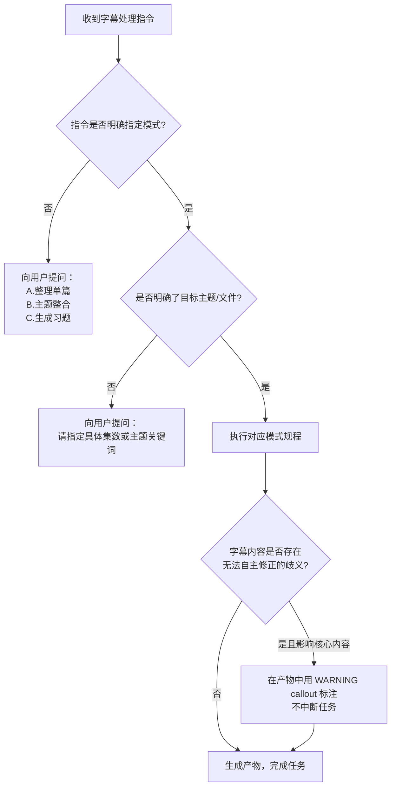

# 视频字幕笔记规范

> 版本：1.0.0
> 更新日期：2026-06-23
> 适用对象：所有基于视频教程字幕生成 Obsidian 笔记的 Agent 操作

---

## 0. 前置：继承关系

本规范是 **笔记规范.md** 的子集与扩展，专门针对 `视频教程字幕` 类型的参考资源制定。所有在 **笔记规范.md** 中定义的目录组织、命名规则、Frontmatter 格式、标签体系和归档机制，本规范**全部继承**，不再重复。

本规范在此基础上，额外增加以下内容：
1. 字幕原始素材的**质量问题预处理准则**
2. 三种**工作模式**的触发条件与执行规程
3. 各模式下的**产物模板**

---

## 1. 字幕原始素材的共性质量问题

在任何模式下处理字幕前，Agent 必须先识别并应对以下已知的系统性质量缺陷，**不能因此中断任务或要求用户逐条确认**。

### 1.1 语音识别谬误（必须修正）

字幕由 ASR（自动语音识别）生成，对技术术语的识别率极低。以下是已知的谬误模式，Agent 必须在内容理解阶段主动识别并修正，**不得将错误词汇照搬进产物**。

| 谬误表现 | 正确理解 | 说明 |
|---|---|---|
| `左翼运算` | 左移运算（`<<`） | 形近字混淆 |
| `右翼运算` | 右移运算（`>>`） | 形近字混淆 |
| `Q当中` / `在Q里` | 在 Keil 中 | K→Q 发音混淆 |
| `on3` / `on sign` / `arsa` / `un sign` | `unsigned` | 英文词拼读被拆散 |
| `on sa char` / `on sa int` | `unsigned char` / `unsigned int` | 同上 |
| `sign int` / `sign` | `signed int` / `signed` | 同上 |
| `LANG 家族` | `long` 类型家族 | 英文词发音误写 |
| `set` 作为变量名出现且上下文不符 | 依上下文还原为原变量名 | 随机识别错误 |
| `连X??` 形式（如 `连XFE`、`连XFB`） | `0x??` 十六进制常量 | `0x` 被识别为"连X" |
| `B或` / `B与` 后接常量 | `B \|= 常量` / `B &= 常量` | 运算符被口语化描述 |
| `一向左移N位` | `(1 << N)` | 代码表达式被口语化 |
| `复制给` / `赋值给` | 赋值操作符 `=` | 口语描述赋值 |

> [!IMPORTANT]
> 上表是**已知典型案例**，并非穷举。Agent 必须基于上下文语义和技术合理性，自主判断并修正其他类似谬误。**修正的依据是技术语境的合理性，而非字符相似性**。

### 1.2 代码块完全缺失（必须重建）

字幕中的代码片段会被 ASR 转写为纯文字描述，完全丢失代码形态。Agent 必须：

- 识别出字幕中以**口语形式描述的代码逻辑**（如"定义一个变量 C 初值是 0X81，然后将 C 的值向左移八位，结果赋值给 C"）
- 将其**重建为符合语境的格式化代码块**，并加上合适的语言标识（如 ` ```c ` ）
- 若字幕中明确提到代码运行结果（如"查看一下 C 的结果是零"），须将结果以注释形式附在代码旁或下方

> [!NOTE]
> 代码重建的目标是**还原讲师的演示意图**，允许对变量名作合理推断，但必须保证逻辑正确。若确实无法还原，以 `// [字幕原文过于模糊，代码需人工补充]` 注释标注，不得凭空虚构。

### 1.3 口语化表达（必须书面化）

字幕是口语转写，充斥大量冗余填充词和口语句式，产物中**一律不得出现**。

| 口语模式 | 处理原则 |
|---|---|
| `好 那么 然后 我们来看一下 接下来 大家好 今天学习的是` 等开场与过渡词 | 直接删除 |
| `我们说了好多遍` / `就是说` / `也就是说` | 删除，保留实质内容 |
| `比如` 接例子 | 改写为"示例："或直接转为代码块 |
| 反复强调的相同内容 | 合并为一条，不重复 |
| 第一/二/三等序号列举 | 转换为 Markdown 有序/无序列表 |

### 1.4 时间戳噪声（直接忽略）

字幕文件中的 `### **[HH:MM]**` 时间戳标记，在提取知识内容时**全部忽略**，不保留、不转化为章节标题。章节划分应基于**内容逻辑**，而非时间线。

---

## 2. 三种工作模式

Agent 通过读取用户的**触发指令关键词**来识别当前模式。

### 模式识别表

| 触发关键词模式 | 激活模式 | 说明 |
|---|---|---|
| `整理 [字幕文件名/编号]` | **模式 A：单篇整理** | 针对单篇字幕生成结构化笔记 |
| `整合 [主题词]` / `汇总 [主题词]` | **模式 B：主题整合** | Agent 自行从字幕库选择相关文件，生成主题综合笔记 |
| `出题 [主题词]` / `练习 [主题词]` / `生成习题` | **模式 C：习题生成** | Agent 自行从字幕库提取知识点，生成结构化练习题 |

---

## 3. 模式 A：单篇整理

### 3.1 触发与输入

- **触发指令示例**：`整理 034 位运算的左移`
- **输入**：单个字幕 `.md` 文件
- **产物**：一篇结构化的概念笔记，放置于该主题文件夹根目录下

### 3.2 执行规程

```
步骤 1：通读全文，完成第 1 节中的预处理（修正谬误、重建代码、去除噪声）
步骤 2：提炼核心知识点，按"是什么 → 为什么 → 怎么用 → 注意"逻辑组织
步骤 3：以视频讲师视角补充任何字幕中缺失但逻辑上必要的内容（标注来源）
步骤 4：按照下方「产物模板 A」填写并生成 Markdown 文件
步骤 5：产物文件名遵循笔记规范.md 第 3.4 节，例如：位运算左移详解.md
```

### 3.3 产物模板 A：概念知识笔记

```markdown
---
status: todo
created: YYYY-MM-DD
tags:
  - 主题/子领域          # 例：c-lang/bit-operation
  - todo
source_video: "视频系列名_集数_标题"   # 例：叶宇单片机_034_位运算的左移
references:
  - "[[字幕文件双链名称]]"
---

# 笔记标题

> [!NOTE]
> **来源**：[视频系列名] 第 N 集《视频标题》
> **整理说明**：（如有字幕内容模糊或代码重建之处，在此简要说明）

---

## 1. 核心概念

> 一段话说清楚"这是什么"，以及"为什么存在"。不允许从字幕复制口语句子。

---

## 2. 原理详解

### 2.1 [子主题一]

（知识点说明，必要时插入 Mermaid 图）

**核心示例**：

\`\`\`c
// 示例代码（由字幕口语描述重建）
// 结果：xxx
\`\`\`

### 2.2 [子主题二]

...

---

## 3. 常见陷阱与注意事项

> [!WARNING]
> **陷阱 1**：（来源于字幕中讲师特别强调的"未定义行为"、"注意"等）

> [!CAUTION]
> **陷阱 2**：...

---

## 4. 典型应用场景

| 场景 | 用法 | 示例代码 |
|---|---|---|
|  |  |  |

---

## 5. 总结速查

（用 3~5 条精炼要点总结全篇，可以是讲师"三点总结"的书面化版本）

- **要点一**：...
- **要点二**：...
- **要点三**：...

---

## 6. 待深入 / 遗留疑问

- [ ] （字幕中未交代清楚、或需要结合其他章节才能理解的点）

---

## 7. 关联笔记

- [[相关概念笔记A]]
- [[相关概念笔记B]]
```

---

## 4. 模式 B：主题整合

### 4.1 触发与输入

- **触发指令示例**：`整合 C语言指针`、`汇总 位运算`
- **输入**：Agent 自主在字幕库中检索与主题相关的所有字幕文件
- **产物**：一篇覆盖该主题多个集数的**综合性主题笔记**，跨文件融合内容

### 4.2 执行规程

```
步骤 1：扫描字幕库目录，列出所有文件名，识别与目标主题相关的集数
步骤 2：按集数顺序通读相关字幕，完成第 1 节的预处理
步骤 3：跨集提炼并去重，将同一知识点在不同集数中的重复讲解合并
步骤 4：按"知识体系"重新组织章节，而非按"集数时间线"
步骤 5：按照下方「产物模板 B」生成 Markdown 文件
步骤 6：在 Frontmatter 的 references 中列出所有参与整合的字幕文件双链
```

> [!IMPORTANT]
> 模式 B 的**核心价值**在于跨集整合，必须避免产出"多篇笔记的拼接"。同一个知识点无论在多少集中出现，在产物中只出现一次，以最清晰的表述呈现。

### 4.3 产物模板 B：主题综合笔记

```markdown
---
status: todo
created: YYYY-MM-DD
tags:
  - 主题/领域
  - todo
source_video: "视频系列名"
references:
  - "[[字幕文件A双链]]"
  - "[[字幕文件B双链]]"
  - "[[字幕文件C双链]]"    # 列出所有参与整合的集数
---

# 主题标题（综合笔记）

> [!NOTE]
> **来源**：[视频系列名] 第 N~M 集（共 X 集整合）
> **覆盖集数**：列出具体集数和标题

---

## 知识体系导图

\`\`\`mermaid
graph TD
    A[主题] --> B[子主题一]
    A --> C[子主题二]
    B --> D[概念一]
    B --> E[概念二]
\`\`\`

---

## 1. [子主题一]

（综合多集内容的完整知识点，含代码示例）

---

## 2. [子主题二]

...

---

## 核心对比速查表

| 特性 | 方案 A | 方案 B |
|---|---|---|
|  |  |  |

---

## 总结

（整个主题的精华提炼）

---

## 关联笔记

- [[相关概念笔记]]
```

---

## 5. 模式 C：习题生成

### 5.1 触发与输入

- **触发指令示例**：`出题 位运算`、`练习 C语言指针 中等难度`、`生成习题 自加自减`
- **输入**：Agent 自主在字幕库中检索相关文件，或由用户指定集数范围
- **产物**：一份结构化的练习题文件，答案以折叠 callout 形式内嵌

### 5.2 执行规程

```
步骤 1：扫描字幕库，识别与主题相关的集数，同步提取讲师自带的练习题示例
步骤 2：基于字幕知识点，按以下三种题型设计题目：
        - 概念判断题（是否正确，并说明理由）
        - 代码阅读题（给出代码，问运行结果或分析过程）
        - 代码填空/改错题（给出残缺/错误代码，要求补全或修正）
步骤 3：每道题注明知识点来源（对应哪一集/知识点），方便定向复习
步骤 4：按照下方「产物模板 C」生成 Markdown 文件
步骤 5：产物文件名格式：[主题]练习题_YYYY-MM-DD.md
```

### 5.3 难度标定规则

| 难度标识 | 定义 | 题目特征 |
|---|---|---|
| ⭐ 基础 | 直接考察定义和基本用法 | 单一知识点，无需推导 |
| ⭐⭐ 进阶 | 考察组合运用和边界条件 | 2~3 个知识点联动，含溢出/类型转换等 |
| ⭐⭐⭐ 挑战 | 考察未定义行为、场景选择和优化 | 需要结合硬件背景或多步推导 |

### 5.4 产物模板 C：练习题文件

```markdown
---
status: todo
created: YYYY-MM-DD
tags:
  - 主题/练习
  - exercise
  - todo
source_video: "视频系列名"
references:
  - "[[字幕文件双链]]"
---

# [主题] 练习题

> [!NOTE]
> **知识点范围**：[视频系列名] 第 N~M 集
> **题目总数**：X 题（基础 X / 进阶 X / 挑战 X）

---

## 第一部分：概念判断题

### Q1 ⭐

（题目描述）

> [!TIP]- 查看答案（点击展开）
> **结论**：正确 / 错误
> **分析**：（详细推导过程）
> **关联知识点**：[[相关笔记]]

---

## 第二部分：代码阅读题

### Q2 ⭐⭐

以下代码在 Keil C51 环境下运行，输出结果是什么？请分析每一步的中间值。

\`\`\`c
// 代码（由字幕知识点重建或改编自讲师练习题）
unsigned char c = 0x81;
unsigned int y;
y = (unsigned int)c << 8;
// y = ?
\`\`\`

> [!TIP]- 查看答案（点击展开）
> **结果**：y = 0x8100
> **分析步骤**：
> 1. c 提升为 unsigned int 后为 0x0081
> 2. 左移 8 位后得 0x8100
> 3. 赋值给 y（16 位），完整保存
> **来源集数**：第 034 集《位运算的左移》

---

## 第三部分：代码填空 / 改错题

### Q3 ⭐⭐

下方代码意图将字节 H = 0x12 和 L = 0x34 合并为 16 位整数 0x1234，但存在一处错误，请找出并修正。

\`\`\`c
unsigned char H = 0x12, L = 0x34;
unsigned int C;
C = H;          // 步骤①
C = C >> 8;     // 步骤②（此处有误）
C = C + L;      // 步骤③
\`\`\`

> [!TIP]- 查看答案（点击展开）
> **错误位置**：步骤② C = C >> 8 应改为 C = C << 8
> **分析**：将 H 移至高字节需要向左移 8 位，而非右移。右移会使低字节清零。
> **来源集数**：第 034 集《位运算的左移》

---

## 错误记录（自用）

（完成练习后在此记录错题和反思，以便后续复习）

| 题号 | 错误原因 | 修正理解 | 日期 |
|---|---|---|---|
|  |  |  |  |
```

---

## 6. 模式选择决策树

当用户指令不够明确时，Agent 应按以下决策树主动确认：



---

## 7. 产物质量自检清单

Agent 在输出任何模式的产物前，必须对照以下清单逐条验证：

### 7.1 内容质量

- [ ] **无 ASR 谬误**：产物中不存在第 1.1 节中已知的语音识别错误词汇
- [ ] **代码块格式正确**：所有代码内容以代码块格式呈现，不以纯文字描述代替
- [ ] **无口语填充词**：不包含"我们来看一下"、"大家好"等口语过渡词
- [ ] **技术内容正确**：代码示例逻辑无误，分析过程符合 C 语言规范

### 7.2 Obsidian 格式

- [ ] **Frontmatter 完整**：包含 status、created、tags、source_video、references 字段
- [ ] **双链指向原始字幕**：references 中已建立指向源字幕文件的双链
- [ ] **标签格式正确**：使用 `/` 层级标签，如 `c-lang/pointer`
- [ ] **文件命名合规**：遵循 笔记规范.md 第 3.4 节的命名规则

### 7.3 结构完整性

- [ ] **模板结构完整**：产物包含模板要求的所有核心章节（非空章节）
- [ ] **无空节占位**：如某章节真的无内容，应删除该节而非留空
- [ ] **关联笔记已建立**：若知识库中已有相关笔记，已在"关联笔记"节建立双链

---

## 8. 特殊情况处理规则

### 8.1 字幕内容极稀少（无效集）

部分字幕文件内容极少（文件大小 < 1KB），通常是无字幕的视频被提取后产生的空壳。

**处理规则**：跳过该文件，在产物的 NOTE callout 或 references 中注明"第 X 集字幕缺失，内容已跳过"。不为空壳文件单独创建笔记。

### 8.2 字幕中包含讲师演示代码的口播描述

当字幕包含如"现在程序写好了……定义一个变量 C 初值是 0X81……"这类代码演示口播时：

**处理规则**：必须将其**重建为代码块**，并在代码块前加注 `// 代码来源：字幕口述重建` 注释，以区分准确的板书代码与口播重建代码（可能有偏差）。

### 8.3 同一知识点在多集中重复讲解

当字幕库中多集内容对同一知识点有重复讲解时（如"类型提升"在多集中反复出现）：

**处理规则**：该知识点只在**最详细的那一集**中深度整理，其他集的笔记中以双链引用，不重复展开。维护知识库的 DRY（不重复）原则。

### 8.4 字幕中出现全新 ASR 谬误模式

当 Agent 在处理过程中发现第 1.1 节未收录的新型 ASR 谬误模式时：

**处理规则**：在产物末尾追加一个 NOTE callout，格式如下，提示用户更新规范：

```
> [!NOTE]
> **建议更新规范**：本次整理发现新 ASR 谬误模式：
> 谬误表现：`xxx` → 正确理解：`yyy`
> 请考虑将其追加至 视频字幕笔记规范.md 第 1.1 节。
```

---

*本规范由 Antigravity Agent 于 2026-06-23 基于字幕库实际质量问题制定。*
