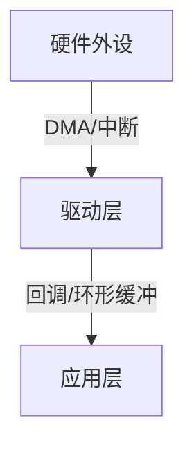

# 驱动名称（如：BSP 串口框架）

> [!NOTE]
> **使用说明**：此模板适用于对 BSP 驱动、中间件、外设框架等代码的系统性解析笔记。填写完毕后删除所有 `←` 注释行。

---

## 1. 框架定位

> 一段话说明该驱动的设计目标、解决的核心痛点、所处的层次位置（HAL 层 / BSP 层 / 中间件层）。

- **解决的核心问题**：
- **所处架构层次**：
- **对外隐藏的细节**：
- **依赖的第三方库**：（如 lwrb、FreeRTOS 等）

---

## 2. 架构总览

> 用数据流/调用关系描述整体设计，优先用 Mermaid 图，或简洁的文字流程。



**关键数据结构**：

| 结构体/类型 | 可见性 | 作用 |
|-------------|--------|------|
|             | public / private | |

---

## 3. 核心机制

### 3.1 接收机制（RX）

> [!TIP]
> 优先记录"为什么这样设计"，而不只是"怎么实现的"。

**设计方案**：

**核心代码片段**：

```c
// 在此粘贴核心接收逻辑，通常是 IRQ 处理函数或 DMA 回调
```

**关键变量说明**：

| 变量名 | 含义 | 更新时机 |
|--------|------|----------|
|        |      |          |

> [!WARNING]
> **陷阱 / 注意事项**：（例如：绕回边界处理、中断清标志时序等）

---

### 3.2 发送机制（TX）

**设计方案**：（如有多种模式，分条说明）

- **模式 A**（如：队列模式）：
- **模式 B**（如：直连零拷贝模式）：
- **模式 C**（如：阻塞同步模式）：

**核心代码片段**：

```c
// 在此粘贴核心发送逻辑
```

> [!WARNING]
> **陷阱 / 注意事项**：（例如：Zero-Copy 下缓冲区生命周期、RTOS 忙等问题等）

---

### 3.3 错误处理与自愈

**错误类型速查**：

| 错误标志 | 对应寄存器位 | 物理含义 | 触发原因 |
|----------|-------------|----------|----------|
|          |             |          |          |

**自愈流程**：

```
检测到错误 → 清除寄存器标志 → 复位 HAL 状态机 → 重启 DMA → 通知上层
```

---

## 4. 初始化配置速查

> 直接给出可运行的初始化代码模板，不加过多解释。

```c
/* 最小配置（仅 RX，不带 TX 队列）*/
static uint8_t  s_dma_buf[64];
static uint8_t  s_rx_buf[512];
static lwrb_t   s_rx_rb;

lwrb_init(&s_rx_rb, s_rx_buf, sizeof(s_rx_buf));

port_uart_config_t cfg = {
    .baudrate       = 0,                   // 沿用 CubeMX 默认
    .rx_dma_buf     = s_dma_buf,
    .rx_dma_buf_size = sizeof(s_dma_buf),
    .rx_rb          = &s_rx_rb,
    .on_rx_data     = app_on_uart_rx,      // 替换为实际回调
};
port_uart_init(PORT_UART_1, &cfg);
```

---

## 5. 对外接口速查表

| 函数签名 | 阻塞 | 返回值 | 一句话说明 |
|----------|------|--------|------------|
| `init()` | 否 | status | 初始化并启动 DMA 接收 |
| `deinit()` | 否 | status | 停止所有 DMA，释放外设 |
| `write()` | **是** | status | 阻塞发送，超时自适应计算 |
| `write_async()` | 否 | status | 提交后立即返回，完成触发回调 |
| `is_tx_busy()` | 否 | bool | 查询 DMA 发送通道状态 |
| `tx_wait()` | **是** | status | 轮询等待异步发送完成 |
| `enable_rx()` | 否 | status | 开启 DMA 接收流 |
| `disable_rx()` | 否 | status | 关闭 DMA 接收流 |
| `get_error()` | 否 | error_t | 读后即清的硬件错误查询 |
| `recover()` | 否 | status | 强制重置串口底层状态机 |

---

## 6. 使用注意事项

> [!IMPORTANT]
> 以下为实际使用中必须了解的约定，忽略可能导致难以复现的 Bug。

1. **ISR 调用约定**：必须在 `USARTx_IRQHandler` 中同时调用 `HAL_UART_IRQHandler()` 和 `port_uart_irq_handler()`，否则 TX 完成回调和错误回调均不触发。
2. **Zero-Copy 缓冲区生命周期**：直连模式下，传给 `write_async` 的缓冲区必须在 `on_tx_complete` 回调触发前保持有效，禁止传局部变量地址。
3. **RTOS 场景下的 tx_wait**：`tx_wait` 是裸轮询（while 忙等），在 FreeRTOS 任务中调用会持续占用 CPU，建议改用信号量阻塞等待或仅在裸机场景使用。
4. **rx_rb 大小选择**：应至少为 `rx_dma_buf_size` 的 4~8 倍，防止上层解析较慢时 lwrb 满导致数据丢失。

---

## 7. 改进方向 / 待深入研究

- [ ] （记录当前还未理解透彻的点，或后续想扩展的特性）
- [ ] 例：RTOS 下将 tx_wait 改为信号量实现
- [ ] 例：研究 STM32H7 DCache 场景下 DMA 缓冲区的对齐要求

---

## 8. 关联笔记

- [[DMA数据传输机制]]        ← 替换为实际关联笔记的双链
- [[LwRB 环形缓冲区]]
- [[STM32 UART 中断机制]]
