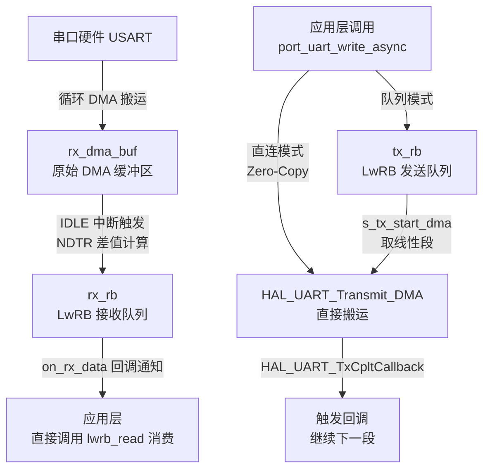

# BSP 串口框架

## 1. 框架定位

基于 STM32 HAL 库封装的 BSP 串口接口层，设计目标是**隔离 HAL 库细节，向上层提供统一的非阻塞串口通信接口**。

- **解决的核心问题**：不定长数据流接收（动态断帧）、高并发发送数据不丢失、串口硬件死锁后的自动恢复
- **所处架构层次**：BSP 硬件抽象层（位于 HAL 层之上、应用协议层之下）
- **对外隐藏的细节**：DMA 循环模式配置、NDTR 寄存器读取、绕回处理、HAL 中断回调挂载
- **依赖的第三方库**：[[LwRB 环形缓冲区]]（lwrb），用于接收缓存与可选的发送队列

---

## 2. 架构总览



**关键数据结构**：

| 结构体 / 类型 | 可见性 | 作用 |
|--------------|--------|------|
| `uart_context_t` | 模块私有（仅 .c 内可见） | 串口运行时上下文，存储所有状态变量和回调指针 |
| `port_uart_config_t` | 公开（.h 暴露） | 初始化配置，承载依赖注入的缓冲区和回调 |
| `port_uart_id_t` | 公开 | 串口逻辑 ID 枚举，作为所有 API 的第一参数 |
| `port_uart_error_t` | 公开 | 硬件错误位掩码枚举，支持按位或组合多错误 |

---

## 3. 核心机制

### 3.1 接收机制：循环 DMA + IDLE 中断

**设计方案**：RX 通道配置为循环模式（`DMA_CIRCULAR`），硬件持续向 `rx_dma_buf` 写入，CPU 全程旁观。串口总线空闲超过 1 字节时间时触发 IDLE 中断，由软件结算这期间新增的数据。

**核心代码片段**（IRQ 入口，见 `port_uart_irq_handler`）：

```c
// 1. 过滤非 IDLE 中断
if (!__HAL_UART_GET_FLAG(ctx->huart, UART_FLAG_IDLE)) return;
__HAL_UART_CLEAR_IDLEFLAG(ctx->huart);

// 2. NDTR 换算当前 DMA 写指针
uint16_t cur_pos  = ctx->rx_dma_size - (uint16_t)ctx->huart->hdmarx->Instance->NDTR;
uint16_t last_pos = ctx->dma_write_pos;
if (cur_pos == last_pos) return;  // 过滤假空闲中断

// 3. 分段拷入 LwRB
if (cur_pos > last_pos) {
    lwrb_write(ctx->rx_rb, &ctx->rx_dma_buf[last_pos], cur_pos - last_pos);
} else {
    // 绕回：尾段 + 头段两次写入
    lwrb_write(ctx->rx_rb, &ctx->rx_dma_buf[last_pos], ctx->rx_dma_size - last_pos);
    lwrb_write(ctx->rx_rb, &ctx->rx_dma_buf[0],        cur_pos);
}

// 4. 更新指针，上抛通知
ctx->dma_write_pos = cur_pos;
if (ctx->on_rx_data) ctx->on_rx_data(uart, recv_len, ctx->user_ctx);
```

**关键变量说明**：

| 变量名 | 含义 | 更新时机 |
|--------|------|----------|
| `dma_write_pos` | 上次 IDLE 中断结算时的 DMA 写指针位置 | 每次 IDLE 中断末尾更新 |
| `NDTR` | DMA 硬件剩余传输计数（递减，循环自动复位） | 硬件自动维护 |
| `cur_pos` | 当前 DMA 写指针 = `rx_dma_size - NDTR` | 每次中断临时计算 |

> [!WARNING]
> **陷阱**：IDLE 中断标志必须手动清除，否则中断服务退出后立即重新进入，导致死循环。HAL 宏 `__HAL_UART_CLEAR_IDLEFLAG` 内部通过先读 SR 再读 DR 完成原子清除。

---

### 3.2 发送机制

**三种模式对比**：

| 模式 | 触发条件 | 内存操作 | 适用场景 |
|------|----------|----------|----------|
| **队列模式** | 初始化时传入 `tx_rb != NULL` | 深拷贝到 lwrb，调用后可立即复用缓冲区 | 高频碎片化发送（日志、传感器数据流） |
| **直连模式** | 初始化时 `tx_rb == NULL` | Zero-Copy，DMA 直接读原始缓冲区 | 内存紧张、单次大块发送 |
| **阻塞模式** | 调用 `port_uart_write` | HAL 轮询，死等超时 | 初始化阶段、RTOS 调度前、Crash Dump |

**队列模式核心逻辑**（`s_tx_start_dma`）：

```c
// 取线性可读段，避免 DMA 跨越物理边界（DMA 不懂"转弯"）
const void *ptr = lwrb_get_linear_block_read_address(ctx->tx_rb);
lwrb_sz_t   len = lwrb_get_linear_block_read_length(ctx->tx_rb);
// 发送完成后在 TxCpltCallback 里调用 lwrb_skip 销账，再触发下一段
```

**绕回拆段原理**：lwrb 在物理内存上是线性数组，DMA 无法跨越数组末尾。`lwrb_get_linear_block_read_length` 只返回到数组末尾为止的连续长度，触发第一次 DMA。完成回调中 `lwrb_skip` 销账后，读指针自动绕回，再次取到头部的剩余段，触发第二次 DMA。

> [!WARNING]
> **直连模式陷阱**：传给 `write_async` 的缓冲区指针由 DMA 直接读取，在 `on_tx_complete` 回调触发前**不能修改、释放或让变量离开作用域**（禁止传局部变量地址）。

---

### 3.3 错误处理与自愈

**硬件错误标志速查**：

| 框架标志 | 寄存器位（STM32F4） | 物理含义 | 常见触发原因 |
|----------|---------------------|----------|--------------|
| `PORT_UART_ERR_ORE` | USART_SR Bit3 (ORE) | 溢出错误 | 接收寄存器未及时读走，新字节到来 |
| `PORT_UART_ERR_FE`  | USART_SR Bit1 (FE)  | 帧错误   | 停止位为低电平，波特率严重不匹配 |
| `PORT_UART_ERR_NE`  | USART_SR Bit2 (NF)  | 噪声错误 | 采样期间电平不一致，总线存在干扰 |
| `PORT_UART_ERR_PE`  | USART_SR Bit0 (PE)  | 校验错误 | 奇偶校验失败，数据位发生翻转 |

**自愈流程**：

```
HAL_UART_ErrorCallback 触发
    → 复位 tx_busy / tx_dma_len（解除发送死锁）
    → 调用 on_error 通知上层
    → s_rx_start_dma 重新拉起循环 DMA（恢复接收能力）

port_uart_get_error（主动查询，读后即清）
    → 读取 HAL_UART_GetError
    → 转换为 port_uart_error_t 位掩码
    → __HAL_UART_CLEAR_OREFLAG 等清除寄存器标志
    → 复位 huart->ErrorCode

port_uart_recover（核弹接口，上层主动触发）
    → HAL_UART_Abort 中止所有传输
    → 清除全部寄存器错误标志
    → 重置 tx 状态
    → 重启 DMA 接收
```

---

## 4. 初始化配置速查

```c
/* === 最小配置（仅 RX，不带 TX 队列） === */
static uint8_t s_dma_buf[64];
static uint8_t s_rx_buf[512];   // 建议为 dma_buf 的 4~8 倍
static lwrb_t  s_rx_rb;

lwrb_init(&s_rx_rb, s_rx_buf, sizeof(s_rx_buf));

port_uart_config_t cfg = {
    .baudrate        = 0,               // 0 = 沿用 CubeMX 默认波特率
    .rx_dma_buf      = s_dma_buf,
    .rx_dma_buf_size = sizeof(s_dma_buf),
    .rx_rb           = &s_rx_rb,
    .on_rx_data      = app_on_uart_rx,  // 替换为实际回调
};
port_uart_init(PORT_UART_1, &cfg);

/* === 完整配置（含 TX 队列） === */
static uint8_t s_tx_buf[1024];
static lwrb_t  s_tx_rb;

lwrb_init(&s_tx_rb, s_tx_buf, sizeof(s_tx_buf));
cfg.tx_rb          = &s_tx_rb;
cfg.on_tx_complete = app_on_uart_tx_done;
cfg.on_error       = app_on_uart_error;
cfg.user_ctx       = &my_app_ctx;      // 回调时原样返回，可传 this 指针
port_uart_init(PORT_UART_1, &cfg);
```

---

## 5. 对外接口速查表

| 函数签名 | 阻塞 | 返回值 | 一句话说明 |
|----------|:----:|--------|------------|
| `port_uart_init(id, cfg)` | 否 | bsp_status_t | 初始化串口，启动循环 DMA 接收 |
| `port_uart_deinit(id)` | 否 | bsp_status_t | 停止 DMA，释放外设资源 |
| `port_uart_write(id, data, len)` | **是** | bsp_status_t | 阻塞发送，超时由波特率自适应计算 |
| `port_uart_write_async(id, data, len, cb, ctx)` | 否 | bsp_status_t | 提交后立即返回，完成时触发回调 |
| `port_uart_is_tx_busy(id)` | 否 | bool | 查询 DMA 发送通道是否在忙 |
| `port_uart_tx_wait(id, timeout_ms)` | **是** | bsp_status_t | 轮询等待异步发送完成（裸机场景用） |
| `port_uart_enable_rx(id)` | 否 | bsp_status_t | 启动 DMA 接收流（流控恢复时用） |
| `port_uart_disable_rx(id)` | 否 | bsp_status_t | 停止 DMA 接收流（流控暂停时用） |
| `port_uart_get_error(id)` | 否 | port_uart_error_t | 主动读取硬件错误，**读后即清** |
| `port_uart_recover(id)` | 否 | bsp_status_t | 强制重置串口底层，恢复通信能力 |
| `port_uart_irq_handler(id)` | — | void | 在 `USARTx_IRQHandler` 中调用，处理 IDLE 断帧 |

---

## 6. 使用注意事项

> [!IMPORTANT]
> 以下约定忽略任意一条均可能导致难以复现的 Bug。

1. **ISR 调用约定**：`USARTx_IRQHandler` 中必须**同时**调用 `HAL_UART_IRQHandler(&huartX)` 和 `port_uart_irq_handler(PORT_UART_X)`。前者触发 TxCplt / Error 回调，后者处理 IDLE 断帧。两者缺一不可。

2. **直连模式缓冲区生命周期**：Zero-Copy 下 DMA 直接读源地址，在 `on_tx_complete` 触发前原始缓冲区必须保持有效。禁止传入栈上局部数组的地址。

3. **RTOS 下慎用 tx_wait**：`port_uart_tx_wait` 是 `while(tx_busy)` 裸轮询，在 FreeRTOS 任务中会持续占 CPU，应使用二值信号量（`xSemaphoreTake`）替代。

4. **rx_rb 容量选择**：至少为 `rx_dma_buf_size` 的 4~8 倍。若上层协议解析较慢，lwrb 打满后新数据会被静默丢弃（`lwrb_write` 返回写入量不足）。

5. **rx_dma_buf 内存对齐**：若使用 STM32H7 且开启了 DCache，`rx_dma_buf` 必须声明为 32 字节对齐并放置在非缓存内存区（`__attribute__((aligned(32)))` + MPU 配置），否则 DCache 可能造成数据不一致。

---

## 7. 改进方向 / 待深入研究

- [ ] 研究 RTOS 场景下将 `tx_wait` 改为信号量实现的最佳实践
- [ ] 梳理 STM32H7 + DCache 下 DMA 缓冲区对齐配置方法
- [ ] 了解 `lwrb_get_linear_block_write_address` 在 RX 侧直接 DMA 写入 lwrb 的可行性（消除 `rx_dma_buf` 中间层）
- [ ] 评估在多串口（>2 个）场景下，`HAL_UART_TxCpltCallback` for 循环遍历的性能影响

---

## 8. 关联笔记

- [[LwRB 环形缓冲区]]
- [[STM32 DMA 数据传输机制]]
- [[STM32 UART 中断机制]]
