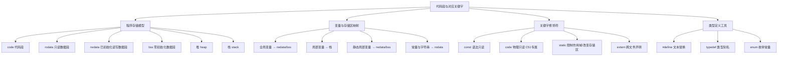

# 代码段与对应关键字（综合笔记）

> [!NOTE]
> **来源**：叶宇单片机 第 012/013/014/020/037/054 集 + static/const_code/#define/78 集 + 小智嵌入式分享《代码段》视频（共 11 源整合）
> **覆盖集数**：
> - 叶宇 012《变量的定义和赋值》
> - 叶宇 013《赋值语句的覆盖性》
> - 叶宇 014《二进制与字节单位及变量取值范围》
> - 叶宇 020《隐藏的中间变量为何物》
> - 叶宇 037《单字节变量赋值给多字节变量的疑惑》
> - 叶宇 054《从全局变量和局部变量中感悟栈为何物》
> - 叶宇《static的重要作用》
> - 叶宇《const_code在定义数据时的作用》
> - 叶宇《全局一键替换功能的#define》
> - 叶宇 78《define、typedef、enum》
> - 小智《如何让你写的代码更节省空间》

---

## 知识体系导图



---

## 1. 程序存储模型：Flash 与 RAM 的分工

嵌入式程序的二进制映像由若干**段（segment）**组成，每个段在 Flash 和 RAM 中有不同的占用关系。

### 1.1 四大段定义

| 段名 | 全称 | 存放内容 | 占 Flash | 占 RAM |
|---|---|---|---|---|
| **code** | Code Segment | 函数体、逻辑指令的机器码 | 是 | 否 |
| **rodata** | Read-Only Data | const 常量、字符串字面量 | 是 | 否 |
| **rwdata** | Read-Write Data（已初始化） | 初始化为**非零值**的全局/静态变量 | 是（存初始值） | 是（运行时副本） |
| **bss** | Block Started by Symbol | 初始化为**零**或**未初始化**的全局/静态变量 | 否 | 是 |

### 1.2 Flash 与 RAM 占用公式

**公式一：程序烧录所需 Flash 大小**

```
Flash = code + rodata + rwdata
```

**公式二：程序运行时占用 RAM 大小**

```
RAM = rwdata + bss + heap_size + stack_size
```

> [!WARNING]
> **常见误区**：很多教程只写 `RAM = rwdata + bss`，忽略了堆和栈。实际上局部变量、函数调用压栈、动态内存分配（malloc）都在栈和堆中运行，实际 RAM 占用远大于 rwdata + bss。

### 1.3 上电启动过程

```
Flash 中的 rwdata 初始值 ──搬运──→ RAM 中的 rwdata 运行区
                                ──清零──→ RAM 中的 bss 区
```

单片机上电后，启动代码（crt0）自动完成两件事：
1. 将 Flash 中 rwdata 段的初始值**搬运**到 RAM 对应位置
2. 将 bss 段对应的 RAM 区域**清零**

---

## 2. 变量与存储区的映射关系

### 2.1 基本数据类型与字节占用（C51/8051 体系）

| 类型 | 字节数 | 取值范围 | 存储区 |
|---|---|---|---|
| **unsigned char** | 1 | 0 ~ 255 | rwdata / bss / 栈 |
| **signed char** | 1 | -128 ~ 127 | 同上 |
| **unsigned int** | 2 | 0 ~ 65535 | 同上 |
| **signed int** | 2 | -32768 ~ 32767 | 同上 |
| **unsigned long** | 4 | 0 ~ 4294967295 | 同上 |
| **signed long** | 4 | -2147483648 ~ 2147483647 | 同上 |
| **float** | 4 | ±3.4E38 | 同上 |
| **double** | 4(C51) / 8(部分平台) | 视编译器 | 同上 |

> [!NOTE]
> C51 中 unsigned int 为 2 字节（16 位），而在 32 位 MCU（如 STM32）中 unsigned int 为 4 字节。跨平台移植时需注意。

### 2.2 全局变量 vs 局部变量

| 特性 | 全局变量 | 局部变量 |
|---|---|---|
| 定义位置 | 函数外部 | 函数内部 |
| 存储区 | rwdata（非零初值）或 bss（零初值/未初始化） | 栈（Stack） |
| 生命周期 | 整个程序运行期 | 函数调用期间 |
| 作用域 | 全文件可用，extern 声明后可跨文件 | 仅限定义所在的函数 |
| 初始值 | 未显式初始化则默认为 0 | 未显式初始化则值不确定 |
| 栈占用 | 不占栈 | 占栈，函数返回后释放 |

### 2.3 栈的工作机制

栈是一块**公共临时区域**，遵循后进先出（LIFO）原则：

1. 函数调用时：现场保护数据压栈 → 返回地址压栈 → 局部变量在栈中分配空间
2. 函数返回时：跳过局部变量空间（释放） → 弹出返回地址 → 弹出现场保护数据

SP（Stack Pointer）寄存器记录当前栈顶位置。

> [!CAUTION]
> **栈的三大禁忌**：
> 1. 函数内不能定义太大的数组（栈空间有限，C51 仅约 32 字节可用）
> 2. 函数嵌套调用层数不能太多（每层都需压栈）
> 3. 局部变量出了函数就无效，不可返回局部变量的指针

---

## 3. 关键字修饰符详解

### 3.1 const —— 语法层面的只读约束

```c
/* const 修饰全局变量：仍在 RAM 中，语法禁止修改 */
const unsigned char a = 10;  /* 全局：rwdata 段，语法只读 */

void func(void)
{
    /* const 修饰局部变量：仍在 RAM 中（栈），语法禁止修改 */
    const unsigned char b = 20;  /* 局部：栈区，语法只读 */
}
```

**要点**：
- const **不改变**变量的存储位置，变量仍在 RAM 中
- const 是**语法约束**，编译器检查写操作并报错
- 可以通过指针绕过 const 修改（但不建议，破坏约定）

### 3.2 code —— 物理层面的只读约束（C51 专属）

```c
/* code 修饰的变量强制存储在 ROM（Flash）中 */
code unsigned char a = 10;  /* 全局：rodata 段，物理只读 */

void func(void)
{
    code unsigned char b = 20;  /* 局部：rodata 段，物理只读 */
}
```

**要点**：
- code 是 **C51/8051 专属**关键字，其他平台不可用
- code 将变量**强制分配到 ROM**，节省 RAM 空间
- ROM 中数据**物理上只能读不能写**，任何写操作均为非法
- 适用于查表数据、固定参数等运行期间不修改的数据

### 3.3 const vs code 对比

| 特性 | const | code |
|---|---|---|
| 标准 | C 标准关键字 | C51 专属关键字 |
| 存储位置 | RAM（不变） | ROM（Flash） |
| 只读性质 | 语法约束，物理可写 | 物理只读，不可写 |
| 跨平台 | 所有平台可用 | 仅 8051 体系 |
| 节省 RAM | 否 | 是 |
| 典型用途 | 函数参数保护、接口约定 | 大数组查表、固定常量 |

### 3.4 static —— 限制作用域与改变存储区

static 对三种对象的作用各不相同：

#### 3.4.1 static 修饰全局变量

```c
/* 普通全局变量：所有文件可见（extern 声明后） */
unsigned char g_count;

/* 静态全局变量：仅当前文件可见 */
static unsigned char s_count;
```

| 特性 | 全局变量 | 静态全局变量 |
|---|---|---|
| 可见性 | 全部文件（extern 声明） | 仅当前 .c 文件 |
| 存储区 | rwdata / bss | rwdata / bss（不变） |
| 生命周期 | 程序全程 | 程序全程 |

**原则**：能用 static 先用 static，再用全局。好处：
- 安全：限制作用域，防止其他文件误用
- 清晰：一眼区分文件内部使用与对外接口
- 避免重名：多文件项目中防止同名冲突

#### 3.4.2 static 修饰全局函数

```c
/* 普通全局函数：其他文件可调用（声明后） */
void API_SendData(unsigned char dat);

/* 静态全局函数：仅当前文件可调用 */
static void delay_us(unsigned int us);
```

与静态全局变量同理，限制函数的可见范围。

#### 3.4.3 static 修饰局部变量

```c
void counter(void)
{
    /* 普通局部变量：每次调用重新分配栈空间，初值不确定 */
    unsigned char n = 0;
    n++;

    /* 静态局部变量：搬至全局数据区，只初始化一次，值持久保持 */
    static unsigned char s = 0;
    s++;
}
```

| 特性 | 局部变量 | 静态局部变量 |
|---|---|---|
| 存储区 | 栈 | rwdata / bss（全局数据区） |
| 初始化 | 每次调用都初始化 | 仅首次初始化 |
| 值保持 | 函数返回后丢失 | 持久保持上次结果 |
| 时间开销 | 每次分配/释放栈空间 | 无额外分配开销 |

**何时使用静态局部变量**：
1. 需要保持上次执行结果（如计数器、状态机）
2. 变量较大（如大数组），避免占用栈空间
3. 函数被频繁调用，节省栈分配时间

### 3.5 extern —— 跨文件声明

```c
/* file_a.c 中定义 */
unsigned char g_flag = 0;

/* file_b.c 中声明并使用 */
extern unsigned char g_flag;
```

extern 不分配存储空间，仅声明"该变量在别处已定义"。

---

## 4. 类型定义工具：#define / typedef / enum

### 4.1 #define —— 无脑文本替换

```c
#define PI          3.1415926
#define MAX_SIZE    100
#define SQUARE(x)   ((x) * (x))   /* 宏函数：参数和整体都要加括号 */
```

**特性**：
- 预处理阶段执行，纯文本替换，无类型检查
- 不挑食：常量、表达式、代码片段均可替换
- 不占存储空间（编译前已替换完毕）
- 无跨文件属性，需通过 #include 头文件实现全局替换
- 后面不加分号
- 命名习惯全大写

> [!WARNING]
> **宏函数陷阱**：参数和整体表达式必须加括号，否则替换后运算优先级可能改变。

```c
#define SQUARE_BAD(x)   x * x
#define SQUARE_GOOD(x)  ((x) * (x))

/* SQUARE_BAD(2+3) → 2+3 * 2+3 = 11（错误） */
/* SQUARE_GOOD(2+3) → ((2+3) * (2+3)) = 25（正确） */
```

### 4.2 typedef —— 类型别名

```c
typedef unsigned char  U8;
typedef unsigned int   U16;
typedef unsigned long  U32;

/* 结构体别名 */
typedef struct
{
    U8  id;
    U8  data[10];
} Packet_t;
```

**特性**：
- 为已有类型起别名，具有**类型属性**
- 编译器会进行类型检查
- 不占存储空间
- 跨平台移植利器：只需修改 typedef 一处即可适配不同 MCU

> [!NOTE]
> typedef 与 #define 定义指针类型的区别：
> ```c
> typedef unsigned char *PU8;
> PU8 p1, p2;  /* p1 和 p2 都是指针 */
>
> #define PU8_DEF unsigned char *
> PU8_DEF p3, p4;  /* p3 是指针，p4 是普通 unsigned char */
> ```

### 4.3 enum —— 枚举常量

```c
enum WeekDay
{
    MON = 1, TUE, WED, THU, FRI, SAT, SUN
};

enum Mode
{
    MODE_IDLE = 0,
    MODE_RUN,
    MODE_STOP,
    MODE_ERROR = 99
};
```

**特性**：
- 成员本质是 int 类型整数常量
- 自动从 0 开始递增，也可手动指定值
- 可以定义枚举类型变量，变量占存储空间
- 枚举常量本身不占存储空间
- 新增成员时自动编号，不会像 #define 那样需要手动维护编号

### 4.4 三者对比

| 特性 | #define | typedef | enum |
|---|---|---|---|
| 替换对象 | 任意文本 | 仅类型 | 仅整数常量 |
| 类型检查 | 无 | 有 | 有 |
| 占存储空间 | 否 | 否 | 变量占，常量不占 |
| 跨文件属性 | 需 #include | 需 #include | 需 #include |
| 适用场景 | 常量、宏函数、代码片段 | 类型别名、跨平台移植 | 一组关联的整数常量 |

---

## 5. 存储区与关键字速查表

| 代码写法 | 所在段 | 占 Flash | 占 RAM | 可读 | 可写 |
|---|---|---|---|---|---|
| `unsigned char g = 10;`（全局） | rwdata | 是（初始值） | 是 | 是 | 是 |
| `unsigned char g;`（全局未初始化） | bss | 否 | 是 | 是 | 是 |
| `const unsigned char g = 10;`（全局） | rwdata | 是（初始值） | 是 | 是 | 否（语法） |
| `code unsigned char g = 10;`（全局） | rodata | 是 | 否 | 是 | 否（物理） |
| `static unsigned char g = 10;`（全局） | rwdata | 是（初始值） | 是 | 是 | 是 |
| `unsigned char l;`（局部） | 栈 | 否 | 是（临时） | 是 | 是 |
| `static unsigned char l = 0;`（局部） | bss | 否 | 是 | 是 | 是 |
| `#define MAX 100` | 无（预处理替换） | 否 | 否 | — | — |
| `enum { A, B };` | 常量不占空间 | 否 | 否 | — | — |

---

## 6. 代码优化实例：节省 RAM 与 Flash

### 6.1 大数组的存储优化

```c
/* 优化前：数组在 RAM 中，既占 Flash（初始值）又占 RAM */
unsigned char font_table[500] = {1, 1, 1, ...};  /* Flash: 500B + RAM: 500B */

/* 优化后：数组在 ROM 中，只占 Flash */
code unsigned char font_table[500] = {1, 1, 1, ...};  /* Flash: 500B + RAM: 0B */
```

### 6.2 初始化数组的优化

```c
/* 优化前：非零初始化 → rwdata 段，占 Flash + RAM */
unsigned char buf[500] = {1, 1, 1, ...};  /* Flash: 500B + RAM: 500B */

/* 优化后：零初始化 → bss 段，只占 RAM；运行时再赋值 */
unsigned char buf[500] = {0};  /* Flash: 0B + RAM: 500B */
/* 然后在代码中逐个赋值 */
```

### 6.3 大数组避免放在栈中

```c
/* 危险：大数组在栈中，容易栈溢出 */
void process(void)
{
    unsigned char temp[100];  /* 占用 100 字节栈空间 */
    /* ... */
}

/* 安全：改为静态局部变量，放在全局数据区 */
void process(void)
{
    static unsigned char temp[100];  /* 在 bss 段，不占栈 */
    /* ... */
}
```

---

## 7. 大端与小端存储

### 7.1 定义

| 存储方式 | 规则 | 典型平台 |
|---|---|---|
| **小端（Little-Endian）** | 低字节存低地址，高字节存高地址 | ARM Cortex-M、x86 |
| **大端（Big-Endian）** | 高字节存低地址，低字节存高地址 | 8051/C51、PowerPC |

### 7.2 示例

```c
unsigned long val = 0x12345678;

/* 小端存储（ARM） */
/* 地址：  0x00  0x01  0x02  0x03 */
/* 数据：  0x78  0x56  0x34  0x12 */

/* 大端存储（8051） */
/* 地址：  0x00  0x01  0x02  0x03 */
/* 数据：  0x12  0x34  0x56  0x78 */
```

### 7.3 类型提升时的补位规则

少字节赋值给多字节时（类型提升）：
- **正数和零**：高位补 0
- **负数**：高位补 1（符号扩展）

```c
unsigned int  t = 0x00AB;
unsigned long a;
a = t;  /* a = 0x000000AB，正数高位补零 */
```

---

## 8. 算术转换规则：提升与对齐

编译器在运算前自动执行以下规则：

1. **提升**：char/short 类型自动提升为 int（先尝试 signed int，装不下则转 unsigned int）
2. **对齐**：提升后若两个操作数类型仍不同，低等级向高等级对齐

**类型等级**（由低到高）：
```
char → short → int → long → float → double
（每个等级内有 signed < unsigned）
```

> [!TIP]
> **项目实战建议**：为避免自动转换带来的意外溢出，可将所有参与运算的变量预先转为 unsigned long 类型再计算。

---

## 总结

- **Flash = code + rodata + rwdata**，**RAM = rwdata + bss + heap + stack**
- **const** 是语法只读（仍在 RAM），**code** 是物理只读（在 ROM，C51 专属）
- **static** 限制全局变量/函数的作用域为当前文件，改变局部变量的存储区为全局数据区
- **#define** 无脑文本替换不挑食，**typedef** 只替换类型且具有类型属性，**enum** 管理一组关联整数常量
- 大数组和固定数据用 code 存 ROM 节省 RAM；大局部数组加 static 避免栈溢出
- 栈空间有限，忌大数组、忌深嵌套、忌返回局部变量指针

---

## 关联笔记

- [[位运算综合笔记]]
