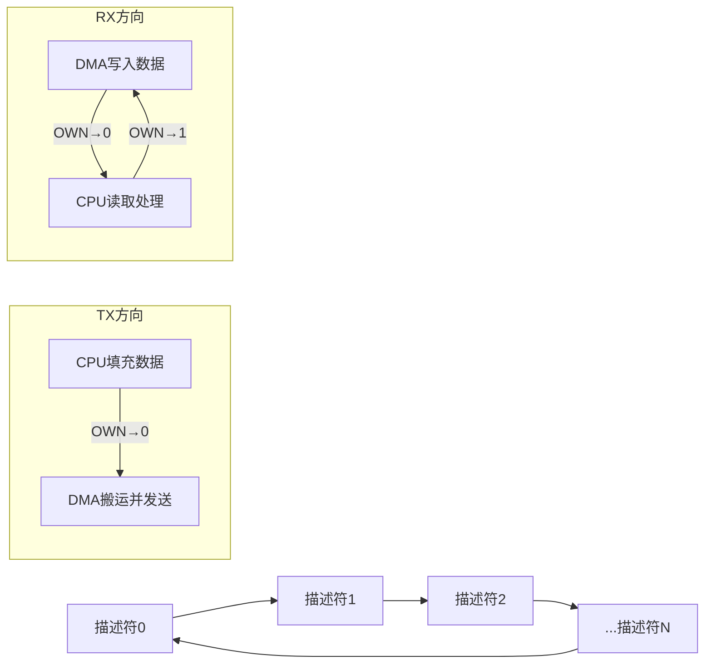

# MAC初始化与DMA描述符

> [!NOTE]
> 本笔记为以太网基础知识体系中的硬件层核心笔记，覆盖 MAC 控制器初始化、DMA 描述符环形队列机制以及以太网引脚配置方法。

---

## 1. 核心概念

以太网 MAC（Media Access Control）控制器是单片机内部负责"帧级数据处理"的硬件模块——它将上层协议栈交付的字节流组装成以太网帧并发送，同时将接收到的帧解析后交给协议栈。而 **DMA 描述符**是 MAC 与内存之间高效搬运数据的"搬运工清单"，通过环形队列实现零 CPU 干预的批量数据传输。

---

## 2. 原理详解

### 2.1 MAC 控制器初始化流程

一个典型的以太网 MAC 初始化需要按以下顺序完成（以 STM32 ETH / CH32V ETH 为例）：

1. **时钟使能**：开启 MAC 和 DMA 所对应的外设时钟
2. **引脚配置**：将 GPIO 复用为 RMII/MII 功能（详见第 2.4 节）
3. **MAC 复位**：通过软件复位位清除 MAC 和 DMA 的残留状态
4. **配置 MAC 地址**：写入 6 字节 MAC 地址到 MAC 地址寄存器（低 4 字节 + 高 2 字节）
5. **设置帧过滤模式**：配置为 promiscuous（接收所有帧）或unicast/multicast过滤
6. **初始化 DMA 描述符**：构建发送与接收环形队列（详见第 2.2 节）
7. **启动 DMA 发送与接收通道**

```c
/* MAC 地址写入示例（小端序存储） */
ETH->MACA0HR = (mac_addr[5] << 8) | mac_addr[4];  /* 高2字节 */
ETH->MACA0LR = (mac_addr[3] << 24) | (mac_addr[2] << 16) |
               (mac_addr[1] << 8)  | mac_addr[0];  /* 低4字节 */
```

> [!TIP]
> MAC 地址在寄存器中以小端序存储，但网络帧中以大端序传输。初始化时需注意写入顺序，详见 [[大小端无缝转换机制#核心转换函数与宏|大小端无缝转换机制]]。

---

### 2.2 DMA 描述符环形队列

DMA 描述符是 MAC 控制器与内存之间的"契约"。每个描述符是一条固定格式的记录，告诉 DMA：
- **数据缓冲区的地址**在哪里
- **缓冲区的大小**是多少
- **当前状态**是"CPU 拥有"还是"DMA 拥有"

#### 发送描述符链（TX Descriptor Ring）

发送时，CPU 将待发送数据填入缓冲区，将描述符的 **OWN 位**置0（交给 DMA），DMA 读到 OWN=0 后自动搬运数据并发帧。

```c
/* 发送描述符简化结构 */
struct eth_tx_desc {
    volatile uint32_t status;    /* OWN位 + 各种帧状态标志 */
    uint32_t control;            /* 缓冲区大小 + 帧控制 */
    uint8_t *buf1_addr;          /* 第一缓冲区地址 */
    uint8_t *buf2_addr;          /* 第二缓冲区地址（可选，用于扩展） */
    uint32_t reserved1;
    uint32_t reserved2;
    struct eth_tx_desc *next;    /* 环形链：指向下一个描述符 */
};
```

#### 接收描述符链（RX Descriptor Ring）

接收时，DMA 在 OWN=1（DMA 拥有）的描述符对应的缓冲区中等待数据。收到帧后 DMA 自动写入数据，将 OWN 位清零（交给 CPU），CPU 在主循环或中断中轮询处理。

```c
/* 接收描述符简化结构 */
struct eth_rx_desc {
    volatile uint32_t status;    /* OWN位 + 接收帧状态 */
    uint32_t control;            /* 缓冲区大小 */
    uint8_t *buf1_addr;          /* 接收缓冲区地址 */
    uint8_t *buf2_addr;          /* 第二缓冲区（可选） */
    uint32_t reserved1;
    uint32_t reserved2;
    struct eth_rx_desc *next;    /* 环形链 */
};
```

#### 环形队列的工作原理



描述符通过 **next 指针**首尾相连形成环形。发送/接收分别维护一个"当前指针"（头）和"尾指针"，头指针由 DMA 管理，尾指针由 CPU 管理。两者像环形跑道上的两个选手，永不相撞。

---

### 2.3 OWN 位与数据所有权交接

OWN 位是整个 DMA 描述符机制的**灵魂**：
- **OWN = 1**：描述符及其缓冲区归 **DMA** 所有，CPU 不得修改
- **OWN = 0**：描述符及其缓冲区归 **CPU** 所有，DMA 不得访问

**发送方向**：CPU 填好数据 → 将 OWN 置 0 → DMA 检测到 OWN=0 → 搬运发帧 → 发完后 DMA 将 OWN 置 1（归还 CPU）
**接收方向**：CPU 提供空缓冲区 → 将 OWN 置 1 → DMA 收帧写入 → DMA 将 OWN 置 0 → CPU 处理完数据 → 再次将 OWN 置 1（归还 DMA）

> [!WARNING]
> **陷阱**：如果 CPU 处理接收数据过慢，来不及将 OWN 置回 1，DMA 找不到可用缓冲区会导致**丢包**。接收描述符数量和缓冲区大小必须根据最大帧长（MTU=1500字节）合理配置。

---

### 2.4 以太网引脚配置为 RMII 功能

单片机的以太网引脚需要从默认的 GPIO 功能**复用（AF）**为 RMII/MII 功能。关键步骤：

1. **启用 GPIO 端口时钟**
2. **配置引脚模式为 AF（复用功能）**
3. **选择 AF 映射编号**：不同芯片的 ETH AF 编号不同（STM32F4 为 AF11，CH32V 为对应的复用功能号）
4. **配置引脚速度为高速**：以太网信号频率达 50MHz（RMII），需要 GPIO 高速模式

**RMII 模式所需引脚（共 8 根信号线）**：

| 引脚名称 | 方向 | 功能说明 |
|---|---|---|
| **TX_EN** | MAC→PHY | 发送使能 |
| **TXD0** | MAC→PHY | 发送数据位0 |
| **TXD1** | MAC→PHY | 发送数据位1 |
| **RXD0** | PHY→MAC | 接收数据位0 |
| **RXD1** | PHY→MAC | 接收数据位1 |
| **CRS_DV** | PHY→MAC | 载波侦听+数据有效 |
| **REF_CLK** | PHY→MAC | 50MHz 参考时钟 |
| **MDC** | MAC→PHY | SMI 管理时钟 |
| **MDIO** | 双向 | SMI 管理数据 |

```c
/* STM32 HAL 库引脚配置示例 */
GPIO_InitTypeDef gpio = {0};
gpio.Pin = GPIO_PIN_1 | GPIO_PIN_2 | GPIO_PIN_7; /* RMII_TX_EN, TXD0, TXD1 */
gpio.Mode = GPIO_MODE_AF_PP;
gpio.Pull = GPIO_NOPULL;
gpio.Speed = GPIO_SPEED_FREQ_VERY_HIGH;
gpio.Alternate = GPIO_AF11_ETH;  /* ETH 复用功能号 */
HAL_GPIO_Init(GPIOB, &gpio);
```

> [!TIP]
> RMII 信号定义和 MII 对比的完整细节，参见 [[03_MAC与PHY硬件接口#MII 与 RMII 接口对比|MAC与PHY硬件接口]]。

---

## 3. 深度补充：DMA 描述符环形队列的完整初始化代码流程

仅仅看描述符的结构体定义并不足够。我们来完整走一遍在 C 语言中如何从零初始化一条包含 4 个节点的**接收描述符环形队列**，彻底理解指针如何构成"环"。

```c
/* 全局声明：4 个描述符 + 4 个静态接收缓冲区 */
#define RX_DESC_NUM  4
#define ETH_RX_BUF_SIZE  1524   /* 大于最大帧长 1518 字节 */

struct eth_rx_desc rx_desc_ring[RX_DESC_NUM];
uint8_t rx_buffer[RX_DESC_NUM][ETH_RX_BUF_SIZE];

void eth_dma_rx_desc_init(void)
{
    for (int i = 0; i < RX_DESC_NUM; i++)
    {
        /* 1. OWN 位置 1：将缓冲区控制权交给 DMA，允许 DMA 写入 */
        rx_desc_ring[i].status = ETH_DMARxDesc_OWN;
        
        /* 2. 绑定静态缓冲区地址 */
        rx_desc_ring[i].buf1_addr = rx_buffer[i];
        
        /* 3. 配置缓冲区大小（不能超过硬件允许的最大值） */
        rx_desc_ring[i].control = ETH_RX_BUF_SIZE;
        
        /* 4. 构成环形链：最后一个节点指向第 0 个节点，形成"环" */
        if (i < RX_DESC_NUM - 1)
        {
            rx_desc_ring[i].next = &rx_desc_ring[i + 1];
        }
        else
        {
            /* 最后一个节点：next 绕回起始，同时设置"环形链"标志位 */
            rx_desc_ring[i].next = &rx_desc_ring[0];
            rx_desc_ring[i].control |= ETH_DMARxDesc_RER; /* 链末标志 */
        }
    }
    
    /* 5. 将描述符起始地址写入 DMA 寄存器 */
    ETH->DMARDLAR = (uint32_t)rx_desc_ring;
}
```

**关键细节逐行解读**：
- 所有描述符的 **OWN=1**：初始化完成后，所有缓冲区立即归 DMA 管辖，等待接收帧。
- **环形链的物理构成**：最后一个节点的 `next` 指回第 0 个节点，形成真正的环形。
- **DMARDLAR 寄存器**：这是 DMA 引擎的"起跑线"，DMA 从这个地址出发，沿着 `next` 指针一路巡检有没有 OWN=1 的缓冲区等待接收。

## 4. 深度补充：CPU 处理逻辑与丢包恢复策略

当 DMA 收到一帧并将 OWN 置 0 后，CPU 如何处理？如何避免丢包？

```c
/* 在主循环或中断中轮询接收描述符 */
void eth_rx_poll(void)
{
    /* current_rx_desc 是 CPU 维护的当前处理指针 */
    while (!(current_rx_desc->status & ETH_DMARxDesc_OWN))
    {
        /* 1. OWN=0：DMA 已写完，帧数据在 current_rx_desc->buf1_addr 中 */
        uint32_t frame_len = (current_rx_desc->status >> 16) & 0x3FFF;
        
        /* 2. 将数据送入协议栈处理（ethernetif_input 内部调用） */
        process_rx_frame(current_rx_desc->buf1_addr, frame_len);
        
        /* 3. 处理完成：将 OWN 置回 1，将缓冲区控制权归还给 DMA */
        current_rx_desc->status = ETH_DMARxDesc_OWN;
        
        /* 4. CPU 指针移向环形链中的下一个描述符 */
        current_rx_desc = current_rx_desc->next;
    }
    
    /* 5. 如果 DMA 因为找不到可用描述符而暂停，触发重启 */
    if (ETH->DMASR & ETH_DMASR_RBUS) /* 接收缓冲区不可用标志 */
    {
        ETH->DMASR = ETH_DMASR_RBUS;   /* 清除该中断标志 */
        ETH->DMARPDR = 0;               /* 唤醒 DMA RX 轮询 */
    }
}
```

> [!CAUTION]
> **丢包陷阱**：如果 CPU 处理帧的速度比 DMA 接收帧的速度慢，会导致所有描述符的 OWN 都是 0（CPU 没来得及归还），DMA 找不到可用缓冲区就会停止接收并置位 **RBUS 标志**。此时即使新帧来了也会被网卡硬件直接丢弃！解决方案：要么增加描述符数量，要么加快 CPU 处理速度（中断驱动替代轮询）。

---

## 总结速查

- **MAC 初始化**需按"时钟→引脚→复位→MAC地址→过滤→DMA描述符→启动"的严格顺序完成
- **DMA 描述符**通过环形队列实现 MAC 与内存间的零 CPU 干预数据搬运，每个描述符含缓冲区地址、大小和状态
- **OWN 位**是数据所有权交接的核心：OWN=1归DMA，OWN=0归CPU，接收方向CPU必须及时归还否则丢包
- **以太网引脚**需配置为 AF 复用模式，RMII 仅需 8 根信号线（含 SMI 管理），MII 需要 16 根
- **描述符结构体**在内存中的布局涉及对齐和字节序问题，参见前置知识笔记

---

## 待深入 / 遗留疑问

- [ ] DMA 描述符数量如何根据实际网络负载和帧长调优？是否存在经验公式？
- [ ] 描述符结构体是否需要 packed 属性？不同芯片的 MAC DMA 对描述符对齐的要求是否一致？
- [ ] RX 方向的丢包恢复策略：当 CPU 处理过慢导致所有描述符被占用时，是否有硬件自动丢弃机制？

---

## 关联笔记

- [[MAC与PHY硬件接口#MII 与 RMII 接口对比|MAC与PHY硬件接口]] — RMII/MII 引脚信号定义与接口选择依据
- [[02_网络分层模型与数据封装#逐层封装与解封装|网络分层模型与数据封装]] — MAC 帧在链路层的封装位置
- [[结构体内存对齐与消除填充#以太网 MAC 首部惨案|结构体内存对齐与消除填充]] — 描述符结构体的 packed 对齐需求
- [[大小端无缝转换机制#核心转换函数与宏|大小端无缝转换机制]] — MAC 地址寄存器写入时的字节序处理
