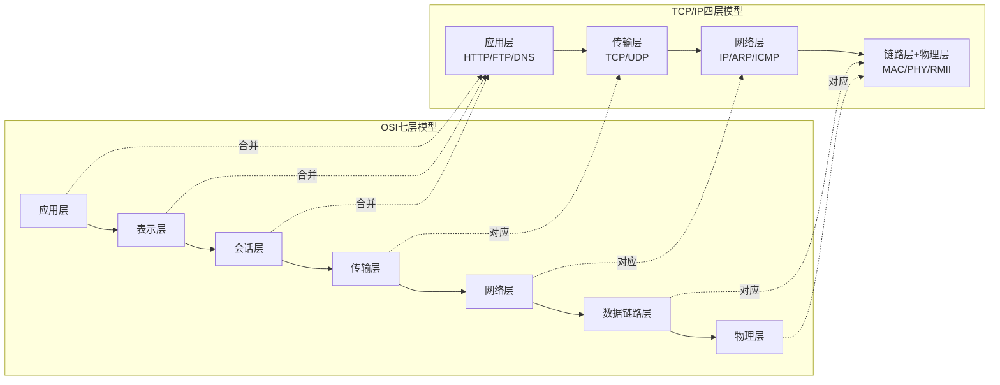
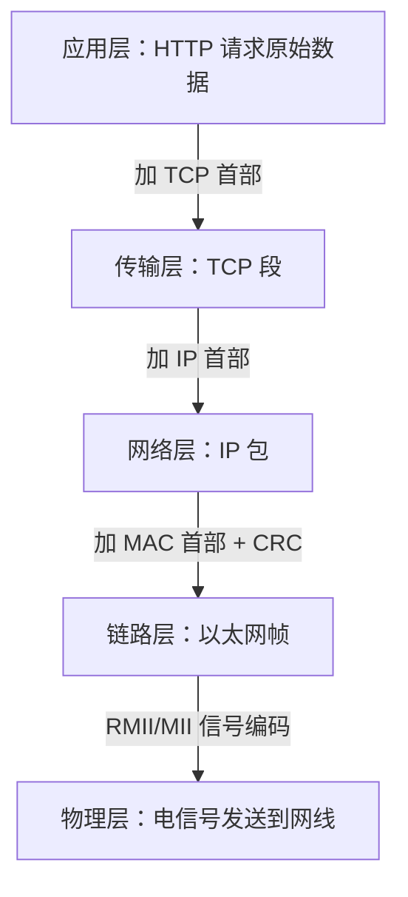

# 网络分层模型与数据封装

> [!NOTE]
> 本笔记为以太网基础知识体系中的理论基石笔记，覆盖 OSI 七层模型与 TCP/IP 四层模型的对应关系，以及数据从应用层逐层加包头最终通过物理层发送出去的完整封装过程。

---

## 1. 核心概念

网络分层模型的本质是**职责分离**——将复杂的网络通信问题拆分为多个独立的层次，每层只关心自己的任务，对上层提供服务接口，对下层传递数据。数据在发送时逐层"加壳"（封装），在接收时逐层"剥壳"（解封装），就像寄快递时反复套包装盒一样。

---

## 2. 原理详解

### 2.1 OSI 七层 vs TCP/IP 四层模型

OSI 模型是理论标准，TCP/IP 模型是工程实践。两者的映射关系如下：



| TCP/IP 层次 | OSI 对应层 | 核心职责 | 嵌入式中的关键协议 |
|---|---|---|---|
| **应用层** | 应用+表示+会话 | 用户数据与业务逻辑 | HTTP、DNS、MQTT |
| **传输层** | 传输层 | 端到端通信，端口寻址 | TCP、UDP |
| **网络层** | 网络层 | 路由寻址，IP 地址 | IP、ARP、ICMP |
| **链路层+物理层** | 链路+物理 | 帧封装与信号传输 | MAC 帧、RMII/MII |

> [!TIP]
> 嵌入式以太网开发实际只涉及 **4 个层次**。理解 TCP/IP 四层模型比死记 OSI 七层更有实战价值。

---

### 2.2 逐层封装：发送时的"加壳"过程

当你在单片机上发送一个 HTTP 请求时，数据经历了以下封装过程：



每一层只在自己的数据前面加上一个**首部（Header）**：

| 封装阶段 | 添加的首部 | 首部大小 | 关键字段 |
|---|---|---|---|
| 传输层 | TCP 首部 | 20 字节（最小） | 源端口、目的端口、序列号 |
| 网络层 | IP 首部 | 20 字节（最小） | 源 IP、目的 IP、协议号 |
| 链路层 | MAC 首部 + CRC | 14 + 4 = 18 字节 | 目的 MAC、源 MAC、类型 |

最终在网线上传输的以太网帧结构：

```
| MAC首部(14B) | IP首部(20B) | TCP首部(20B) | 应用数据(NB) | CRC(4B) |
```

> [!TIP]
> 首部结构体在 C 语言中的映射必须使用 **packed 属性**，否则填充字节会导致字段错位。详见 [[结构体内存对齐与消除填充#以太网 MAC 首部惨案|结构体内存对齐与消除填充]]。

---

### 2.3 逐层解封装：接收时的"剥壳"过程

接收是封装的逆过程。MAC 控制器收到帧后：

1. **链路层**：DMA 将帧写入缓冲区 → CPU 判断 MAC 首部中的 **type 字段**（0x0800=IP, 0x0806=ARP）
2. **网络层**：剥去 MAC 首部 → 解析 IP 首部 → 判断 **protocol 字段**（6=TCP, 17=UDP, 1=ICMP）
3. **传输层**：剥去 IP 首部 → 解析 TCP/UDP 首部 → 根据**目的端口**分发到对应回调
4. **应用层**：剥去传输层首部 → 得到原始应用数据

```c
/* 接收帧的逐层剥离示例 */
struct eth_hdr *mac = (struct eth_hdr *)buffer;
if (ntohs(mac->type) == 0x0800) {         /* 判断是否为 IP 包 */
    struct ip_hdr *ip = (struct ip_hdr *)(buffer + 14);
    if (ip->protocol == 6) {              /* 判断是否为 TCP */
        struct tcp_hdr *tcp = (struct tcp_hdr *)(buffer + 14 + 20);
        uint8_t *payload = buffer + 14 + 20 + 20;
        /* payload 即为应用数据 */
    }
}
```

> [!CAUTION]
> 上述代码中 `ntohs(mac->type)` 和 IP/TCP 首部中的多字节字段都需要字节序转换——网络字节是大端序，单片机是小端序。详见 [[大小端无缝转换机制#核心转换函数与宏|大小端无缝转换机制]]。

---

### 2.4 嵌入式开发实际涉及的层次

在单片机以太网开发中，你不会直接操作 OSI 的表示层或会话层。实际工作集中在以下三层：

- **链路层**：配置 MAC 初始化、DMA 描述符、PHY 接口（硬件层工作）
- **网络层+传输层**：配置 IP 地址、注册 ARP/ICMP/TCP/UDP 回调（协议栈配置工作）
- **应用层**：在回调函数中处理业务数据（应用逻辑工作）

LwIP 协议栈已经帮你处理了链路层到传输层的全部细节，你只需配置 netif 和注册回调。

---

## 总结速查

- **TCP/IP 四层模型**（应用/传输/网络/链路）是嵌入式以太网开发的实际层次框架
- **封装**是发送时逐层加首部（TCP→IP→MAC），**解封装**是接收时逐层剥首部
- 每层首部都有**类型/协议字段**用于向上层分发：MAC.type→IP.protocol→TCP/UDP.port
- 首部结构体映射需要 **packed 属性**消除填充字节，多字节字段需要 **ntohs/htons** 转换字节序
- 嵌入式开发实际只涉及链路层配置+协议栈配置+应用层回调三块工作

---

## 待深入 / 遗留疑问

- [ ] VLAN 标签（802.1Q）在 MAC 首部中如何插入？对帧长度和解析有何影响？
- [ ] IPv6 首部结构（40 字节固定）与 IPv4 首部有何关键差异？对嵌入式资源占用的影响？
- [ ] jumbo frame（超长帧）对 MTU 和 DMA 缓冲区设计的影响？

---

## 关联笔记

- [[04_ARP与ICMP协议#ARP 请求与应答流程|ARP与ICMP协议]] — 网络层的两个辅助协议如何配合 IP 工作
- [[06_TCP协议与可靠传输#三次握手流程|TCP协议与可靠传输]] — 传输层的可靠连接机制
- [[07_UDP协议与无连接通信#UDP 首部结构|UDP协议与无连接通信]] — 传输层的轻量替代方案
- [[结构体内存对齐与消除填充#以太网 MAC 首部惨案|结构体内存对齐与消除填充]] — 各层首部结构体必须 packed 的根本原因
- [[MAC初始化与DMA描述符#DMA 描述符环形队列|MAC初始化与DMA描述符]] — 链路层帧接收的硬件搬运机制
