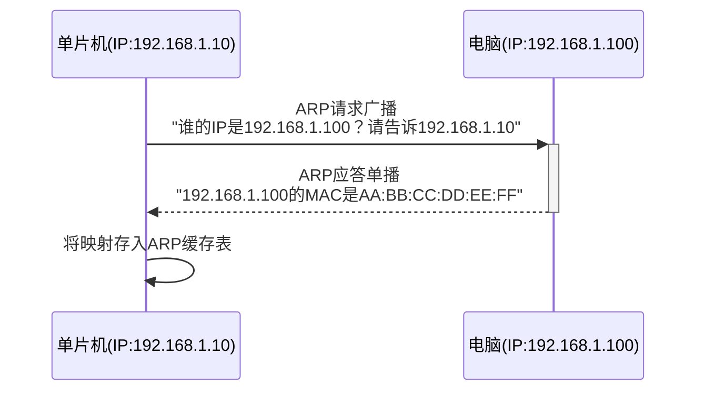

# ARP与ICMP协议

> [!NOTE]
> 本笔记为以太网基础知识体系中的网络层辅助协议笔记，覆盖 ARP（IP→MAC地址解析）和 ICMP（Ping连通性测试）的工作原理与报文结构。

---

## 1. 核心概念

**ARP**（Address Resolution Protocol）解决的是"我知道对方的 IP 地址，但不知道它的 MAC 地址"的问题——在网络中，MAC 地址才是帧投递的实际门牌号，IP 地址只是逻辑标识。**ICMP**（Internet Control Message Protocol）则是 IP 协议的"报信使者"，最常见的用途就是 **Ping** 命令——测试网络是否连通。

---

## 2. 原理详解

### 2.1 ARP 请求与应答流程

当单片机需要向同一局域网内的目标 IP 发送数据时，它必须先知道目标的 MAC 地址。ARP 的工作流程如下：



- **ARP 请求**：以广播帧发送（目的 MAC = FF:FF:FF:FF:FF:FF），所有局域网设备都会收到
- **ARP 应答**：只有匹配 IP 的设备回复，以单播帧发送（目的 MAC = 请求者的 MAC）

---

### 2.2 ARP 缓存表与老化机制

单片机每次通过 ARP 获得一个 IP→MAC 映射后，会将其存入**ARP 缓存表（ARP Table）**，避免每次发送都重复请求。但映射关系不是永久的——如果目标设备的 MAC 地址变了（换网卡），缓存的旧映射会导致帧投递失败。因此 ARP 表项设有**老化超时**（典型值 10 分钟），超时后自动删除，下次发送时重新 ARP 请求。

```c
/* ARP 缓存表项结构（简化） */
struct arp_entry {
    uint32_t ip_addr;       /* 目标 IP 地址 */
    uint8_t  mac_addr[6];   /* 对应的 MAC 地址 */
    uint8_t  state;         /* 状态：EMPTY / PENDING / STABLE */
    uint32_t age;           /* 老化计时器 */
};
```

> [!WARNING]
> **陷阱**：如果 ARP 请求发出后无人应答（目标设备离线或不在同一子网），协议栈会挂起等待。在裸机 NO_SYS 模式下，这可能导致发送任务阻塞。LwIP 会自动重试并最终返回超时错误。

---

### 2.3 ARP 与 ICMP 报文结构

**ARP 报文结构**（28 字节固定长度）：

```c
struct __attribute__((packed)) arp_hdr {
    uint16_t htype;     /* 硬件类型：1=以太网 */
    uint16_t ptype;     /* 协议类型：0x0800=IPv4 */
    uint8_t  hlen;      /* 硬件地址长度：6 */
    uint8_t  plen;      /* 协议地址长度：4 */
    uint16_t oper;      /* 操作：1=请求, 2=应答 */
    uint8_t  sha[6];    /* 发送方 MAC 地址 */
    uint32_t spa;       /* 发送方 IP 地址（网络字节序） */
    uint8_t  tha[6];    /* 目标 MAC 地址 */
    uint32_t tpa;       /* 目标 IP 地址（网络字节序） */
};
```

**ICMP Echo 报文结构**（Ping 使用的请求/应答）：

```c
struct __attribute__((packed)) icmp_echo_hdr {
    uint8_t  type;      /* 8=Echo Request, 0=Echo Reply */
    uint8_t  code;      /* 0=无额外代码 */
    uint16_t chksum;    /* 校验和 */
    uint16_t id;        /* 标识符（匹配请求与应答） */
    uint16_t seqno;     /* 序列号（每发一次Ping递增） */
};
```

> [!TIP]
> 上述结构体均使用 **packed 属性**消除填充字节，且多字节字段（htype、ptype、oper、spa、tpa、chksum、id、seqno）都以**网络字节序（大端）**存储，读取时需用 ntohs 转换。详见 [[大小端无缝转换机制#核心转换函数与宏|大小端无缝转换机制]] 和 [[结构体内存对齐与消除填充#以太网 MAC 首部惨案|结构体内存对齐与消除填充]]。

---

### 2.4 ICMP 在嵌入式中的实用场景

1. **Ping 连通性测试**：单片机启动后向电脑发送 ICMP Echo Request，收到 Reply 即确认链路+协议栈工作正常——这是以太网例程调试的**第一步**
2. **网络诊断**：ICMP Destination Unreachable（目标不可达）消息可以帮助判断路由或端口问题
3. **LwIP 内置 ICMP**：默认开启，收到 Echo Request 会自动回复 Echo Reply，无需手动编码

---

## 3. 深度补充：免费 ARP（Gratuitous ARP）

初学者往往只知道 ARP 是"问别人要 MAC 地址"的协议，但忽略了一种特殊形式——**免费 ARP（Gratuitous ARP）**。

免费 ARP 是指：**单片机在系统启动时或 IP 更新后，主动向整个局域网广播自己的 IP→MAC 映射。**
特征是：**发送方 IP = 目标 IP**（查询自己），目标 MAC = FF:FF:FF:FF:FF:FF（广播）。

免费 ARP 有三大用途：
1. **IP 冲突检测**：如果有人应答了这个广播，说明局域网中已有设备使用了相同的 IP，存在冲突。
2. **更新邻居的 ARP 缓存**：当单片机更换了 MAC 地址或重新配置了 IP 后，广播可以让局域网中所有设备的 ARP 表及时刷新，避免它们持有过期映射。
3. **加速首次通信**：其他设备收到免费 ARP 后，提前把单片机的 IP→MAC 写入本地缓存，单片机发起通信时无需等待额外的 ARP 请求-应答往返延迟。

> [!TIP]
> LwIP 在 `netif_set_up()` 被调用后，会自动发出一个免费 ARP 广播，通知局域网"我上线了"。这就是为什么单片机启动时，Wireshark 的第一个捕获包通常是一个"Who has 192.168.1.10? Tell 192.168.1.10"的奇怪 ARP 请求——发送方和查询的都是自己。

## 4. 深度补充：ICMP 校验和的计算原理

ICMP 报文中有一个 16 位的 **chksum 校验和字段**，这是初学者容易忽略但发送时必须正确填写的字段——如果校验和错误，接收方会直接丢弃这个 ICMP 包（Ping 不通），且不会有任何错误提示。

**计算规则（RFC 1071 标准）**：
1. 将整个 ICMP 报文（首部+数据）看作若干个 16 位整数序列
2. 将所有 16 位整数进行**反码求和**（即带进位的累加，高位进位回绕加到最低位）
3. 将求和结果取反，即为最终的 checksum 值

```c
uint16_t inet_checksum(void *data, uint16_t len) {
    uint16_t *buf = (uint16_t *)data;
    uint32_t sum = 0;
    
    /* 1. 将所有 16 位块累加（包含进位） */
    while (len > 1) {
        sum += *buf++;
        len -= 2;
    }
    /* 2. 如果有奇数字节，最后补 0 凑成 16 位 */
    if (len == 1) {
        sum += *(uint8_t *)buf;
    }
    /* 3. 将 32 位和的高 16 位（进位）折叠到低 16 位 */
    sum = (sum >> 16) + (sum & 0xFFFF);
    sum += (sum >> 16);
    /* 4. 取反 */
    return (uint16_t)(~sum);
}
```

> [!TIP]
> **验证技巧**：校验和的一个美妙特性是——如果你对含有正确 checksum 的整个报文再做一次反码求和，结果应该是 **0xFFFF**（全 1）。这可以用来验证接收到的 ICMP 报文是否完整无误。

---

## 总结速查

- **ARP** 解决 IP→MAC 地址映射：请求广播、应答单播，结果缓存在 ARP 表中并设老化超时
- **ARP 报文**28 字节固定长度，含发送方/目标的 IP+MAC，oper 字段区分请求(1)/应答(2)
- **ICMP** 是 IP 协议的报信使者，**Ping** 使用 ICMP Echo Request(类型8)/Reply(类型0)测试连通性
- 报文结构体均需 **packed 属性**，多字节字段需 **ntohs/htons** 转换字节序
- LwIP 默认内置 ICMP 自动回复，Ping 例程是调试以太网的第一步

---

## 待深入 / 遗留疑问

- [ ] ARP 伪造攻击（ARP Spoofing）在嵌入式局域网中是否存在风险？如何防范？
- [ ] gratuitous ARP（免费ARP）在单片机启动时主动广播自身 IP→MAC 的作用与时机？
- [ ] ICMP Redirect 消息对嵌入式路由的影响？

---

## 关联笔记

- [[05_IP协议与寻址#IPv4 首部结构|IP协议与寻址]] — ARP 为 IP 协议提供 MAC 地址解析服务
- [[大小端无缝转换机制#核心转换函数与宏|大小端无缝转换机制]] — ARP/ICMP 报文中多字节字段字节序转换
- [[结构体内存对齐与消除填充#以太网 MAC 首部惨案|结构体内存对齐与消除填充]] — 报文结构体必须 packed 的原因
- [[09_以太网例程实操指南#Ping 例程|以太网例程实操指南]] — Ping 例程是 ARP/ICMP 的第一步实操验证
