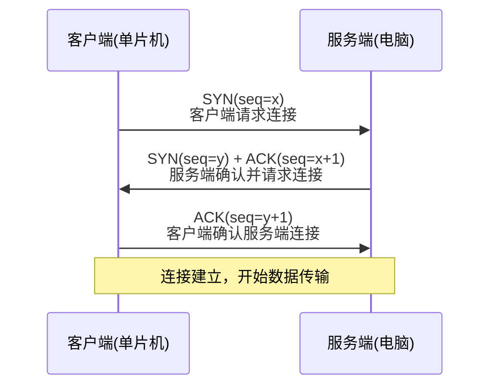
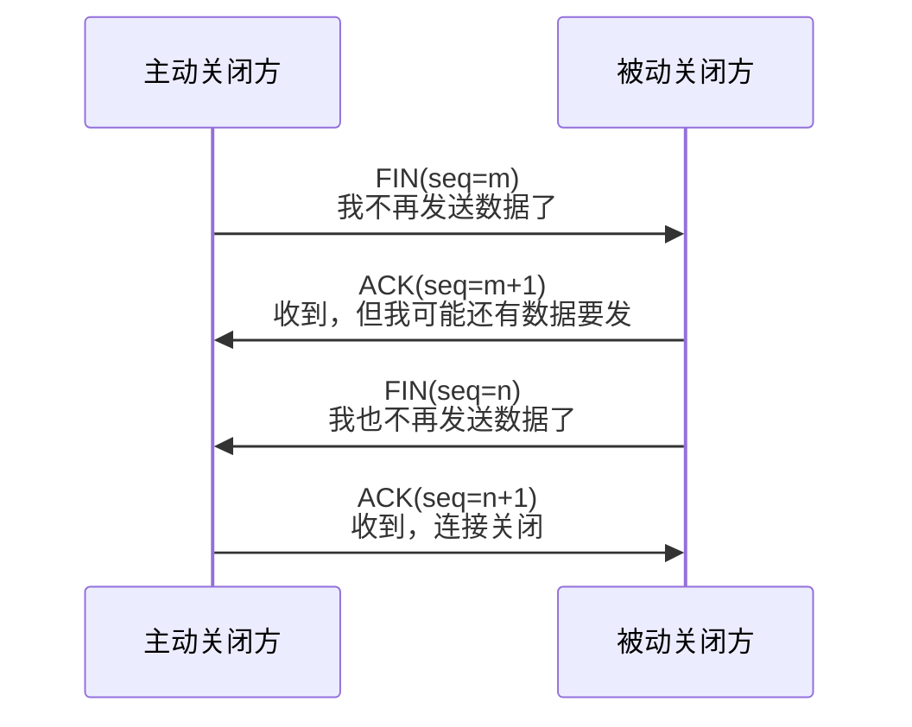

# TCP协议与可靠传输

> [!NOTE]
> 本笔记为以太网基础知识体系中的传输层核心笔记，覆盖 TCP 的面向连接机制、三次握手/四次挥手流程、滑动窗口以及嵌入式中的 TCP RAW API 使用方式。

---

## 1. 核心概念

TCP（Transmission Control Protocol）是 TCP/IP 协议栈中**最复杂的传输层协议**——它提供面向连接、可靠、全双工的数据传输服务。可靠性的代价是：建立连接需要三次握手，断开连接需要四次挥手，传输过程中需要序列号、确认号、重传机制和滑动窗口流量控制。在嵌入式以太网中，TCP 是 HTTP、MQTT 等应用层协议的承载体。

---

## 2. 原理详解

### 2.1 三次握手流程

TCP 连接建立必须经过三次握手，确保双方都确认了对方的发送和接收能力：



**握手过程解读**：
1. **SYN**：客户端发送同步请求，携带初始序列号 x
2. **SYN+ACK**：服务端确认客户端的 SYN（ack=x+1），同时发送自己的 SYN（seq=y）
3. **ACK**：客户端确认服务端的 SYN（ack=y+1）

> [!TIP]
> 在 LwIP RAW API 模式下，三次握手由协议栈自动完成。你只需调用 `tcp_connect(pcb, &ipaddr, port, connected_callback)` 注册连接成功回调。

---

### 2.2 四次挥手流程

TCP 是全双工连接，每个方向需要独立关闭，因此断开需要四次挥手：



**为什么不能三次？** 因为被动关闭方在收到 FIN 后，可能还有未发送完的数据。它先回 ACK 表示"收到了你的关闭请求"，等自己的数据发完后再发 FIN。这两步不能合并。

---

### 2.3 滑动窗口与流量控制

TCP 通过**滑动窗口（Sliding Window）**实现流量控制，防止发送方速度过快淹没接收方：

- 发送方维护一个**发送窗口**：只有落在窗口内的数据段才允许发送
- 接收方在每个 ACK 中携带**窗口大小（win）**：告诉发送方"我还能接收多少字节"
- 窗口动态滑动：收到 ACK 后窗口右移，允许发送新数据

> [!WARNING]
> **嵌入式关键陷阱**：TCP 回调中收到数据后，**必须调用 `tcp_recved(pcb, len)` 通知协议栈已处理完毕**，否则接收窗口永远不会更新，发送方会停止发送！这是初学者最常见的 Bug。

---

### 2.4 TCP 首部结构

TCP 首部固定 **20 字节**（最大 60 字节含选项）：

```c
struct __attribute__((packed)) tcp_hdr {
    uint16_t src_port;   /* 源端口 */
    uint16_t dest_port;  /* 目的端口 */
    uint32_t seqno;      /* 序列号：本段数据首字节的编号 */
    uint32_t ackno;      /* 确认号：期望收到的下一个序列号 */
    uint16_t hdrlen_flags; /* 首部长度(4bit)*4 + 保留(6bit) + 标志位(6bit) */
    uint16_t wnd;        /* 窗口大小：接收方还能接收的字节数 */
    uint16_t chksum;     /* 校验和 */
    uint16_t urgent_ptr; /* 紧急指针（一般不使用） */
};
```

**关键标志位**（在 hdrlen_flags 的低 6 位）：

| 标志 | 名称 | 含义 |
|---|---|---|
| **SYN** | 同步 | 请求建立连接 |
| **ACK** | 确认 | 确认号有效 |
| **FIN** | 结束 | 请求关闭连接 |
| **RST** | 重置 | 异常断开连接 |
| **PSH** | 推送 | 请求接收方立即交付数据 |
| **URG** | 紧急 | 紧急指针有效 |

---

### 2.5 嵌入式中的 TCP 使用：LwIP RAW API

在裸机 NO_SYS 模式下，TCP 使用 **RAW API**（回调驱动）：

```c
/* TCP Client 连接示例 */
struct tcp_pcb *pcb = tcp_new();
tcp_connect(pcb, &dest_ip, 80, on_connected);

/* 连接成功回调 */
err_t on_connected(void *arg, struct tcp_pcb *pcb, err_t err) {
    tcp_recv(pcb, on_recv);      /* 注册接收回调 */
    tcp_sent(pcb, on_sent);      /* 注册发送完成回调 */
    tcp_write(pcb, data, len, 0); /* 发送数据 */
    return ERR_OK;
}

/* 接收回调 */
err_t on_recv(void *arg, struct tcp_pcb *pcb, struct pbuf *p, err_t err) {
    if (p != NULL) {
        /* 处理接收数据 */
        tcp_recved(pcb, p->tot_len); /* 必须调用！更新窗口 */
        pbuf_free(p);
    }
    return ERR_OK;
}
```

> [!CAUTION]
> 回调函数中**绝对禁止阻塞操作**（延时、等待信号量）。回调在中断或协议栈主循环中执行，阻塞会导致整个系统死锁。详见 [[回调函数与函数指针的事件驱动模型#回调函数的上下文安全性|回调函数与函数指针的事件驱动模型]]。

---

## 3. 深度补充：TCP 重传机制（RTO）

TCP 可靠性的核心秘密在于：**发出去的每个字节，如果对方没有确认（ACK），就会在一段时间后自动重发**。这个超时时间称为 **RTO（Retransmission Timeout，重传超时时间）**。

### 3.1 RTO 的动态计算

RTO 不是一个固定值，而是根据网络实时状况动态计算的。TCP 实时测量每次发送到收到 ACK 的往返时延 **RTT（Round-Trip Time）**，然后用指数加权平均来估算下一次的 RTO：

```
SRTT  = α * SRTT + (1 - α) * RTT_sample   // 平滑RTT，α通常取7/8
RTTVAR = β * RTTVAR + (1 - β) * |SRTT - RTT_sample| // RTT方差，β通常取3/4
RTO = SRTT + 4 * RTTVAR                    // 最终RTO
```

**嵌入式关键影响**：
- 如果 `sys_check_timeouts()` 调用间隔过大，RTT 计算误差增大，RTO 会偏保守（偏大），导致重传延迟增加，TCP 性能下降。
- LwIP 中 RTO 的最小值由 **TCP_SLOW_INTERVAL**（默认 500ms）决定，在局域网环境中这个值偏大，可适当调小。

### 3.2 LwIP 中的两个关键（却常被忽视）回调

在前面的 TCP 代码骨架中，我们只展示了 `tcp_recv` 和 `tcp_sent`。但在生产代码中，另外两个回调几乎是**必须注册**的：

**tcp_err 回调（错误处理）**：
当 TCP 连接发生不可恢复的错误时（如对方 RST 强制断开、内存不足导致连接被迫关闭），LwIP 会调用 `tcp_err` 回调，并自动释放 PCB。

```c
void on_tcp_err(void *arg, err_t err) {
    struct my_app_state *state = (struct my_app_state *)arg;
    /* 注意：此时 PCB 已被 LwIP 自动释放，不要再调用 tcp_close */
    state->pcb = NULL;   /* 将本地 PCB 指针置空，防止后续访问野指针 */
    state->connection_alive = 0;
    /* 可以在这里触发重连逻辑 */
}
// 注册方式：
tcp_err(pcb, on_tcp_err);
```

> [!CAUTION]
> **野指针陷阱**：如果不注册 `tcp_err`，或者在 err 回调中忘记将本地 PCB 指针清零，程序在连接断开后继续用已被释放的 PCB 调用 `tcp_write` 等函数，会导致访问野指针，引发 **HardFault**。

**tcp_poll 回调（超时轮询）**：
LwIP 会按固定时间间隔调用 `tcp_poll`，用于实现**应用层的心跳/超时检测**：

```c
err_t on_tcp_poll(void *arg, struct tcp_pcb *pcb) {
    struct my_app_state *state = (struct my_app_state *)arg;
    state->idle_counter++;
    if (state->idle_counter > 10) {  /* 超过10个轮询间隔无数据 */
        tcp_abort(pcb);              /* 强制关闭连接 */
        return ERR_ABRT;
    }
    return ERR_OK;
}
// 注册方式（第3个参数是每几个TCP慢定时器间隔触发一次，即500ms * N）：
tcp_poll(pcb, on_tcp_poll, 4);  /* 每 4 * 500ms = 2秒触发一次 */
```

---

## 总结速查

- **TCP** 是面向连接、可靠、全双工的传输层协议，代价是三次握手+四次挥手+序列号确认+滑动窗口
- **三次握手**：SYN→SYN+ACK→ACK，建立连接；**四次挥手**：FIN→ACK→FIN→ACK，独立关闭每个方向
- **滑动窗口**实现流量控制：接收方用 win 字段告知发送方可接收字节数
- **嵌入式关键陷阱**：回调中必须调用 **tcp_recved** 更新窗口，否则对方停止发送
- **RAW API** 所有操作通过注册回调函数完成，回调中禁止阻塞操作

---

## 待深入 / 遗留疑问

- [ ] TCP 重传机制（RTO 计算）在嵌入式低带宽场景下如何调优？
- [ ] TIME_WAIT 状态在单片机（资源极度受限）下如何处理？是否可跳过？
- [ ] RTOS 模式下 Netconn/Socket API 与 RAW API 的性能差异实测？

---

## 关联笔记

- [[07_UDP协议与无连接通信#TCP 与 UDP 对比|UDP协议与无连接通信]] — TCP vs UDP 核心对比对象
- [[05_IP协议与寻址#IPv4 首部结构|IP协议与寻址]] — TCP 承载于 IP 之上（proto=6）
- [[回调函数与函数指针的事件驱动模型#LwIP 中的回调函数实战|回调函数与函数指针的事件驱动模型]] — RAW API 回调注册机制详解
- [[以太网例程实操指南#TCP Client 与 TCP Server|以太网例程实操指南]] — TCP Client/Server 例程代码对照
- [[Wireshark抓包实战#TCP 三次握手观测|Wireshark抓包实战]] — 抓包验证握手序列号
