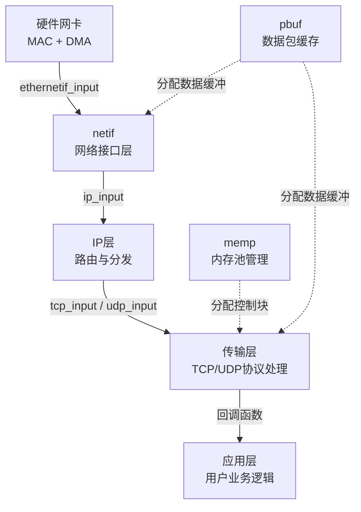

# LwIP协议栈架构

> [!NOTE]
> 本笔记为以太网基础知识体系中的软件栈架构笔记，覆盖 LwIP 的定位与三种 API 模式、核心模块架构以及初始化流程。memp/pbuf/回调机制的底层原理通过双链引用前置知识笔记，不自建详解内容。

---

## 1. 核心概念

LwIP（Lightweight IP）是专为嵌入式资源受限环境设计的**轻量级 TCP/IP 协议栈**——其核心设计目标是在仅十几 KB RAM 的 MCU 上也能跑完整的网络协议。LwIP 通过静态内存池（memp）替代 malloc、链表式数据包缓存（pbuf）替代连续缓冲区、回调驱动替代阻塞轮询，将协议栈的 RAM 占用压缩到极致。

---

## 2. 原理详解

### 2.1 三种 API 模式对比

LwIP 提供三种应用层接口，按资源消耗从低到高排列：

| API 模式 | 触发方式 | 资源消耗 | 适用场景 | 关键特征 |
|---|---|---|---|---|
| **RAW API** | 回调函数 | 最低（裸机首选） | NO_SYS=1 无 RTOS | 事件驱动，无阻塞，所有操作在回调中完成 |
| **Netconn API** | RTOS 线程+信号量 | 中等 | 有 FreeRTOS 等操作系统 | 线程间通信，可阻塞等待 |
| **Socket API** | POSIX socket 接口 | 最高（最易上手） | 有 RTOS，需要移植兼容性 | 标准 socket() / bind() / send() 接口 |

> [!TIP]
> **嵌入式裸机必选 RAW API**——它不依赖任何 RTOS 机制，仅通过函数指针回调驱动。代价是代码风格完全不同传统 socket 编程，需要理解 [[回调函数与函数指针的事件驱动模型#LwIP 中的回调函数实战|回调函数与函数指针的事件驱动模型]]。

---

### 2.2 核心架构四模块

LwIP 的核心由四个模块协作驱动，数据流如下：



#### netif：网络接口层

**netif** 是 LwIP 与底层硬件的桥梁——每个 netif 实例代表一个物理网卡，包含：

```c
struct netif {
    ip_addr_t ip_addr;       /* 本接口的 IP 地址 */
    ip_addr_t netmask;       /* 子网掩码 */
    ip_addr_t gw;            /* 默认网关 */
    netif_input_fn input;    /* 接收函数：从 DMA 缓冲区取帧送入协议栈 */
    netif_output_fn output;  /* 发送函数：将协议栈组装的帧交给 DMA 发送 */
    void *state;             /* 用户自定义状态指针（存放硬件私有数据） */
    /* ...其他成员省略 */
};
```

- **input 函数**：通常为 `ethernetif_input`，从 DMA 接收缓冲区取帧，解析 MAC 首部后调用 `ip_input` 或 `arp_input`
- **output 函数**：通常为 `low_level_output`，将协议栈组装好的帧写入 DMA 发送描述符

> [!TIP]
> netif 的 input/output 函数是连接**硬件层**与**协议栈层**的关键纽带。理解这两个函数的数据流向，就理解了 LwIP 的整体数据通路。

#### memp：内存池管理

LwIP 使用静态预分配的固定大小内存池替代 malloc，保证 O(1) 分配/释放且永不碎片。**底层原理详见 [[零碎片内存池与动态数据包缓存机制#LwIP 静态内存池（memp）|零碎片内存池与动态数据包缓存]]**。

关键池类型：
- **TCP_PCB**：TCP 连接控制块，每个活跃 TCP 连接占用一个
- **UDP_PCB**：UDP 控制块
- **PBUF_POOL**：接收数据包缓冲

#### pbuf：数据包缓存

pbuf 通过链表将分散内存块逻辑串联为完整数据包，支持不定长负载并实现 Zero-Copy。**底层原理详见 [[零碎片内存池与动态数据包缓存机制#pbuf：以太网的灵魂数据结构|零碎片内存池与动态数据包缓存]]**。

#### 回调驱动模型

LwIP RAW API 的所有业务逻辑通过注册回调函数完成（tcp_recv、tcp_accept、udp_recv 等）。**底层原理详见 [[回调函数与函数指针的事件驱动模型#LwIP 中的回调函数实战|回调函数与函数指针的事件驱动模型]]**。

---

### 2.3 LwIP 初始化流程

裸机模式下 LwIP 的初始化需按以下严格顺序执行：

```c
/* 1. 协议栈全局初始化 */
lwip_init();

/* 2. 创建并配置 netif */
ip4_addr_t ipaddr, netmask, gw;
IP4_ADDR(&ipaddr,  192, 168, 1, 10);
IP4_ADDR(&netmask, 255, 255, 255, 0);
IP4_ADDR(&gw,      192, 168, 1, 1);

netif_add(&netif, &ipaddr, &netmask, &gw, NULL,
          ethernetif_init,   /* 底层硬件初始化函数 */
          ethernet_input);   /* 帧接收入口函数 */

/* 3. 设为默认网卡并启用 */
netif_set_default(&netif);
netif_set_up(&netif);

/* 4. 主循环中周期调用协议栈定时器 */
while (1) {
    ethernetif_input(&netif);  /* 检查是否有新帧到达 */
    sys_check_timeouts();      /* 处理协议栈内部定时器（ARP老化、TCP重传等） */
}
```

> [!IMPORTANT]
> **sys_check_timeouts()** 是裸机模式的"心跳"——它驱动 ARP 老化、TCP 重传、DHCP 续租等所有定时任务。如果不周期调用，TCP 连接会因为重传超时而断开。

---

## 总结速查

- **LwIP** 是专为嵌入式设计的轻量级协议栈，RAM 占用仅十几 KB
- **RAW API**（回调驱动）是裸机首选，不依赖 RTOS，资源消耗最低
- **netif** 是硬件与协议栈的桥梁，input 函数取帧入栈，output 函数发帧出栈
- **memp/pbuf/回调**的底层原理不自建详解，通过双链引用前置知识笔记（遵循 DRY）
- 初始化流程：lwip_init → netif_add → netif_set_default → netif_set_up → 主循环调用 ethernetif_input + sys_check_timeouts

---

## 待深入 / 遗留疑问

- [ ] sys_check_timeouts 的调用频率对 TCP 重传和 ARP 老化有何影响？最佳间隔是多少？
- [ ] LwIP 配置文件（lwipopts.h）的关键参数调优：MEM_SIZE、MEMP_NUM_TCP_PCB、PBUF_POOL_SIZE 等？
- [ ] 多 netif（双网口）场景下的路由策略与 IP 地址分配？

---

## 关联笔记

- [[回调函数与函数指针的事件驱动模型#LwIP 中的回调函数实战|回调函数与函数指针的事件驱动模型]] — RAW API 回调注册机制详解
- [[零碎片内存池与动态数据包缓存机制#pbuf：以太网的灵魂数据结构|零碎片内存池与动态数据包缓存]] — memp/pbuf 底层原理
- [[01_MAC初始化与DMA描述符#DMA 描述符环形队列|MAC初始化与DMA描述符]] — netif 底层对接 DMA 接收
- [[06_TCP协议与可靠传输#嵌入式中的 TCP 使用|TCP协议与可靠传输]] — LwIP 中 TCP RAW API 的使用方式
- [[09_以太网例程实操指南]] — 实际例程中 LwIP 初始化代码对照
