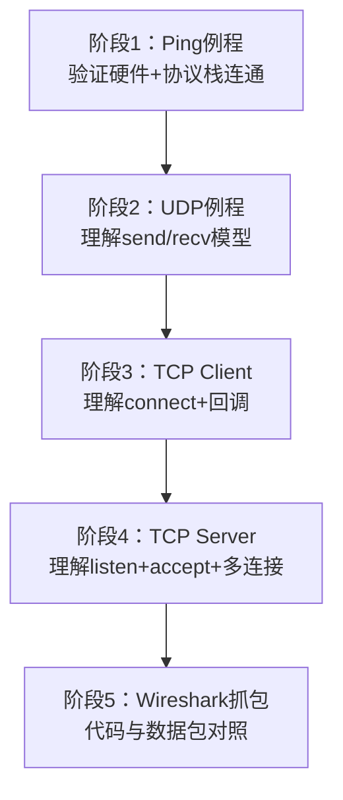

# 以太网例程实操指南

> [!NOTE]
> 本笔记为以太网基础知识体系中的实操进阶笔记，覆盖从 Ping 到 TCP Server 的渐进实践路径、每个阶段的核心代码阅读要点以及常见初学者陷阱。

---

## 1. 核心概念

以太网例程的学习必须遵循**由浅入深**的渐进路径——先验证硬件+协议栈基本工作（Ping），再理解最简通信模型（UDP），最后掌握连接管理的复杂逻辑（TCP Client → TCP Server）。每个阶段只关注一个核心概念，避免一次性消化过多信息。

---

## 2. 原理详解

### 2.1 渐进实践路线



---

### 2.2 Ping 例程（ICMP 连通性测试）

Ping 例程是调试以太网的**第一步**——如果 Ping 不通，后续所有协议都不会工作。

**核心代码阅读要点**：
1. **lwip_init()** 和 **netif_add/netif_set_up** 是否正确完成——IP 地址、MAC 地址、网关是否配对
2. **主循环**是否周期调用 **ethernetif_input()** 和 **sys_check_timeouts()**
3. **PHY 链路状态**是否已检测到 Link Up——如果网线未连接，ARP 请求不会发出

> [!WARNING]
> **常见陷阱**：网线未连接就尝试 Ping——先通过 SMI 读 PHY 的 BMSR 寄存器确认 Link Up。详见 [[MAC与PHY硬件接口#SMI 管理接口：MDIO/MDC|MAC与PHY硬件接口]]。

---

### 2.3 UDP 例程

UDP 例程是最简 Socket 编程模型——没有握手过程，理解 send/recv 即可。

**核心代码阅读要点**：
1. **udp_new()** 创建 UDP 控制块
2. **udp_bind(pcb, IP_ADDR_ANY, port)** 绑定本地监听端口
3. **udp_recv(pcb, callback, NULL)** 注册接收回调——回调中自动获得来源 IP+端口
4. **udp_sendto(pcb, pbuf, &dest_ip, dest_port)** 向目标发送数据

**代码骨架**：

```c
/* UDP 接收回调 */
void udp_recv_cb(void *arg, struct udp_pcb *pcb, struct pbuf *p,
                 const ip_addr_t *addr, uint16_t port) {
    /* 处理 p->payload 中的数据 */
    /* 可选：向来源回复 udp_sendto */
    pbuf_free(p);  /* 必须释放 pbuf */
}

/* UDP 初始化 */
struct udp_pcb *udp = udp_new();
udp_bind(udp, IP_ADDR_ANY, 8080);
udp_recv(udp, udp_recv_cb, NULL);
```

---

### 2.4 TCP Client 与 TCP Server

#### TCP Client（单片机主动连接）

单片机作为客户端主动向电脑发起 TCP 连接，阅读要点：
1. **tcp_new()** 创建 TCP 控制块
2. **tcp_connect(pcb, &dest_ip, port, connected_cb)** 发起连接——三次握手由协议栈自动完成
3. **connected_cb 中注册**：tcp_recv + tcp_sent + tcp_err + tcp_poll 等回调
4. **tcp_write(pcb, data, len, flags)** 发送数据
5. **recv_cb 中必须调用 tcp_recved(pcb, p->tot_len)** 更新窗口

> [!CAUTION]
> **关键陷阱**：recv 回调中忘记调用 **tcp_recved**——导致发送方窗口不更新，最终停止发送。这是 TCP 初学者最常见的 Bug。

#### TCP Server（单片机被动监听）

单片机作为服务端监听端口等待连接，比 Client 多一步 accept 流程：
1. **tcp_new()** + **tcp_bind(pcb, IP_ADDR_ANY, port)** 绑定端口
2. **tcp_listen(pcb)** 将 PCB 转为监听状态（注意：原 PCB 会被释放，返回新的 listen PCB）
3. **tcp_accept(listen_pcb, accept_cb)** 注册新连接接入回调
4. **accept_cb 中**：为新连接分配独立 PCB，注册 recv/sent/err 回调

```c
/* TCP Server accept 回调 */
err_t accept_cb(void *arg, struct tcp_pcb *newpcb, err_t err) {
    tcp_recv(newpcb, recv_cb);    /* 为新连接注册接收回调 */
    tcp_arg(newpcb, conn_state);  /* 附加连接私有状态 */
    return ERR_OK;
}
```

> [!WARNING]
> **陷阱**：tcp_listen 后原 PCB 被释放，返回的是新的 listen_pcb。后续注册 accept 回调必须用新的 listen_pcb，否则无效。

---

### 2.5 实操调试技巧

| 问题 | 检查方向 |
|---|---|
| Ping 不通 | PHY Link Up？IP 配置是否正确？网线是否连接？ |
| ARP 无应答 | 目标 IP 是否在同一子网？ARP 请求是否发出？ |
| TCP 连接超时 | dest_ip+port 是否可达？SYN 包是否发出？ |
| TCP 收不到数据 | recv_cb 是否注册？tcp_recved 是否调用？ |
| UDP 发送失败 | pbuf 分配是否成功？dest_ip 是否可达？ |

---

## 总结速查

- **渐进路线**：Ping(验证连通) → UDP(最简通信) → TCP Client(主动连接) → TCP Server(被动监听)
- **Ping** 是第一步——不通则后续全废；先检查 PHY Link Up 和 IP 配置
- **UDP** 编程极简：udp_new → udp_bind → udp_recv回调 → udp_sendto发送
- **TCP Client** 关键：tcp_connect + 回调注册 + recv 中**必须 tcp_recved**
- **TCP Server** 关键：tcp_bind → tcp_listen → tcp_accept + 为每个新连接独立注册回调

---

## 待深入 / 遗留疑问

- [ ] TCP Server 多连接并发时如何管理每个连接的 PCB 和私有状态？防止资源耗尽？
- [ ] LwIP 内存池（MEMP_NUM_TCP_PCB 等）配置与最大并发连接数的数学关系？
- [ ] 断网后 TCP 连接的保活机制（Keepalive）在嵌入式中的配置与超时策略？

---

## 关联笔记

- [[ARP与ICMP协议#ICMP Echo Request/Reply|ARP与ICMP协议]] — Ping 底层 ICMP 原理
- [[07_UDP协议与无连接通信#UDP 在嵌入式中的典型用法|UDP协议与无连接通信]] — UDP 例程 API 对照
- [[TCP协议与可靠传输#嵌入式中的 TCP 使用|TCP协议与可靠传输]] — TCP Client/Server API 对照
- [[08_LwIP协议栈架构#三种 API 模式对比|LwIP协议栈架构]] — RAW vs Socket API 选择依据
- [[Wireshark抓包实战]] — 例程运行时同步抓包验证
- [[回调函数与函数指针的事件驱动模型#回调函数的上下文安全性|回调函数与函数指针的事件驱动模型]] — TCP 回调中的阻塞禁令
