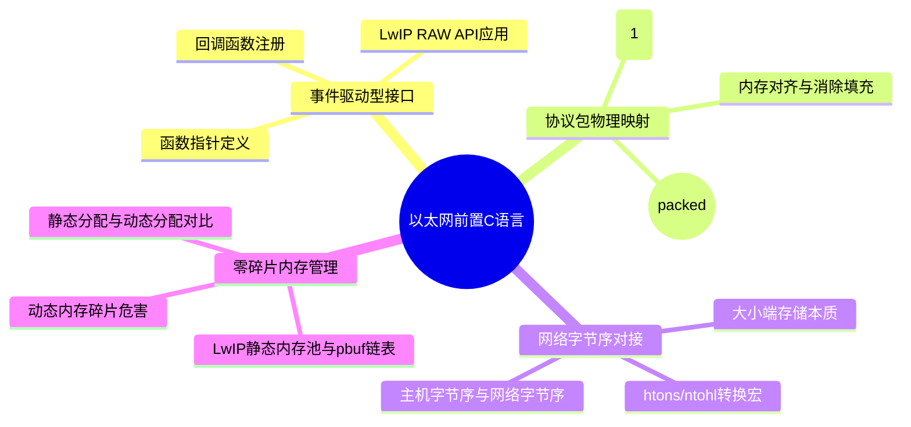

# 以太网前置 C 语言核心知识库构建计划

本计划旨在基于已掌握的嵌软 C 语言基础，针对以太网协议栈（如 **LwIP**、**WCHNET**）的架构特点，补充和构建 4 个最核心的 C 语言底层技术专题。通过本计划的实施，将为后续以太网协议栈的无痛理解与移植铺平道路。

---

## 1. 现有知识库盘点与双链接轨

在构建以太网知识库前，我们已在 **01待处理/嵌软C语言** 目录中沉淀了部分基础概念，它们与以太网专题的接轨关系如下：

* **数据包链表化存储**：以太网的底层核心 `pbuf` 结构本质上是单向/双向链表。
  * 参见已有的 [[链表/链表综合笔记.md|链表综合笔记]]。
* **内存管理基础**：理解栈区、静态区与堆区的分布，是学习协议栈内存池的基础。
  * 参见已有的 [[函数与内存管理/函数与栈和堆.md|函数与栈和堆]]。
* **数据还原与传输**：叶宇教程中提及的指针强转、大小端及结构体传输，与协议包的封包和拆包机制天然对应。
  * 参见 [[叶宇单片机教程字幕md/【叶宇单片机】—指针的应用，大小端，化整为零，化零为整—【2026-03-13】-中文.md|指针应用与大小端基础]]。
  * 参见 [[叶宇单片机教程字幕md/【叶宇单片机】—73  结构体数据的传输与还原—【2026-04-20】-中文.md|结构体数据的传输与还原]]。
  * 参见 [[叶宇单片机教程字幕md/【叶宇单片机】—74 结构体指针在函数接口处的频繁调用—【2026-04-24】-中文.md|结构体指针高频调用]]。

---

## 2. 四大核心子知识点构建规划

### 2.1 专题一：回调函数与函数指针的事件驱动模型

* **构建目标**：彻底理清以太网协议栈在无操作系统（NO_SYS=1）环境下如何通过“函数指针”实现异步事件通知。
* **核心内容**：
  1. 函数指针的基本声明与 `typedef` 别名定义。
  2. 回调函数（Callback）的注册机制：传递函数地址作为接口。
  3. LwIP 经典应用场景分析：以 RAW API 中的 `tcp_recv()`、`tcp_accept()` 以及 `tcp_sent()` 的接收和发送回调为例，解析其参数传递与调用时机。
* **双链关联**：
  * [[代码段与对应关键字/代码段与对应关键字综合笔记.md|代码段与对应关键字综合笔记]] — 关联函数生存周期与局部变量安全性。
  * [[叶宇单片机教程字幕md/【叶宇单片机】—74 结构体指针在函数接口处的频繁调用—【2026-04-24】-中文.md|结构体指针频繁调用]] — 关联回调中传递 `pcb` 及应用缓冲区指针的机制。

### 2.2 专题二：网络协议包结构体对齐与字节填充消除

* **构建目标**：解决单片机内存 4 字节自动对齐导致的“通信包解析错位”问题，确保结构体能精准映射到物理网线上传输的字节流。
* **核心内容**：
  1. 编译器默认对齐机制（Alignment）及填充（Padding）原理。
  2. 通信包对齐消除指令：GCC 中的 `__attribute__((packed))` 与 Keil MDK 中的 `#pragma pack(1)` 用法。
  3. 实战案例：使用紧凑型结构体无缝映射 **以太网首部（14字节）**、**IP首部（20字节）** 及 **TCP/UDP首部**，并进行指针强转解析。
* **双链关联**：
  * [[叶宇单片机教程字幕md/【叶宇单片机】—73  结构体数据的传输与还原—【2026-04-20】-中文.md|结构体数据的传输与还原]] — 对应结构体打包传输的基础理论。

### 2.3 专题三：大小端无缝转换（网络字节序与主机字节序）

* **构建目标**：解决网络传输的“大端字节序”与单片机 CPU（ARM / RISC-V）的“小端字节序”之间的冲突。
* **核心内容**：
  1. 大端（Big-Endian）与小端（Little-Endian）在内存中存放多字节数据的物理差异。
  2. 为什么网络协议强制要求使用大端序（网络字节序）。
  3. 字节序转换宏的原理与实现：`htons()`、`htonl()`、`ntohs()`、`ntohl()`，以及如何手写位移操作进行 16 位和 32 位整型的大小端倒转。
* **双链关联**：
  * [[叶宇单片机教程字幕md/【叶宇单片机】—指针的应用，大小端，化整为零，化零为整—【2026-03-13】-中文.md|指针应用与大小端基础]] — 继承已有的字节分解（化整为零）思想。

### 2.4 专题四：零碎片内存池与动态数据包缓存机制

* **构建目标**：搞懂协议栈如何在极度受限的单片机 RAM 中，既不使用 `malloc` 产生碎片，又能高频接收不定长度的数据包。
* **核心内容**：
  1. 传统 `malloc` 在单片机长时间运行下产生“内存碎片（Fragmentation）”导致死机的危害。
  2. LwIP 静态分配机制：`memp` 动态内存池的分块分配策略。
  3. `pbuf` 的链表化管理：四种 `pbuf` 类型（RAM、ROM、REF、POOL）的内存分布图解，以及它们是如何通过链表指针连接在一起构成完整数据包的。
* **双链关联**：
  * [[函数与内存管理/函数与栈和堆.md|函数与栈和堆]] — 关联静态堆栈管理与动态内存规避。
  * [[链表/链表综合笔记.md|链表综合笔记]] — 关联 `pbuf` 结构体的双链表断开与重链操作。

---

## 3. 关联笔记

- [[链表/链表综合笔记.md|链表综合笔记]] — 详细介绍双向链表的增删改查实现
- [[函数与内存管理/函数与栈和堆.md|函数与栈和堆]] — 详细介绍单片机内部内存物理分区
