# 位运算（综合笔记）

> [!NOTE]
> **来源**：叶宇单片机 第 30~36 集（共 7 集整合）
> **覆盖集数**：030 与运算、031 或运算、032 异或运算、033 按位取反、034 左移、035 右移、036 运算优先级与括号

---

## 知识体系导图

```mermaid
graph TD
    A[位运算] --> B[双目运算]
    A --> C[单目运算]
    A --> D[移位运算]
    A --> E[公共规则]
    B --> B1[与 &amp;]
    B --> B2[或 &#124;]
    B --> B3[异或 ^]
    C --> C1[取反 ~]
    D --> D1[左移 &lt;&lt;]
    D --> D2[右移 &gt;&gt;]
    E --> E1[类型提升与对齐]
    E --> E2[隐式类型转换陷阱]
    E --> E3[运算优先级]
    E --> E4[自反简写]
```



---

## 1. 位运算的公共规则：类型提升与对齐

所有位运算（与、或、异或、取反、左移、右移）都遵循**算术转换规则**——四个字：**提升对齐**。

### 1.1 双目运算的类型处理流程

双目位运算（与、或、异或、左移、右移）的类型处理流程：

1. **步骤1**：对每个操作数进行类型提升（小于 int 的提升为 int）
2. **步骤2**：若两个操作数类型不同，再进行类型对齐（低等级对齐到高等级）
3. **步骤3**：将提升对齐后的数据交给运算器，运算器按公共类型解读

**示例：char 与 int 的类型提升**

```c
unsigned char a = 0x05;    // 8位，提升为16位 int
unsigned int  b = 0xFF00;  // 16位，无需提升
unsigned int  c;

c = a & b;  // a 提升为 0x0005，b 保持 0xFF00
            // 结果: c = 0x0005 & 0xFF00 = 0x0000
```

### 1.2 单目运算（取反）的类型处理

按位取反只有一个操作数，只需**类型提升**，无需对齐。

1. **步骤1**：对操作数进行类型提升（小于 int 的提升为 int）
2. **步骤2**：运算器按提升后的类型计算

> 无需对齐——对齐是两个人的事，取反只有自己。

**示例：char 取反的类型提升**

```c
unsigned char a = 0x05;    // 8位
unsigned int  y;

y = ~a;  // a 提升为 int: 0x0005 → 取反: 0xFFFA
         // 赋值给 y: y = 0xFFFA（完整保存16位结果）
```

### 1.3 隐式类型转换陷阱（核心警告）

> [!WARNING]
> **陷阱**：当参与运算的操作数类型符号不一致时（如 **unsigned int** 与 **signed char**），隐式类型转换会导致截然不同的结果。这是位运算中最容易踩的坑。

**示例：与运算中 signed char 的影响**

```c
unsigned int b = 0xFFFE;
unsigned char a = 0xFF;   // unsigned char: 0xFF = 255，正数
unsigned int c;

c = b & a;
// a 提升为 int: 0x00FF（正数，高位补0）
// 再提升为 unsigned int: 0x00FF
// b & a = 0xFFFE & 0x00FF = 0x00FE
// 结果：c = 0x00FE
```

```c
unsigned int b = 0xFFFE;
signed char a = 0xFF;     // signed char: 0xFF = -1，负数！
unsigned int c;

c = b & a;
// a 提升为 int: 0xFFFF（负数，高位补1）
// 再提升为 unsigned int: 0xFFFF
// b & a = 0xFFFE & 0xFFFF = 0xFFFE
// 结果：c = 0xFFFE —— 与上面完全不同！
```

> [!CAUTION]
> **核心原则**：位运算时务必使用**同类型、同符号**的操作数，避免隐式类型转换带来的意外结果。

---

## 2. 按位与运算（&）

### 2.1 运算规则

逐位比较，**有 0 则 0，全 1 才 1**。

| 位 A | 位 B | A & B |
|------|------|-------|
| 0    | 0    | 0     |
| 0    | 1    | 0     |
| 1    | 0    | 0     |
| 1    | 1    | 1     |

**示例：与运算逐位计算过程**

```c
unsigned char a = 0xC3;   // 二进制: 11000011
unsigned char b = 0x55;   // 二进制: 01010101
unsigned char c;

c = a & b;  // 逐位计算:
            // 1 & 0 = 0, 1 & 1 = 1, 0 & 0 = 0, 0 & 1 = 0,
            // 0 & 0 = 0, 0 & 1 = 0, 1 & 0 = 0, 1 & 1 = 1
            // 结果: 01000001 = 0x41
```

### 2.2 核心应用：使某一位清零

与 0 的位结果为 0（清零），与 1 的位结果不变（保留）。

```c
unsigned char b = 0x85;   // 二进制: 10000101
b = b & 0xFE;            // 0xFE = 11111110，最低位清零
// 结果: b = 0x84 (10000100)
```

```c
unsigned char b = 0xFF;   // 11111111
b = b & 0x7F;            // 0x7F = 01111111，最高位清零
// 结果: b = 0x7F (01111111)
```

### 2.3 自与简写

```c
c &= 5;    // 等价于 c = c & 5;
```

---

## 3. 按位或运算（|）

### 3.1 运算规则

逐位比较，**有 1 则 1，全 0 才 0**。

| 位 A | 位 B | A \| B |
|------|------|--------|
| 0    | 0    | 0      |
| 0    | 1    | 1      |
| 1    | 0    | 1      |
| 1    | 1    | 1      |

**示例：或运算逐位计算过程**

```c
unsigned char a = 0xC3;   // 二进制: 11000011
unsigned char b = 0x55;   // 二进制: 01010101
unsigned char c;

c = a | b;  // 逐位计算:
            // 1 | 0 = 1, 1 | 1 = 1, 0 | 0 = 0, 0 | 1 = 1,
            // 0 | 0 = 0, 0 | 1 = 1, 1 | 0 = 1, 1 | 1 = 1
            // 结果: 11010111 = 0xD7
```

### 3.2 核心应用：使某一位置 1

或 1 的位结果为 1（置位），或 0 的位结果不变（保留）。

```c
unsigned char a = 0x88;   // 二进制: 10001000
a = a | 0x01;            // 0x01 = 00000001，最低位置1
// 结果: a = 0x89 (10001001)
```

```c
unsigned char b = 0x00;   // 00000000
b = b | 0x80;            // 0x80 = 10000000，最高位置1
// 结果: b = 0x80 (10000000)
```

### 3.3 自或简写

```c
c |= 5;    // 等价于 c = c | 5;
```

---

## 4. 按位异或运算（^）

### 4.1 运算规则

逐位比较，**不同为 1，相同为 0**。记忆口诀：**"异"就是不同**。

| 位 A | 位 B | A ^ B |
|------|------|-------|
| 0    | 0    | 0     |
| 0    | 1    | 1     |
| 1    | 0    | 1     |
| 1    | 1    | 0     |

**示例：异或运算逐位计算过程**

```c
unsigned char a = 0xC3;   // 二进制: 11000011
unsigned char b = 0x55;   // 二进制: 01010101
unsigned char c;

c = a ^ b;  // 逐位计算:
            // 1 ^ 0 = 1, 1 ^ 1 = 0, 0 ^ 0 = 0, 0 ^ 1 = 1,
            // 0 ^ 0 = 0, 0 ^ 1 = 1, 1 ^ 0 = 1, 1 ^ 1 = 0
            // 结果: 10010110 = 0x96
```

### 4.2 三种位运算的对比速记

| 运算 | 与 0 的位 | 与 1 的位 |
|------|-----------|-----------|
| 与 & | 结果为 0（清零） | 结果不变 |
| 或 \| | 结果不变 | 结果为 1（置位） |
| 异或 ^ | 结果不变 | 结果取反 |

### 4.3 核心应用：使某一位取反

异或 0 的位不变，异或 1 的位取反——可以**选择性地**对某些位取反。

```c
unsigned char b = 0xFF;   // 11111111
b = b ^ 0x01;            // 0x01 = 00000001，最低位取反
// 结果: b = 0xFE (11111110)
```

```c
unsigned char b = 0xFF;   // 11111111
b = b ^ 0x80;            // 0x80 = 10000000，最高位取反
// 结果: b = 0x7F (01111111)
```

### 4.4 异或 vs 取反的区别

- **异或**：可以选择性地对某些位取反（掩码控制）
- **取反 ~**：对自己空间的所有位无条件取反

**示例：异或选择性取反 vs 取反全部翻转**

```c
unsigned char a = 0xC3;   // 二进制: 11000011

// 异或选择性取反（只翻转第0位和第7位）
a = a ^ 0x81;             // 0x81 = 10000001
// 结果: 00111100 = 0x3C（仅第0位和第7位翻转）

// 取反全部翻转（所有8位都翻转）
a = 0xC3;
a = ~a;
// 结果: 00111100 = 0x3C（所有位翻转）
```

### 4.5 自异或简写

```c
c ^= 5;    // 等价于 c = c ^ 5;
```

---

## 5. 按位取反运算（~）

### 5.1 运算规则

单目运算，对每一位**无条件取反**（0→1，1→0），包括符号位。

**示例：取反运算逐位翻转过程**

```c
unsigned char a = 0xC3;   // 二进制: 11000011
unsigned char b;

b = ~a;  // 逐位翻转:
         // 1 → 0, 1 → 0, 0 → 1, 0 → 1,
         // 0 → 1, 0 → 1, 1 → 0, 1 → 0
         // 结果: 00111100 = 0x3C
```

### 5.2 取反结果的类型

取反运算的结果类型取决于操作数提升后的类型，而非原始类型。

```c
unsigned char a = 0x05;   // 00000101
a = ~a;
// a 提升为 int: 0x0005 → 取反: 0xFFFA
// 赋值回 a（8位），截断低8位: 0xFA
// 结果: a = 0xFA
```

```c
unsigned char a = 0x05;
unsigned int y;

y = ~a;
// a 提升为 int: 0x0005 → 取反: 0xFFFA
// 赋值给 y（16位），完整保存
// 结果: y = 0xFFFA
```

### 5.3 signed char 取反的特殊情况

```c
signed char a = 0x05;    // 正数 5
unsigned int y;

y = ~a;
// a 提升为 int: 0x0005（正数，高位补0）
// 取反: 0xFFFA
// 赋值给 y: y = 0xFFFA
```

```c
signed char a = 0xFB;    // -5（负数！）
unsigned int y;

y = ~a;
// a 提升为 int: 0xFFFB（负数，高位补1）
// 取反: 0x0004
// 赋值给 y: y = 0x0004
```

---

## 6. 左移运算（<<）

### 6.1 运算规则

被移数整体向左移动 N 位，**左边移出的丢弃，右边空位补 0**。

```c
unsigned char a = 0x0F;  // 二进制: 00001111

a = a << 1;  // 左移1位: 00011110 = 0x1E
a = a << 2;  // 左移2位: 00111100 = 0x3C
// 规律：左移N位，右边补N个0
```

### 6.2 未定义行为（重点）

> [!WARNING]
> **陷阱 1：左移后符号位改变**

对有符号数左移，若结果改变了符号位（0→1 或 1→0），触发未定义行为。Keil C51 中的处理方式是保存左移后的原始结果（符号位当普通位处理），但其他编译器可能不同。

**建议**：被移数优先使用**无符号类型**，消除符号位带来的不确定性。

> [!WARNING]
> **陷阱 2：移位位数违法**

移位位数 N 必须满足：
- **非负整数**（0 或正整数），负数触发未定义行为
- **小于被移数的位宽**（提升后的位宽）

| 类型（提升后） | 位宽 | 合法移位范围 |
|----------------|------|--------------|
| int            | 16   | 0 ~ 15      |
| unsigned int   | 16   | 0 ~ 15      |
| long           | 32   | 0 ~ 31      |

> [!CAUTION]
> char 和 short 类型在运算前会提升为 int（16位），因此对 char 左移 8 位是**合法的**（提升后位宽 16，8 < 16）。

### 6.3 左移的应用

#### 应用一：乘以 2 的幂次

左移 N 位等价于乘以 2^N，但**仅在不溢出时成立**。

```c
unsigned char a = 0x0F;  // 15

a = a << 1;  // 15 × 2 = 30，不溢出 ✓
a = a << 2;  // 15 × 4 = 60，不溢出 ✓

// 反例：192 左移1位（8位变量）
unsigned char b = 192;  // 11000000
b = b << 1;             // 10000000 = 128
// 192 × 2 = 384 ≠ 128，溢出导致错误！
```

> [!CAUTION]
> **不要迷恋左移乘以 2**——溢出时结果不等于乘法。

#### 应用二：不同数据类型的合并

将两个字节合并为一个 16 位整数。

```c
unsigned char H = 0x12;
unsigned char L = 0x34;
unsigned int C;

C = H;              // 步骤1: H 赋值给 C，C = 0x0012（高位补0）
C = C << 8;         // 步骤2: C 左移8位，C = 0x1200（H 移到高字节）
C = C + L;          // 步骤3: 加上 L，C = 0x1234
// 结果: C = 0x1234
```

#### 应用三：聚焦某个变量的某个位

用 `(1 << N)` 代替硬编码的十六进制掩码，更直观地表达"操作第 N 位"。

```c
unsigned char b = 0x00;

// 或运算置位：
b |= (1 << 0);      // 等价于 b |= 0x01，置位第0位
b |= (1 << 1);      // 等价于 b |= 0x02，置位第1位
b |= (1 << 2);      // 等价于 b |= 0x04，置位第2位

// 与运算清零：
b &= ~(1 << 0);     // 等价于 b &= 0xFE，清零第0位
b &= ~(1 << 1);     // 等价于 b &= 0xFD，清零第1位
b &= ~(1 << 2);     // 等价于 b &= 0xFB，清零第2位
```

### 6.4 自左移简写

```c
f <<= 2;    // 等价于 f = f << 2;
```

---

## 7. 右移运算（>>）

### 7.1 运算规则

被移数整体向右移动 N 位，**右边移出的丢弃，左边空位的填充取决于符号**。

**示例：无符号数右移**

```c
unsigned char a = 0x0F;  // 二进制: 00001111

a = a >> 1;  // 右移1位: 00000111 = 0x07
a = a >> 2;  // 右移2位: 00000011 = 0x03
// 无符号数：左边空位补0
```

### 7.2 符号位填充规则（与左移的核心区别）

| 操作数类型 | 符号位 | 左边空位填充 |
|------------|--------|--------------|
| 无符号数   | 无     | 补 0         |
| 有符号正数 | 0      | 补 0         |
| 有符号负数 | 1      | 补 1         |

> 这与类型提升时的规则一致：正数高位补 0，负数高位补 1，目的是**保证数值大小不变**。

**示例：有符号负数右移**

```c
signed char c = 0x81;    // -127（负数）
int y;

y = c;           // c 提升为 int: 0xFF81（高位补1）
y = y >> 8;      // 右移8位，前面补1（负数）
// 结果: y = 0xFFFF（负数符号扩展）
```

### 7.3 未定义行为

与左移规则相同：
- 移位位数**必须是非负整数**
- 移位位数**必须小于被移数的位宽**（提升后）

### 7.4 右移的应用

#### 应用一：除以 2 的幂次

右移 N 位等价于除以 2^N，但**仅在整除时成立**。

```c
unsigned char a = 240;  // 240

a = a >> 1;  // 240 ÷ 2 = 120，整除 ✓
a = a >> 2;  // 240 ÷ 4 = 60，整除 ✓

// 反例：14 右移2位
unsigned char b = 14;   // 00001110
b = b >> 2;             // 00000011 = 3
// 14 ÷ 4 = 3.5 ≠ 3，低位被截断导致向下取整
```

> [!CAUTION]
> **不要迷恋右移除以 2**——不整除时结果与除法不同。

#### 应用二：不同数据类型的分解

将一个 16 位整数分解为高字节和低字节。

```c
unsigned int C = 0x1234;
unsigned char H, L;

L = C;              // 步骤1: 截断低8位，L = 0x34
H = C >> 8;         // 步骤2: C 右移8位，高字节移到低8位，H = 0x12
// 结果: H = 0x12, L = 0x34
```

### 7.5 自右移简写

```c
f >>= 2;    // 等价于 f = f >> 2;
```

---

## 8. 左移与右移的核心区别

| 特性 | 左移 << | 右移 >> |
|------|---------|---------|
| 空位填充 | 右边始终补 0 | 左边按符号填充（正数补0，负数补1） |
| 符号位影响 | 符号位改变触发未定义行为 | 符号位有迹可循，不触发未定义行为 |
| 乘除关系 | 左移 N ≈ × 2^N（不溢出时） | 右移 N ≈ ÷ 2^N（整除时） |
| 移位位数要求 | 非负整数且 < 位宽 | 非负整数且 < 位宽 |

---

## 9. 运算优先级与括号

位运算符优先级从高到低：**取反 > 移位 > 与 > 异或 > 或 > 赋值**。

> [!TIP]
> **不需要死记优先级**。只记住"先乘除后加减"，其余一律用**括号**明确运算顺序。

```c
unsigned char a = 0x0F;

// 不加括号——歧义
a << 2 + 5;    // 是 (a << 2) + 5 还是 a << (2+5)？

// 加括号——明确意图
(a << 2) + 5;  // 先左移2位，再加5
a << (2 + 5);  // 先算2+5=7，再左移7位
```

---

## 核心对比速查表

| 运算 | 符号 | 核心操作 | 典型应用 | 自反简写 |
|------|------|----------|----------|----------|
| 与   | &    | 与0清零，与1保留 | 某位清零 | &= |
| 或   | \|   | 或1置位，或0保留 | 某位置1 | \|= |
| 异或 | ^    | 异或1取反，异或0保留 | 某位取反 | ^= |
| 取反 | ~    | 全部取反 | 按位求反 | 无 |
| 左移 | <<   | 左移N位，右补0 | ×2^N、字节合并 | <<= |
| 右移 | >>   | 右移N位，左补符号 | ÷2^N、字节分解 | >>= |

---

## 总结

- **位运算都遵循类型提升与对齐规则**，务必使用同类型同符号的操作数，避免隐式转换陷阱
- **与运算清零**（&0）、**或运算置位**（|1）、**异或运算取反**（^1）——三种双目运算各司其职
- **取反是无条件全部翻转**，异或可以选择性取反
- **左移右边补0，右移左边按符号补**——这是移位运算最核心的区别
- **移位位数必须是非负整数且小于位宽**，否则触发未定义行为
- **左移改变符号位是未定义行为**，建议被移数使用无符号类型
- **不要迷信左移乘2、右移除2**——溢出和不整除时结果不等于乘除法
- **用 `(1 << N)` 代替硬编码掩码**，代码更直观
- **拿不准优先级就用括号**，消除一切歧义

---

## 关联笔记

- [[二进制与字节单位，以及常用三种变量的取值范围]]
- [[二进制与十六进制]]
- [[赋值语句的覆盖性]]
- [[隐藏的中间变量为何物]]
- [[单字节变量赋值给多字节变量的疑惑]]

> [!NOTE]
> **建议更新规范**：本次整理发现新 ASR 谬误模式：
> 谬误表现：`微运算` → 正确理解：`位运算`（第035集）
> 谬误表现：`被余数` → 正确理解：`被移数`（第035集）
> 谬误表现：`复制给` → 正确理解：`赋值给`（第034、035集）
> 请考虑将其追加至 视频字幕笔记规范.md 第 1.1 节。