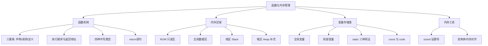
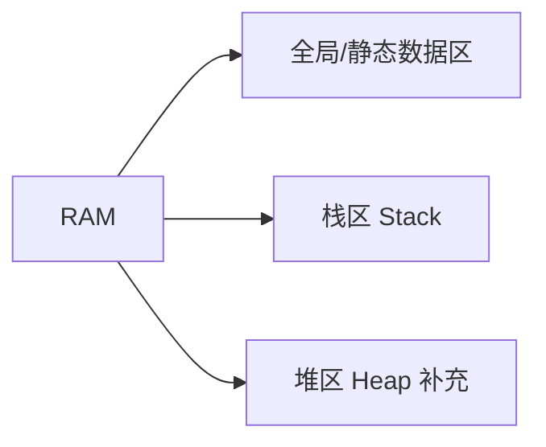
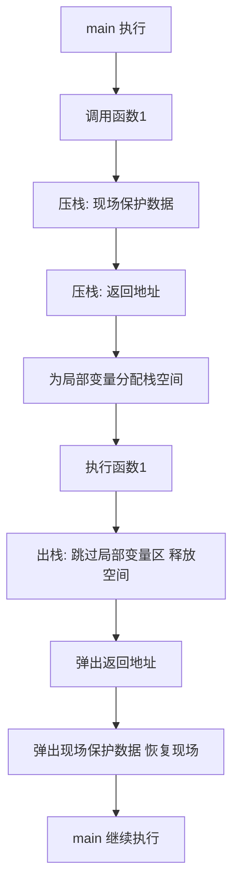

# 函数与栈和堆（综合笔记）

> [!NOTE]
> **来源**：叶宇单片机 第 053、054、055、056 集 + static / const_code / sizeof / 结构体 共 8 集整合
> **覆盖集数**：
> - 第 053 集《使用函数的三要素和执行顺序》
> - 第 054 集《从全局变量和局部变量中感悟"栈"为何物》
> - 第 055 集《函数的作用和四种常见书写类型》
> - 第 056 集《return在函数中的作用，以及四个容易被忽略的功能》
> - 《static的重要作用》
> - 《const_code在定义数据时的作用》
> - 第 69 集《sizeof()运算符》
> - 第 70 集《"万能数组"的结构体》
>
> **整理说明**：字幕中关于"栈"的讲解非常完整，但**未专门讲解"堆"**。本笔记中堆相关内容以讲师视角补充，并在章节标题处明确标注，便于读者区分来源。

---

## 知识体系导图



---

## 1. 函数的本质与三要素

### 1.1 函数的组成

函数是**实现功能模块化**的语法单元。其一般格式由五部分组成：

| 组成部分 | 作用 | 说明 |
|---|---|---|
| 返回值类型 | 告知外界函数输出数据的类型 | 也叫"输出接口" |
| 函数名 | 函数的标识，记录函数入口地址 | 命名规则与变量相同 |
| 参数列表 | 接收外界传入的数据 | 也叫"输入接口"，可为 void |
| 函数体 | 封装实现该功能的所有语句 | 大括号包围 |
| 返回值 | 通过 return 将结果送出 | 与返回值类型匹配 |

### 1.2 函数三要素：声明、调用、定义

> [!IMPORTANT]
> 编译器从上到下依次编译，**调用函数前必须让编译器明确知道三个关键信息**：返回类型、函数名、参数列表。三者缺一不可。

- **函数定义**：把实现某功能的所有语句封装在一起，是函数的"实体"。
- **函数声明**：函数定义的第一行加分号，**提前告知编译器三个关键信息**。一般放在文件开头几行，保证后续所有函数都能调用。
- **函数调用**：通过函数名找到函数地址并执行，执行完毕返回到调用处的下一条语句。

```c
// 函数声明：放在文件开头，提前告知编译器三个关键信息
void func1(void);

int main(void)
{
    unsigned char a = 0;     // 第一条语句
    a++;                     // a = 1
    func1();                 // 调用函数：记录返回地址 → 跳转执行
    a++;                     // 返回后继续执行，a = 3（子函数内还有一次 a++）
    while (1) {
        ;
    }
    return 0;
}

// 函数定义：实体部分
void func1(void)
{
    a++;                     // 全局变量 a 自加
}
```

### 1.3 函数的执行顺序与返回地址

函数调用过程并非简单的"跳转"，而是**记录返回地址 → 跳转执行 → 返回地址处继续执行**：

1. **调用前**：将调用语句的**下一条语句地址**（即返回地址）保存起来。
2. **跳转**：通过函数名找到函数入口地址，跳转执行。
3. **返回**：执行完毕后，回到事先保存的返回地址，继续执行后续语句。

> [!TIP]
> 讲师类比：就像放学回家，第二天回到学校——事先必须记住学校的地址。函数调用前同样要事先记录返回地址。

**术语对照**：
- **main 函数**：主函数 / 主程序，程序入口
- **被调用函数**：子函数 / 子程序

---

## 2. 函数的四种书写类型

### 2.1 四种类型分类

按"是否有输入参数"和"是否有返回值"两两组合，函数共有四种书写类型。所有示例均实现"两数求和"功能。

| 类型 | 输入接口 | 输出接口 | 数据流动方式 |
|---|---|---|---|
| 第一类 | 无（void） | 无（void） | 全局变量输入 + 全局变量输出 |
| 第二类 | 有 | 无（void） | 形参输入 + 全局变量输出 |
| 第三类 | 无（void） | 有 | 全局变量输入 + return 输出 |
| 第四类 | 有 | 有 | 形参输入 + return 输出（封装最彻底） |

> [!NOTE]
> **形参**：参数列表中定义的变量名（如 `i`、`k`），用于在函数内部接收外界数据。
> **实参**：调用时传入的具体数值（如 `2`、`3`），通过赋值操作传递给形参。

#### 第一类：无输入无输出

```c
void sum1(void);              // 函数声明

unsigned int y;               // 全局变量：存储结果
unsigned char a = 2;          // 全局变量：加数
unsigned char b = 3;          // 全局变量：加数

void sum1(void)
{
    y = a + b;                // 通过全局变量实现输入和输出
}
```

#### 第二类：有输入无输出

```c
void sum2(unsigned char i, unsigned char k);

unsigned int y;

void sum2(unsigned char i, unsigned char k)
{
    y = i + k;                // 形参 i、k 接收实参，结果通过全局变量 y 输出
}

// 调用：sum2(2, 3);  → 2 赋给 i，3 赋给 k
```

#### 第三类：无输入有输出

```c
unsigned int sum3(void);

unsigned char a = 2;
unsigned char b = 3;

unsigned int sum3(void)
{
    unsigned int s;
    s = a + b;                // 通过全局变量输入
    return s;                 // 通过 return 输出，并立即退出函数
}

// 调用：y = sum3();
```

#### 第四类：有输入有输出

```c
unsigned int sum4(unsigned char i, unsigned char k);

unsigned int sum4(unsigned char i, unsigned char k)
{
    unsigned int t;
    t = i + k;
    return t;
}

// 调用：y = sum4(2, 3);
```

> [!IMPORTANT]
> 第四类**输入和输出接口都已封装好**，是工程实践中最推荐的写法，函数独立性强、可复用性高。

### 2.2 return 语句的作用

return 不只是"返回数据"，其完整功能可总结为**一句话五大要点**：

> **在函数内部，若想立即跳出函数，可使用 return；在有输出的函数中，它附带送出数据的功能。**

| 功能 | 说明 | 适用函数类型 |
|---|---|---|
| ① 输出数据 | 将结果送出函数外 | 仅用于有返回值的函数（第三、四类） |
| ② 立即退出函数 | 执行到 return 立即跳出 | 四类函数均可用 |
| ③ 可置于任意位置 | 不局限于函数末尾 | 四类函数均可用 |
| ④ 可多次出现 | 配合 if 条件实现多分支退出 | 四类函数均可用 |
| ⑤ 可跳出多层循环 | 直接终止函数，比 break 更彻底 | 四类函数均可用 |

> [!WARNING]
> 无返回值的函数（void）中使用 return 时，**return 后面什么都不加**，仅起退出作用。

**典型应用：除法运算的除零保护**

```c
unsigned int div(unsigned int dividend, unsigned int divisor)
{
    unsigned int quotient;
    if (divisor == 0) {
        return 0;             // 除数为零，立即退出，避免除零错误
    }
    quotient = dividend / divisor;
    return quotient;          // 正常返回商
}

// div(128, 0) → 0    （走 if 分支）
// div(128, 2) → 64   （正常计算）
```

---

## 3. 内存区域划分

单片机存储器分为 **ROM**（只读存储器）和 **RAM**（随机存取存储器）两大物理区域，程序运行时不同类型的数据被分配到不同区域。

### 3.1 ROM 与 RAM 的物理特性

| 存储器 | 特性 | 用途 | 容量特点 |
|---|---|---|---|
| ROM | 物理上**只能读不能写** | 存储程序代码、常量 | 通常是 RAM 的几十到几百倍 |
| RAM | 物理**能读能写** | 存储变量、栈区、堆区 | 资源稀缺 |

### 3.2 RAM 内部的逻辑分区

RAM 在逻辑上进一步划分为多个区域，每个区域有不同的分配规则和生命周期：



| 区域 | 分配方式 | 生命周期 | 存放内容 |
|---|---|---|---|
| 全局/静态数据区 | 编译期分配 | 上电后永久占用 | 全局变量、静态变量 |
| 栈区 | 函数调用时自动分配/释放 | 函数返回即释放 | 局部变量、返回地址、现场保护数据 |
| 堆区 | 手动 malloc/free | 由程序员控制 | 动态分配的大块数据 |

> [!NOTE]
> **讲师视角补充（非字幕原文）**：堆区由程序员通过 `malloc` / `free`（或嵌入式系统中的 `pvPortMalloc` / `vPortFree`）手动管理，灵活性最高但易产生内存泄漏和碎片。**单片机裸机程序中较少使用堆**，因为 RAM 稀缺且没有操作系统兜底回收。叶宇教程基于 51 单片机，未涉及堆的讲解，本节仅作概念补充。

---

## 4. 栈的工作机制

### 4.1 压栈与出栈

栈区是 RAM 中一段特殊的存储区域，遵循 **LIFO（后进先出）** 原则。

- **压栈（Push）**：数据从**低地址向高地址**依次存入，称为"向上生长"。
- **出栈（Pop）**：**最后压入的数据最先弹出**。


### 4.2 SP 寄存器：栈顶指针

> [!IMPORTANT]
> **SP（Stack Pointer）** 是一个专用寄存器，**记录栈区当前使用到哪一个存储单元**（即栈顶房间号）。

例如：SP = 0x0063 表示当前栈顶位于地址 0x0063；调用函数后 SP = 0x0067，表示为局部变量分配了新空间。

### 4.3 函数调用与栈的协同过程

每次函数调用都伴随一次"压栈—执行—出栈"的完整循环：



**关键细节**：
1. **现场保护**：将 main 当前使用的寄存器值压栈，防止子函数修改后无法恢复。
2. **返回地址压栈**：保存调用语句的下一条指令地址。
3. **局部变量分配**：在栈区为函数内的局部变量分配临时空间。
4. **跳过而非弹出**：函数返回时，局部变量所占空间**直接跳过（释放）**，不弹出到寄存器——因为这些数据出了函数就不再使用。
5. **恢复现场**：弹出之前保护的寄存器值，main 函数继续执行。

### 4.4 栈溢出的三种典型场景

> [!CAUTION]
> 栈区容量有限（例如 51 单片机从 0x60 到 0x7F 仅 32 字节），以下三种情况会引发**栈溢出**，是初学者必须避免的错误。

| 场景 | 错误做法 | 正确做法 |
|---|---|---|
| ① 局部变量过大 | 在函数内定义大数组 | 改用全局变量或 static 局部变量 |
| ② 函数嵌套过深 | main→f1→f2→f3→f4→f5 层层嵌套 | 控制嵌套层数，每层都消耗栈空间 |
| ③ 递归无终止 | 递归函数缺少终止条件 | 必须有明确的 return 退出条件 |

> [!WARNING]
> **函数内的局部变量出了函数就不能使用**——因为其存储空间位于公共栈区，函数返回后该区域会被分配给其他函数的局部变量使用。

---

## 5. 变量存储类对比

### 5.1 全局变量 vs 局部变量

| 特性 | 全局变量 | 局部变量 |
|---|---|---|
| 定义位置 | 所有函数外部 | 函数内部 |
| 存储区域 | 全局数据区（RAM） | 栈区（RAM） |
| 生命周期 | 上电后永久占用 | 函数调用时分配，返回时释放 |
| 作用域 | 整个工程（需 extern 声明） | 仅当前函数 |
| 跨文件使用 | 需 `extern` 声明 | 不可跨文件 |
| 时间开销 | 无重复分配开销 | 每次调用都重新分配/释放 |
| 类比 | 买下的房子，永久居住权 | 客栈房间，不同时段分配给不同人 |

**重名优先级规则**：当全局变量与局部变量同名时，**在函数内部，局部变量优先级高于全局变量**。

```c
unsigned char a = 5;          // 全局变量 a

void func(void)
{
    unsigned char a = 2;      // 局部变量 a，屏蔽全局 a
    while (a) {               // 使用的是局部 a，结果为 2
        // ...
    }
}
```

> [!TIP]
> 虽然编译器能区分重名变量，但**人为阅读时容易混淆**，建议定义时避免重名。

### 5.2 static 的三种用法

static 关键字根据修饰对象不同，产生三种不同效果：

| 修饰对象 | 名称 | 产生的变化 | 类比 |
|---|---|---|---|
| 全局变量 | 静态全局变量 | 限制作用域为**当前文件**，其他文件不可 extern | 给孙悟空戴上紧箍咒 |
| 全局函数 | 静态全局函数 | 限制作用域为**当前文件** | 同上 |
| 局部变量 | 静态局部变量 | 存储区从**栈区搬到全局数据区**，数据可保持 | 从客栈搬到专属别墅 |

#### 静态局部变量的行为差异

```c
void func1(void)
{
    unsigned char b = 0;      // 普通局部变量：住客栈，每次重新分配
    b++;
    // 三次调用 func1()，b 的值都是 1
}

void func2(void)
{
    static unsigned char b = 0;  // 静态局部变量：住别墅，不重新分配
    b++;
    // 三次调用 func2()，b 的值分别是 1、2、3
}
```

> [!IMPORTANT]
> **静态局部变量的初始化只在第一次调用时执行**，后续调用不再重新分配空间，保留上一次的值。

#### static 的使用决策

| 场景 | 推荐用法 | 理由 |
|---|---|---|
| 变量/函数仅在当前文件使用 | static | 限制作用域，提升可读性和安全性 |
| 变量/函数需要跨文件使用 | 不加 static | 保持全局属性 |
| 局部变量需要保持上次结果 | static 局部变量 | 数据可长期保存 |
| 函数内定义大数组 | static 局部变量 | 避免占用栈区 |
| 函数被频繁调用 | static 局部变量 | 节省重复分配/释放的时间开销 |

> [!TIP]
> **原则：能用静态先用静态，后用全局**。这样程序阅读时一目了然——哪些只在当前文件使用，哪些可跨文件使用。同时 static 还能解决多文件重名冲突问题。

### 5.3 const 与 code

两者都表示"只读"，但**物理实现和适用范围不同**：

| 关键字 | 适用范围 | 存储位置 | 只读性质 | 能否被指针绕过修改 |
|---|---|---|---|---|
| **code** | 51 单片机专属 | 强制分配到 ROM | 物理只读（硬件层面） | 不能（硬件不支持写） |
| **const** | C 标准关键字 | 仍在 RAM | 语法只读（编译器约束） | 能（通过指针可绕过，但不建议） |

#### code 的典型应用：查表

```c
// 月份天数表：程序运行期间不修改，存入 ROM 节省 RAM
unsigned char code month_days[12] = {31, 28, 31, 30, 31, 30,
                                      31, 31, 30, 31, 30, 31};

unsigned char get_days(unsigned char month)
{
    if (month < 1 || month > 12) {
        return 0;              // 月份非法，立即退出
    }
    return month_days[month - 1];  // 数组下标从 0 开始，月份从 1 开始
}
```

#### const 的典型应用：配置常量

```c
const float temp_upper_limit = 35.0;   // 温度上限，语法只读
const float temp_lower_limit = 10.0;   // 温度下限

void check_temp(float temp)
{
    if (temp > temp_upper_limit) {
        // 过温处理
    } else if (temp < temp_lower_limit) {
        // 低温处理
    } else {
        // 正常范围
    }
}
```

> [!WARNING]
> **static 与 code 的区别不要混淆**：
> - **static** 限制的是**作用域**（能否跨文件使用）
> - **code** 限制的是**读写功能**（物理只读）和**存储位置**（ROM）

---

## 6. 结构体内存对齐

> [!NOTE]
> 本节基于 32 位单片机讲解，8 位单片机内存分配从上往下依次排列，不存在对齐问题。

### 6.1 为什么要内存对齐

32 位单片机有 32 根数据线，**对齐的地址**可以让 CPU 一次读取完成，**不对齐的地址**需要读取两次并拼接数据，效率低下。

| 数据宽度 | 对齐要求 | 示例地址 |
|---|---|---|
| 1 字节 | 任意地址 | 0x00、0x01、0x02… |
| 2 字节 | 2 的倍数 | 0x00、0x02、0x04… |
| 4 字节 | 4 的倍数 | 0x00、0x04、0x08… |

### 6.2 结构体的两重对齐要求

结构体内存对齐需要同时满足两个条件：

1. **每个成员对齐**：成员的起始地址必须是其自身宽度的倍数。
2. **整体大小对齐**：结构体总大小必须是其最宽成员的倍数（**考虑到结构体数组的情况**，保证数组中每个元素的成员也都对齐）。

```c
// 示例：相同成员、不同顺序，结构体大小不同（32 位单片机）
struct A {                // 紧凑排列：8 字节
    unsigned int   m3;    // 4 字节，偏移 0
    short int      m2;    // 2 字节，偏移 4
    unsigned char  m1;    // 1 字节，偏移 6（末尾补 1 字节凑齐 4 的倍数）
};

struct B {                // 松散排列：12 字节
    unsigned char  m1;    // 1 字节，偏移 0（后补 3 字节空）
    unsigned int   m3;    // 4 字节，偏移 4
    short int      m2;    // 2 字节，偏移 8（末尾补 2 字节凑齐 4 的倍数）
};
```

> [!IMPORTANT]
> **结构体成员的顺序换一下，申请的存储空间数量可能不同**。设计结构体时，建议按成员宽度**从小到大或从大到小**排列，以减少填充字节。

### 6.3 结构体成员的地址访问

结构体变量通过**基地址 + 偏移地址**访问成员：

- **基地址**：变量的起始地址（通过变量名获取，但变量本身不是指针）
- **偏移地址**：成员在结构体内的相对位置

```c
struct Example {
    unsigned char  m1;   // 偏移 0，1 字节
    short int      m2;   // 偏移 2，2 字节
    unsigned int   m3;   // 偏移 4，4 字节
};

struct Example ex;       // 假设基地址 0x0080
// ex.m1 → 0x0080 + 0 = 0x0080，按 unsigned char 解读
// ex.m2 → 0x0080 + 2 = 0x0082，按 short int 解读
// ex.m3 → 0x0080 + 4 = 0x0084，按 unsigned int 解读
```

---

## 7. sizeof 运算符

### 7.1 三个特点

| 特点 | 说明 | 示例 |
|---|---|---|
| ① 求变量或类型占用的字节数 | 后面可放变量名或类型名 | `sizeof(unsigned char)` → 1 |
| ② 对表达式只确定类型不执行代码 | 表达式不会真正求值 | `sizeof(a + 3.14)` → `sizeof(double)` → 4 |
| ③ 编译阶段完成并替换 | 运行时表达式已被替换为常量 | `sizeof(a)` 在编译期替换为 1 |

### 7.2 类型提升规则

小于 int 的类型先提升为 int，低等级类型提升为高等级类型：

```c
unsigned char a = 5;

// 表达式 a + 3.14：
//   a 是 unsigned char，3.14 是 double
//   a 提升为 double，结果类型为 double
//   sizeof(a + 3.14) = sizeof(double) = 4

// 表达式 a + 100：
//   a 是 unsigned char，100 是 int
//   a 提升为 int，结果类型为 int
//   sizeof(a + 100) = sizeof(int) = 2（51 单片机）
```

### 7.3 陷阱：数组名作为函数参数退化

> [!CAUTION]
> **数组名作为函数参数时，会退化为指向首元素的指针**。在函数内部对形参使用 sizeof，得到的是**指针变量的大小**，而非数组大小。

```c
unsigned char average(unsigned char buffer[4])
{
    // 陷阱：buffer 在此处已退化为 unsigned char *
    // sizeof(buffer) = sizeof(unsigned char *) = 3（51 单片机）
    // 而非数组大小 4
    return (buffer[0] + buffer[1] + buffer[2] + buffer[3]) / 4;
}

unsigned char arr[4] = {10, 20, 30, 40};
// 在 main 中：sizeof(arr) = 4（此时 arr 是真正的数组名）
// 在函数内：sizeof(buffer) = 3（已退化为指针）
```

---

## 核心对比速查表

### 变量存储类对比

| 存储类 | 存储区域 | 生命周期 | 作用域 | 初始化次数 | 时间开销 |
|---|---|---|---|---|---|
| 全局变量 | 全局数据区 | 永久 | 全工程（extern） | 1 次 | 无 |
| 静态全局变量 | 全局数据区 | 永久 | 当前文件 | 1 次 | 无 |
| 局部变量 | 栈区 | 函数调用期间 | 当前函数 | 每次调用 | 有（分配/释放） |
| 静态局部变量 | 全局数据区 | 永久 | 当前函数 | 1 次 | 无 |
| code 变量 | ROM | 永久 | 同全局/局部 | 1 次 | 无 |
| const 变量 | RAM（全局/局部对应区） | 同全局/局部 | 同全局/局部 | 1 次 | 同全局/局部 |

### 只读关键字对比

| 关键字 | 存储位置 | 只读性质 | 适用平台 |
|---|---|---|---|
| code | ROM | 物理只读 | 51 单片机专属 |
| const | RAM | 语法只读 | C 标准，所有平台 |

### 函数四种类型对比

| 类型 | 输入 | 输出 | 封装程度 | 推荐度 |
|---|---|---|---|---|
| 第一类 | 全局变量 | 全局变量 | 最差 | ⭐ |
| 第二类 | 形参 | 全局变量 | 部分 | ⭐⭐ |
| 第三类 | 全局变量 | return | 部分 | ⭐⭐ |
| 第四类 | 形参 | return | 完全 | ⭐⭐⭐ |

---

## 总结

- **函数三要素**：声明（提前告知编译器三个关键信息）、调用（记录返回地址 → 跳转执行 → 返回）、定义（封装功能语句）。三者顺序：声明在前，调用在中，定义在后。
- **栈是函数调用的基础设施**：每次函数调用都伴随现场保护、返回地址、局部变量的压栈，返回时跳过局部变量区并恢复现场。栈区容量有限，避免大数组、深嵌套、无终止递归。
- **return 五大功能**：输出数据、立即退出、任意位置、多次出现、跳出多层循环。无返回值函数中 return 后不加任何值。
- **static 改变存储位置和作用域**：全局/函数加 static 限制为当前文件；局部变量加 static 从栈区搬到全局数据区，数据可保持且节省时间开销。原则：**能用静态先用静态，后用全局**。
- **code 与 const 的只读差异**：code 是 51 专属，物理只读，存入 ROM 节省 RAM；const 是 C 标准，语法只读，仍在 RAM。两者用途不同，不可混淆。
- **结构体内存对齐**：32 位单片机为提高读取效率，要求成员地址对齐且整体大小对齐。成员顺序影响结构体大小，建议按宽度排序。
- **sizeof 三特点一陷阱**：可求变量/类型大小、对表达式只确定类型不执行、编译期完成替换；陷阱是数组名作为函数参数退化为指针。

---

## 待深入 / 遗留疑问

- [ ] 堆区的具体使用方法（malloc/free 在嵌入式系统中的实践与风险）
- [ ] 51 单片机栈区具体容量与 SP 初始化值
- [ ] 不同编译器（Keil C51 / Keil MDK / GCC）的内存对齐默认规则差异
- [ ] 函数指针与栈的关系（函数指针调用时的压栈过程）
- [ ] RTOS 中任务栈的分配与管理（每个任务独立栈区的实现机制）

---

## 关联笔记

- [[指针变量的基础知识]]
- [[指针与数组]]
- [[结构体指针]]
- [[一维数组]]
