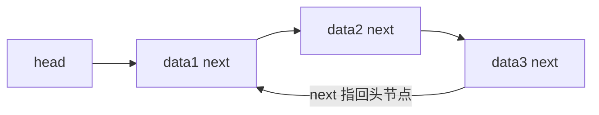
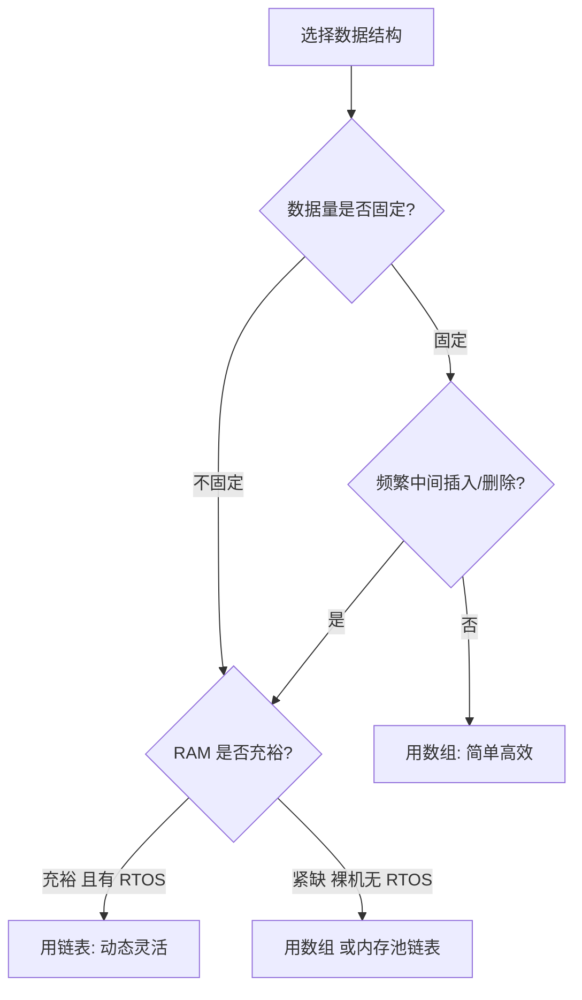

# 链表综合笔记

> [!NOTE]
> **来源**：Gemini 对话记录《讨论链表与结构体和数组之间的关系》（4 轮对话）
> **覆盖主题**：链表概念、链表与数组对比、链表在 C 语言中的实现、插入/删除/访问操作
>
> **整理说明**：对话内容质量较高，本文在其基础上做了以下处理：
> - 修正 CPU Cache 相关结论（Cortex-M 上 Cache 影响远小于 Cortex-A/x86）
> - 补充双向链表和循环链表（FreeRTOS 工业级实现必备）
> - 代码全部改为项目规范风格（Allman 大括号、snake_case 命名）
> - 补充嵌入式场景下的内存池链表实践
> - 对话中 char 链表利用率不足 10% 的极端案例予以保留但补充说明

---

## 知识体系导图

```mermaid
graph TD
    A[链表] --> B[核心概念]
    A --> C[链表 vs 数组]
    A --> D[C语言实现]
    A --> E[嵌入式实践]

    B --> B1[节点: 数据域 &#43; 指针域]
    B --> B2[单链表]
    B --> B3[双链表]
    B --> B4[循环链表]

    C --> C1[内存分配]
    C --> C2[指针开销]
    C --> C3[CPU Cache]

    D --> D1[节点定义]
    D --> D2[遍历与查找]
    D --> D3[头部/尾部/中间插入]
    D --> D4[按值删除]

    E --> E1[内存池替代 malloc]
    E --> E2[FreeRTOS 链表实现]
    E --> E3[选择决策]
```



---

## 1. 核心概念

### 1.1 什么是链表

链表是一种**线性数据结构**，与数组同属"存储一系列数据"的范畴，但内存管理策略完全不同：

- **数组**：内存中**连续**分配，通过索引直接访问任意元素（查询快），但插入/删除需要移动后续所有数据（增删慢），且长度固定。
- **链表**：内存中**分散**存储，每个数据块（节点）不仅存数据，还存下一个节点的地址（指针）。通过"顺藤摸瓜"访问（查询慢），但只需修改指针指向即可增删（增删快）。

**类比**：
- 数组 = **连续的储物柜**——知道柜号就能直接找到，但中间插柜子必须把后面的全挪开。
- 链表 = **寻宝游戏**——每个盒子除了宝物（数据），还有一张纸条（指针）写着下一个盒子的地址。

### 1.2 节点的结构

链表的基本单元是**节点（Node）**，由两部分组成：

| 组成部分 | 名称 | 作用 |
|---|---|---|
| 数据域 | data | 存储实际业务数据（整数、结构体等） |
| 指针域 | next | 存放下一个节点的内存地址 |

```c
/* 单链表节点定义 */
typedef struct Node {
    int data;              /* 数据域 */
    struct Node *next;     /* 指针域：指向下一个同类型节点 */
} node_t;
```

> [!IMPORTANT]
> 指针域的类型是 `struct Node *`，因为它指向的下一个目标**依然是同一种节点**。这是 C 语言中"自引用结构体"的经典用法。

### 1.3 链表的三种基本形态

#### 单链表（Singly Linked List）

每个节点只有一个 `next` 指针，指向下一个节点。最后一个节点的 `next` 为 `NULL`。


- 只能**从头到尾**单向遍历
- 结构最简单，空间开销最小

#### 双向链表（Doubly Linked List）

每个节点增加一个 `prev` 指针，指向前一个节点。


- 可以**双向遍历**，删除节点时无需再遍历找前驱
- 每个节点多一个指针（32 位系统 +4 字节，64 位系统 +8 字节）
- **FreeRTOS 的链表就是双向链表**

#### 循环链表（Circular Linked List）

尾节点的 `next` 指向头节点而非 `NULL`，形成环。



- 适合"轮询"场景（如任务调度器循环分配时间片）
- 可从任意节点开始遍历整个链表

> [!TIP]
> FreeRTOS 的就绪链表是**双向循环链表**，兼具双向遍历和循环轮询的优势。

---

## 2. 链表与数组的对比

### 2.1 内存分配与容量

| 比较维度 | 数组 | 链表 |
|---|---|---|
| 分配策略 | 预分配固定连续空间 | 按需 malloc，分散存储 |
| 容量 | 创建时固定，满后需整体搬迁扩容 | 动态伸缩，只要堆区有空间就能加 |
| 空闲浪费 | 预分配过大则浪费，过小则不够 | 用多少申请多少，逻辑数据量利用率 100% |
| 连续性要求 | 极高——必须找到一整块连续空间 | 极低——利用碎片化的"边角料"内存 |
| 扩容代价 | 极高——重新 malloc 大块 + 拷贝 + free 旧块 | 极低——只 malloc 新节点 + 修改指针 |

**数组的"预分配困境"**：
- 为了防止装不下，按极限情况分配（如预估最多 1000 个用户，开辟大小 1000 的数组）。
- 实际只用了 10 个，剩下 99% 连续内存闲置。
- 若数据量突破预设大小，无法直接追加（尾部可能已被占用），必须整体搬迁。

**链表的"按需分配"**：
- 新增数据就 malloc 一个节点，删除数据就 free 释放，逻辑数据量的空间利用率 100%。
- 代价是频繁 malloc/free 导致**堆区碎片化**。

### 2.2 指针开销（空间代价）

链表的"用多少申请多少"并非没有代价——每个节点必须额外存储指针：

| 系统 | 指针大小 | 示例：存 1000 个 int（4 字节） | 空间利用率 |
|---|---|---|---|
| 32 位 | 4 字节 | 数组：4000 字节；单链表：8000 字节 | 50% |
| 64 位 | 8 字节 | 数组：4000 字节；单链表：12000 字节 | 33% |

**极端案例**：存 1000 个 `char`（1 字节），64 位系统，考虑内存对齐：
- 数组：1000 字节
- 单链表：每个节点 1 + 8 = 9 字节，对齐到 16 字节，共 16000 字节，**利用率不足 10%**

> [!NOTE]
> 上述极端案例中 char 链表利用率极低，但**嵌入式实际场景中节点数据域通常远大于 1 字节**（如传感器数据结构体、任务控制块等），指针开销占比很小。选择数据结构时应结合具体数据域大小判断。

### 2.3 CPU Cache 影响

| 特性 | 数组 | 链表 |
|---|---|---|
| 空间局部性 | 极好——连续内存，一次 Cache 行加载多个元素 | 极差——节点散落，频繁 Cache Miss |
| 遍历性能 | 极快——CPU 流水线预取高效 | 较慢——每次跳转可能触发主存访问 |

> [!WARNING]
> **嵌入式场景注意**：CPU Cache 对链表的不利影响在 **Cortex-A / x86** 等带大 Cache 的处理器上非常显著，但在 **Cortex-M0/M3/M4/M7** 等 MCU 上：
> - 多数 M0/M3 没有 Cache 或 Cache 极小，影响可忽略
> - M7 带 Cache 但容量仅 4~16KB，影响取决于链表总大小
> - 因此在 Cortex-M 开发中，Cache 问题**不是选择链表或数组的主要考量**，内存分配灵活性和碎片风险才是关键

### 2.4 核心对比速查表

| 比较维度 | 数组 | 链表 |
|---|---|---|
| 内存分配 | 连续，一次性分配 | 分散，按需分配 |
| 容量 | 固定，扩容代价高 | 动态，随用随扩 |
| 按索引访问 | O(1)，直接计算偏移 | O(n)，必须从头遍历 |
| 头部插入 | O(n)，移动所有元素 | O(1)，修改指针 |
| 中间插入 | O(n)，移动后续元素 | O(1)*，找到位置后改指针 |
| 尾部插入 | O(1)*，有空间时直接追加 | O(n)，需遍历到尾（除非维护尾指针） |
| 按值查找 | O(n)，逐个比较 | O(n)，逐个比较 |
| 指针开销 | 无 | 有（每节点 4~8 字节） |
| Cache 友好度 | 极好 | 极差 |
| 碎片风险 | 低（一次性分配） | 高（频繁小块 malloc/free） |

> \* 中间插入的 O(1) 不包含查找位置的 O(n) 开销；尾部插入的 O(1) 不包含扩容的 O(n) 开销

---

## 3. C 语言实现：单链表操作

### 3.1 节点定义与创建

```c
#include <stdio.h>
#include <stdlib.h>
#include <stdint.h>

/* 单链表节点 */
typedef struct Node {
    int32_t data;
    struct Node *next;
} node_t;

/* 创建新节点 */
node_t *node_create(int32_t value)
{
    node_t *new_node = (node_t *)malloc(sizeof(node_t));
    if (new_node == NULL) {
        return NULL;              /* 分配失败保护 */
    }
    new_node->data = value;
    new_node->next = NULL;
    return new_node;
}
```

### 3.2 遍历与查找

遍历的核心动作是**顺藤摸瓜**：从 head 出发，不断让游标指针跳到 next。

```c
/* 遍历打印 */
void list_print(node_t *head)
{
    node_t *current = head;       /* 游标指针，不要直接修改 head */
    while (current != NULL) {
        printf("%d -> ", current->data);
        current = current->next;  /* 跳到下一个节点 */
    }
    printf("NULL\n");
}

/* 按值查找 */
node_t *list_search(node_t *head, int32_t target)
{
    node_t *current = head;
    while (current != NULL) {
        if (current->data == target) {
            return current;       /* 找到，返回节点地址 */
        }
        current = current->next;
    }
    return NULL;                  /* 未找到 */
}
```

> [!TIP]
> 遍历时引入**游标指针** `current` 而非直接用 `head`，是为了保护头指针不被修改——丢失头指针等于丢失整条链表。

### 3.3 插入操作

#### 头部插入

新节点直接插在链表最前面，成为新的头节点。时间复杂度 O(1)。

```c
/* 头部插入（修改头指针本身，因此传入二级指针） */
void list_insert_head(node_t **head_ref, int32_t new_data)
{
    node_t *new_node = node_create(new_data);
    if (new_node == NULL) { return; }

    new_node->next = *head_ref;   /* 新节点指向旧头节点 */
    *head_ref = new_node;         /* 头指针更新为新节点 */
}
```

> [!IMPORTANT]
> 头部插入需要修改头指针本身，因此函数参数必须是**二级指针** `node_t **head_ref`。若只传一级指针，函数内修改的只是 head 的副本，外部头指针不会变。

#### 尾部插入

新节点排在链表末尾。需遍历找到尾节点，时间复杂度 O(n)。

```c
/* 尾部插入 */
void list_insert_tail(node_t **head_ref, int32_t new_data)
{
    node_t *new_node = node_create(new_data);
    if (new_node == NULL) { return; }

    /* 空链表：新节点直接成为头节点 */
    if (*head_ref == NULL) {
        *head_ref = new_node;
        return;
    }

    /* 非空链表：遍历到最后一个节点 */
    node_t *last = *head_ref;
    while (last->next != NULL) {
        last = last->next;
    }
    last->next = new_node;        /* 尾节点指向新节点 */
}
```

> [!TIP]
> 若频繁尾部插入，可维护一个**尾指针** `tail`，将尾部插入也优化为 O(1)。FreeRTOS 的链表就同时维护了 head 和 tail。

#### 中间插入（在指定节点之后插入）

```c
/* 在 target 节点之后插入新节点 */
void list_insert_after(node_t *target, int32_t new_data)
{
    if (target == NULL) { return; }

    node_t *new_node = node_create(new_data);
    if (new_node == NULL) { return; }

    new_node->next = target->next;   /* 新节点指向目标的后继 */
    target->next = new_node;         /* 目标指向新节点 */
}
```

插入过程只需两步指针操作，不移动任何数据：

```
插入前：target → next_node
插入后：target → new_node → next_node
```

### 3.4 删除操作

删除的核心是**接驳断链 + 释放内存**，防止后面的节点丢失（内存泄漏）。

```c
/* 按值删除第一个匹配的节点 */
void list_delete(node_t **head_ref, int32_t key)
{
    if (*head_ref == NULL) { return; }

    node_t *temp = *head_ref;
    node_t *prev = NULL;

    /* 情况1：要删除的是头节点 */
    if (temp->data == key) {
        *head_ref = temp->next;       /* 头指针跳过旧头节点 */
        free(temp);
        return;
    }

    /* 情况2：遍历寻找目标，同时记录前驱 */
    while (temp != NULL && temp->data != key) {
        prev = temp;
        temp = temp->next;
    }

    /* 未找到 */
    if (temp == NULL) { return; }

    /* 接驳断链 */
    prev->next = temp->next;          /* 前驱跳过被删节点 */
    free(temp);                       /* 释放被删节点内存 */
}
```

删除过程示意：

```
删除前：prev → target → next_node
删除后：prev → next_node（target 被 free 释放）
```

> [!CAUTION]
> 删除节点后**必须 free**，否则该节点内存永远无法回收（内存泄漏）。free 后建议将局部指针置 NULL，防止悬空指针误用。

---

## 4. 双向链表

### 4.1 节点定义

```c
/* 双向链表节点 */
typedef struct DNode {
    int32_t data;
    struct DNode *prev;    /* 前驱指针 */
    struct DNode *next;    /* 后继指针 */
} dnode_t;
```

### 4.2 双向链表 vs 单链表

| 对比维度 | 单链表 | 双向链表 |
|---|---|---|
| 指针数量 | 每节点 1 个（next） | 每节点 2 个（prev + next） |
| 空间开销 | 较低 | 较高（多 4~8 字节/节点） |
| 反向遍历 | 不支持 | 支持 |
| 删除指定节点 | 必须遍历找前驱 O(n) | 直接通过 prev 找前驱 O(1) |
| 插入/删除代码 | 较简单 | 需同时维护 prev 和 next |

> [!IMPORTANT]
> 双向链表最大的优势：**删除已知位置的节点无需遍历找前驱**。在 FreeRTOS 等实时系统中，任务从就绪链表移除是 O(1) 操作，这对调度确定性至关重要。

### 4.3 双向链表删除操作

```c
/* 删除双向链表中的指定节点（已知节点地址，无需遍历找前驱） */
void dlist_delete_node(dnode_t *target)
{
    if (target == NULL) { return; }

    if (target->prev != NULL) {
        target->prev->next = target->next;     /* 前驱的 next 跳过自己 */
    }
    if (target->next != NULL) {
        target->next->prev = target->prev;     /* 后继的 prev 跳过自己 */
    }

    free(target);
}
```

---

## 5. 嵌入式链表实践

### 5.1 用内存池替代 malloc

嵌入式裸机中，频繁 malloc/free 导致碎片风险极高。常用方案是**预分配固定数量的节点组成内存池**，分配/释放改为池操作。

```c
/* 静态内存池链表 */
#define POOL_SIZE  16

static node_t node_pool[POOL_SIZE];     /* 预分配节点数组 */
static uint8_t pool_used[POOL_SIZE];    /* 使用标志 */

/* 从池中分配一个空闲节点 */
node_t *pool_alloc(void)
{
    uint8_t i;
    for (i = 0; i < POOL_SIZE; i++) {
        if (pool_used[i] == 0) {
            pool_used[i] = 1;
            node_pool[i].next = NULL;
            return &node_pool[i];
        }
    }
    return NULL;    /* 池满 */
}

/* 将节点归还到池中 */
void pool_free(node_t *node)
{
    uint8_t i;
    for (i = 0; i < POOL_SIZE; i++) {
        if (&node_pool[i] == node) {
            pool_used[i] = 0;
            return;
        }
    }
}
```

> [!TIP]
> 内存池链表的本质是**用连续数组预分配**换取**运行时确定性**。分配和释放时间固定，不产生碎片，但池大小固定且需预估上限。

### 5.2 FreeRTOS 链表实现

FreeRTOS 内部使用**双向循环链表**管理任务，其核心数据结构：

```c
/* FreeRTOS 链表节点（简化版，源码见 list.h） */
typedef struct ListItem_t {
    TickType_t xItemValue;             /* 排序用的值（如任务优先级） */
    struct ListItem_t *pxNext;         /* 后继 */
    struct ListItem_t *pxPrevious;     /* 前驱 */
    void *pvOwner;                     /* 指向拥有此节点的任务 TCB */
    struct List_t *pxContainer;        /* 指向所属链表 */
} ListItem_t;

/* FreeRTOS 链表头（简化版） */
typedef struct List_t {
    UBaseType_t uxNumberOfItems;       /* 链表中节点数量 */
    ListItem_t *pxIndex;               /* 当前遍历索引 */
    ListItem_t xListEnd;               /* 尾部哨兵节点（值为最大） */
} List_t;
```

**设计要点**：
- **哨兵节点** `xListEnd`：值设为最大（0xFFFF），永远在链表尾部，简化边界处理
- **`pvOwner` 指针**：节点不直接存任务数据，而是通过 `pvOwner` 指向任务的 TCB，实现"节点与业务数据解耦"
- **`pxContainer` 指针**：节点知道自己属于哪个链表，方便跨链表移动
- **`uxNumberOfItems`**：O(1) 获取链表长度，无需遍历计数

> [!NOTE]
> FreeRTOS 的链表节点**不是 malloc 分配的**，而是嵌入在任务 TCB 结构体中作为成员存在。创建任务时 TCB 一起分配，节点天然可用，无需额外 malloc。

### 5.3 数组 vs 链表选择决策



| 场景 | 推荐 | 理由 |
|---|---|---|
| 传感器数据缓冲（固定数量） | 数组 / 环形缓冲区 | 大小固定，无需动态伸缩 |
| 串口接收帧缓冲（不定长） | 环形缓冲区 + 链表 | 帧长度变化，链表可动态管理 |
| RTOS 任务调度 | 双向循环链表 | FreeRTOS 标准实现 |
| 消息队列 | 链表 / 队列集 | 消息数量运行时变化 |
| 查表（月份天数、命令表） | const 数组 | 大小固定，查表速度快 |
| 动态注册的回调函数 | 链表 | 回调数量不确定 |

---

## 6. 常见陷阱

> [!CAUTION]
> **陷阱一：丢失头指针**
> 遍历时直接用 `head = head->next`，导致 head 指针被修改，链表入口丢失。
> 正确做法：引入游标指针 `current = head`，用 current 遍历。

> [!CAUTION]
> **陷阱二：删除后未 free**
> 从链表中摘除节点只修改了指针，节点本身仍占堆区内存。忘记 free = 内存泄漏。

> [!CAUTION]
> **陷阱三：free 后继续访问（Use-After-Free）**
> free 后节点内存可能被其他 malloc 复用，此时通过旧指针访问会读到脏数据或崩溃。
> 建议：free 后立即将指针置 NULL。

> [!WARNING]
> **陷阱四：头部插入不用二级指针**
> 头部插入需要修改头指针本身，若函数只接收一级指针 `node_t *head`，函数内修改的只是副本，外部头指针不变。必须传 `node_t **head_ref`。

> [!WARNING]
> **陷阱五：空链表未处理**
> 遍历/删除前必须检查 `head == NULL`，否则解引用空指针导致 HardFault。

---

## 核心对比速查表

### 链表三种形态对比

| 特性 | 单链表 | 双向链表 | 循环链表 |
|---|---|---|---|
| 指针数/节点 | 1（next） | 2（prev + next） | 1 或 2 |
| 反向遍历 | 不支持 | 支持 | 支持（循环回溯） |
| 删除已知节点 | O(n)（找前驱） | O(1)（直接通过 prev） | 取决于是否双向 |
| 尾部访问 | O(n) | O(1)（若有尾指针） | O(1)（head->prev） |
| 空间开销 | 最小 | 较大 | 同单/双链表 |
| 典型应用 | 简单队列 | FreeRTOS 任务链表 | 调度器轮询 |

### 数组 vs 链表选择速查

| 判断条件 | 选数组 | 选链表 |
|---|---|---|
| 数据量固定 vs 可变 | 固定 | 可变 |
| 频繁按索引访问 vs 频繁增删 | 按索引访问 | 频繁增删 |
| RAM 充裕 vs 紧缺 | 充裕时两者皆可 | 紧缺时考虑内存池链表 |
| 有 RTOS vs 裸机 | 均可 | 有 RTOS 时链表更安全 |
| 需要 Cache 友好遍历 | 是 | 否 |

---

## 总结

- **链表的本质**：用"数据 + 地址"的节点串联，放弃连续内存换取动态灵活性。每个节点 = 数据域 + 指针域。
- **链表 vs 数组**：数组查询快增删慢、空间纯粹；链表增删快查询慢、有指针开销。选择取决于数据量是否固定和操作模式。
- **指针开销**：单链表每节点多 4~8 字节，双向链表多 8~16 字节。数据域越小，开销占比越大。
- **单链表操作核心**：遍历靠游标顺藤摸瓜、插入靠断链重连、删除靠接驳断链 + free 释放。头部插入需二级指针。
- **双向链表优势**：删除已知节点 O(1) 无需遍历找前驱，这是 FreeRTOS 选择双向链表的根本原因。
- **嵌入式实践**：裸机慎用 malloc 链表，改用内存池；FreeRTOS 链表节点嵌入 TCB 中，无需额外 malloc。
- **五大陷阱**：丢失头指针、删除未 free、Use-After-Free、头部插入不用二级指针、空链表未处理。

---

## 待深入 / 遗留疑问

- [ ] FreeRTOS 链表源码逐行分析（list.c / list.h）
- [ ] 链表排序算法（归并排序适合链表的特性）
- [ ] 跳表（Skip List）在嵌入式中的适用性
- [ ] Linux 内核链表（list_head 结构体的侵入式设计）
- [ ] 静态链表（用数组模拟链表，51 单片机中的应用）

---

## 关联笔记

- [[函数与栈和堆]]
- [[指针变量的基础知识]]
- [[指针与数组]]
- [[结构体指针]]
- [[一维数组]]
