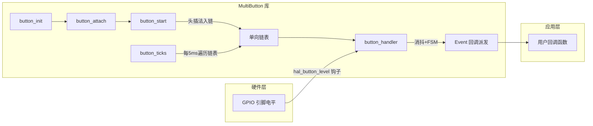
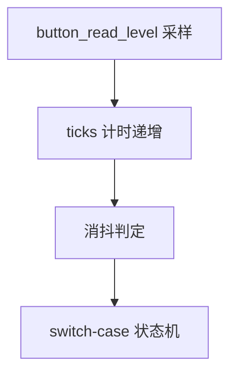
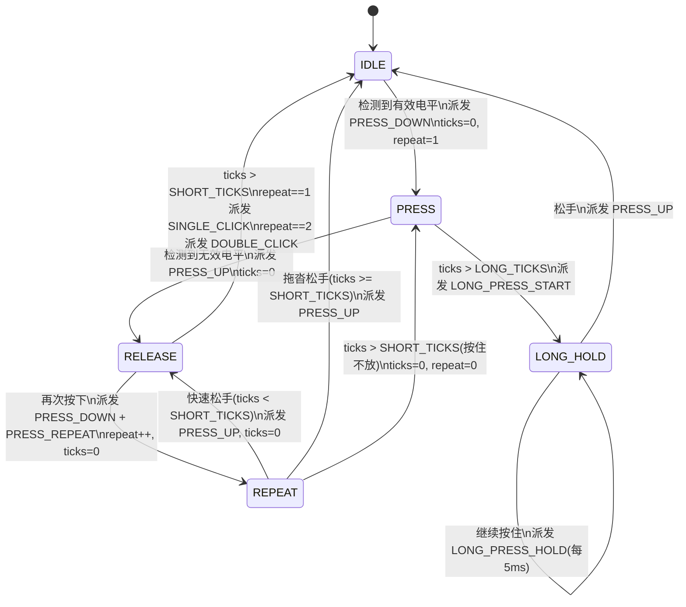

# MultiButton 代码详解

> 轻量级按键驱动库，核心思想：**FSM + 单向链表 + 回调**。每个物理按键对应一个 Button 结构体实例，通过链表串联后由定时心跳统一驱动状态机。

## 1 架构总览



**三大设计支柱：**

| 支柱 | 机制 | 效果 |
|------|------|------|
| 面向对象 | Button 结构体封装状态/计时/回调/链表指针 | 一个结构体 = 一个完整按键实例 |
| 单向链表 | head_handle 头指针 + next 指针串联 | 支持无限按键，一次 ticks 全部更新 |
| 有限状态机 | 5 状态 switch-case 驱动 | 消抖/单击/双击/连击/长按自动识别 |

---

## 2 头文件解析（multi_button.h）

### 2.1 依赖项

| 头文件 | 提供的服务 | 库内用途 |
|--------|-----------|---------|
| **stdint.h** | 固定位宽整型 | uint8_t 用于位域压缩，uint16_t 用于 ticks 计时 |
| **string.h** | memset | button_init 中将 Button 结构体一次性清零 |

### 2.2 版本宏

```c
#define MULTIBUTTON_VERSION_MAJOR 1
#define MULTIBUTTON_VERSION_MINOR 1
#define MULTIBUTTON_VERSION_PATCH 1
```

遵循语义化版本控制（SemVer），当前 **v1.1.1**。纯版本标识，不参与核心逻辑。三个 1 是迭代巧合：1.0.0 → 1.1.0（新增线程安全/单元测试）→ 1.1.1（修复 REPEAT→PRESS 状态转换 Bug）。

### 2.3 配置常量

| 宏名 | 默认值 | 绝对时间 | 作用 | 硬约束 |
|------|--------|---------|------|--------|
| **TICKS_INTERVAL** | 5 | 5ms | 状态机时间基准，所有时间阈值除以它换算心跳次数 | 需与硬件定时器中断周期一致 |
| **DEBOUNCE_TICKS** | 3 | 15ms | 消抖滤波深度，连续读到相同电平的次数 | ≤7（3 位位域） |
| **SHORT_TICKS** | 300/5=60 | 300ms | 单/双击结算等待期，连击手速上限 | — |
| **LONG_TICKS** | 1000/5=200 | 1000ms | 长按判定阈值 | — |
| **PRESS_REPEAT_MAX_NUM** | 15 | — | 最大连击次数 | ≤15（4 位位域） |

> 位域宽度限制了宏的上界，库通过 **#error 编译时拦截** 防止越界配置导致的静默截断 Bug。

### 2.4 编译时检查

```c
#if DEBOUNCE_TICKS > 7
#error "DEBOUNCE_TICKS exceeds 3-bit field maximum (7)"
#endif
```

为什么用 **#error** 而非 assert？三重理由：①编译时拦截，错误代码不进固件；②零 ROM/RAM 开销；③匹配宏的静态特性。库遵循 C99 标准，无 _Static_assert 可用，**#error 是最便携的编译时拦截方案**。

### 2.5 前向声明

```c
typedef struct _Button Button;
```

解决回调函数指针与结构体定义的**交叉引用**：BtnCallback 参数需要 Button*，而 Button 内部又包含 BtnCallback 数组。前向声明先向编译器"打白条"注册类型名，后续再补全定义。

下划线前缀 **_Button** 是 C 语言区分结构体标签（Tag）与类型别名（Typedef Name）的传统惯例：带下划线的作为内部标签，干净的 **Button** 作为对外 API 类型。**这不是实例化，0 字节内存开销。**

### 2.6 事件与状态枚举

**ButtonEvent（对外事件）** — 状态机向应用层派发的通知：

| 事件 | 含义 |
|------|------|
| BTN_PRESS_DOWN | 按下瞬间 |
| BTN_PRESS_UP | 抬起瞬间 |
| BTN_SINGLE_CLICK | 单击（超时结算） |
| BTN_DOUBLE_CLICK | 双击（超时结算） |
| BTN_LONG_PRESS_START | 长按开始（>1s） |
| BTN_LONG_PRESS_HOLD | 长按保持（每 5ms 一次） |
| BTN_PRESS_REPEAT | 连击中再次按下 |

**ButtonState（内部状态）** — 状态机自身维护的阶段，对调用者透明：

| 状态 | 含义 |
|------|------|
| BTN_STATE_IDLE | 空闲待机 |
| BTN_STATE_PRESS | 按住观察（判断短按/长按） |
| BTN_STATE_RELEASE | 松手等待（判断单击/双击/连击） |
| BTN_STATE_REPEAT | 连击按下中 |
| BTN_STATE_LONG_HOLD | 长按保持中 |

### 2.7 Button 结构体

```c
struct _Button
{
    uint16_t ticks;                     // 计时发条
    uint8_t  repeat : 4;                // 连击次数 (0-15)
    uint8_t  event : 4;                 // 当前事件 (0-15)
    uint8_t  state : 3;                 // FSM 状态 (0-7)
    uint8_t  debounce_cnt : 3;          // 消抖计数 (0-7)
    uint8_t  active_level : 1;          // 有效电平
    uint8_t  button_level : 1;          // 消抖后确认电平
    uint8_t  button_id;                 // 按键 ID
    uint8_t  (*hal_button_level)(uint8_t button_id);  // 硬件读取钩子
    BtnCallback cb[BTN_EVENT_COUNT];    // 回调函数指针数组
    void* user_data;                    // 用户上下文
    Button* next;                       // 链表后继指针
};
```

**位域压缩效果**：repeat+event 打包为 1 字节，state+debounce_cnt+active_level+button_level 打包为 1 字节。单个按键实例约 **30 字节**。

四层设计：

| 层次 | 成员 | 职责 |
|------|------|------|
| 计时与状态记忆 | ticks, repeat, event, state, debounce_cnt, active_level, button_level | FSM 运转数据 |
| 硬件解耦 | button_id, hal_button_level | 跨平台适配 |
| 用户交互 | cb[], user_data | 事件回调与上下文传递 |
| 驱动引擎 | next | 单向链表串联 |

### 2.8 线程安全机制

```c
#ifdef MULTIBUTTON_THREAD_SAFE
  #if !defined(MULTIBUTTON_LOCK) || !defined(MULTIBUTTON_UNLOCK)
    #error "Define MULTIBUTTON_LOCK() and MULTIBUTTON_UNLOCK() ..."
  #endif
#else
  #define MULTIBUTTON_LOCK()
  #define MULTIBUTTON_UNLOCK()
#endif
```

**裸机环境**：不定义 MULTIBUTTON_THREAD_SAFE，锁宏为空，零开销。若 ticks 在中断、注册在主循环，则需定义并对接开关全局中断：

```c
#define MULTIBUTTON_THREAD_SAFE
#define MULTIBUTTON_LOCK()   __disable_irq()
#define MULTIBUTTON_UNLOCK() __enable_irq()
```

**RTOS 环境**：对接互斥锁。注意 **button_ticks 内部将锁粒度切碎到仅保护 next 指针读取**，避免回调内嵌套调用 start/stop 时死锁。

### 2.9 EVENT_CB 宏

```c
#define EVENT_CB(ev) \
    do { \
        if (handle->cb[ev]) { \
            handle->cb[ev](handle, handle->user_data); \
        } \
    } while(0)
```

**do...while(0)** 的意义：①吸收分号，匹配函数调用语法习惯；②打包为不可分割的单一语句，安全嵌入 if/else；③编译器优化掉 while(0)，零性能开销。

---

## 3 源文件解析（multi_button.c）

### 3.1 全局链表头

```c
static Button* head_handle = NULL;
```

**static** 使其成为文件私有，外部不可篡改。初始为空链表，button_start 时通过头插法挂载按键。

### 3.2 私有函数

```c
static void button_handler(Button* handle);           // 主厨：FSM 核心引擎
static inline uint8_t button_read_level(Button* handle);  // 传菜员：读取 GPIO 电平
```

**static** 禁止外部调用，保护核心引擎不被越权操作，同时避免命名空间污染。**inline** 消除函数调用开销（压栈/跳转/出栈），将读电平代码直接内联到 FSM 中。

### 3.3 button_init — 初始化

```c
void button_init(Button* handle, uint8_t(*pin_level)(uint8_t),
                 uint8_t active_level, uint8_t button_id);
```

| 参数 | 作用 |
|------|------|
| handle | 按键句柄指针（空白档案袋） |
| pin_level | 硬件电平读取函数指针（状态机的"眼睛"） |
| active_level | 按下时的有效电平（0=低有效/上拉，1=高有效/下拉） |
| button_id | 按键 ID，传入读取函数区分多按键 |

内部操作：①空指针校验；②memset 全结构体清零（含 next=NULL）；③**button_level 初始化为 !active_level**（防上电误触）；④状态归 IDLE、事件归 NONE_PRESS。

**不操作链表**，纯本地赋值，无需加锁。

### 3.4 button_attach — 挂载回调

```c
void button_attach(Button* handle, ButtonEvent event,
                   BtnCallback cb, void* user_data);
```

仅两行赋值：`handle->cb[event] = cb; handle->user_data = user_data;`

**与 init 分离的四大好处：**

1. **避免参数爆炸** — 7 种事件若合并到 init，参数列表将不可读
2. **硬件层与业务层解耦** — init 归 BSP，attach 归 APP
3. **支持运行时动态变身** — 配合 button_detach 可随时更换按键功能
4. **灵活的 user_data 注入** — 同一回调函数绑定不同上下文，实现多按键复用

**user_data 流转路径**：attach 时存入 handle→user_data → EVENT_CB 触发时原封传出 `handle->cb[ev](handle, handle->user_data)` → 回调函数内强转使用。

**不操作链表**，纯本地赋值，无需加锁。

### 3.5 button_start — 入链

```c
int button_start(Button* handle);
```

返回值：0=成功，-1=已存在，-2=空指针。

**三步操作：**

1. **空指针校验**
2. **遍历查重** — 防止重复挂载导致链表成环死循环
3. **头插法入链**：

```c
handle->next = head_handle;  // 新节点尾钩指向旧头
head_handle = handle;        // 头指针移交新节点
```

> **顺序铁律**：必须先牵手再移交，反转则旧链表丢失且新节点自环。

头插法时间复杂度 O(1)，每次调用仅挂载**一个**按键，多按键需多次调用。

### 3.6 button_stop — 出链

```c
void button_stop(Button* handle);
```

遍历链表找到目标节点，将前驱的 next 跨过目标指向后继，完成摘除。**不销毁结构体数据**，硬件配置和回调绑定完好保留，重新 button_start 即可满血复活。

### 3.7 button_ticks — 心跳驱动

```c
void button_ticks(void)
{
    Button* target;
    MULTIBUTTON_LOCK();
    target = head_handle;
    MULTIBUTTON_UNLOCK();

    while (target)
    {
        MULTIBUTTON_LOCK();
        Button* next = target->next;  // 预读取
        MULTIBUTTON_UNLOCK();

        button_handler(target);       // 锁外执行

        target = next;
    }
}
```

**两处防御性设计：**

1. **锁粒度切碎** — 仅保护 next 指针读取（1~2 条指令），button_handler 放在锁外。避免长关中断影响实时性，且防止回调内嵌套调用 start/stop 导致死锁。

2. **预读取 next** — 先记住下一节点地址，再执行 handler。若回调中调用了 button_stop 将当前节点摘除，预读取的 next 仍有效，避免野指针 HardFault。

### 3.8 button_handler — FSM 核心

每次调用依次执行三个阶段：



#### 3.8.1 电平采样

```c
uint8_t read_gpio_level = button_read_level(handle);
```

通过 hal_button_level 钩子读取瞬时物理电平，作为后续所有判定的数据源。必须最先执行。

#### 3.8.2 ticks 计时

```c
if (handle->state > BTN_STATE_IDLE)
{
    if (handle->ticks < UINT16_MAX)
    {
        handle->ticks++;
    }
}
```

- **按需计时**：仅非 IDLE 状态才递增
- **饱和防溢出**：达到 65535 后锁定不再回绕（65535×5ms≈327s），避免整数回绕导致状态误判

#### 3.8.3 消抖算法

```c
if (read_gpio_level != handle->button_level)
{
    if (++(handle->debounce_cnt) >= DEBOUNCE_TICKS)
    {
        handle->button_level = read_gpio_level;
        handle->debounce_cnt = 0;
    }
}
else
{
    handle->debounce_cnt = 0;  // 一票否决
}
```

核心是 **一票否决机制**：新电平必须连续 N 次（默认 3 次/15ms）被采样到才被承认。任何一次中断都会让计数器归零重来，所有毛刺被拦截在 FSM 门外。

---

## 4 状态机完整流转



### 各状态详解

#### IDLE — 空闲待机

唯一关心"电平是否变为有效电平"。一旦确认按下，连续执行 5 个动作：记录事件 → 派发回调 → 秒表归零 → repeat=1 → 切入 PRESS。

#### PRESS — 按住观察

**十字路口**，两条分支：

- **松手（电平失效）**：派发 PRESS_UP → 切入 RELEASE 等待结算
- **超时（ticks > LONG_TICKS）**：派发 LONG_PRESS_START → 切入 LONG_HOLD
- **都不满足**：break 等下一轮 ticks 累加，让子弹飞

#### RELEASE — 松手悬念期

最巧妙的状态。不急于结算，等待 SHORT_TICKS 超时：

- **超时未再按**：根据 repeat 结算 — 1 次=单击，2 次=双击 → 回归 IDLE
- **超时前再按**：派发 PRESS_DOWN + PRESS_REPEAT，repeat++ → 切入 REPEAT

#### REPEAT — 连击按下中

- **快速松手**：派发 PRESS_UP → 切回 RELEASE 继续等待
- **拖沓松手（ticks ≥ SHORT_TICKS）**：派发 PRESS_UP → 直接回 IDLE，连招失败
- **按住不放（ticks > SHORT_TICKS）**：ticks=0, repeat=0 → **退回 PRESS** 重新走长按判定

> 这是 **v1.1.1 修复的核心 Bug**：旧版本退回 PRESS 时未清零 ticks 和 repeat，导致残余大 ticks 值瞬间误触发长按。

#### LONG_HOLD — 长按持续期

逻辑最简单的状态：**不再关心时间，只关心松没松手**。

- 继续按住：每个 tick（5ms）派发一次 LONG_PRESS_HOLD，即 **200Hz 连发**
- 松手：派发 PRESS_UP → 回归 IDLE

> 注意：200Hz 的回调频率下，若业务含耗时操作（刷屏/写 Flash），需在回调内自行节流。

---

## 5 API 速查

| 函数 | 作用 | 操作链表 | 需加锁 |
|------|------|---------|--------|
| button_init | 绑定硬件接口，清零结构体 | 否 | 否 |
| button_attach | 挂载事件回调 + user_data | 否 | 否 |
| button_detach | 取消指定事件回调 | 否 | 否 |
| button_start | 头插法入链 | 是 | 是 |
| button_stop | 遍历摘除出链 | 是 | 是 |
| button_ticks | 遍历链表驱动 FSM | 遍历 | 细粒度 |
| button_get_event | 轮询模式下获取当前事件 | 否 | 否 |

### 典型使用流程

```c
/* 1. 定义读取函数 */
uint8_t read_key(uint8_t button_id)
{
    switch (button_id)
    {
        case 0: return HAL_GPIO_ReadPin(KEY_GPIO, KEY_PIN);
        default: return 0;
    }
}

/* 2. 定义回调 */
void btn_callback(Button* handle, void* user_data)
{
    /* 根据 handle->event 分发业务逻辑 */
}

/* 3. 初始化 + 挂载 + 启动 */
static Button btn1;
button_init(&btn1, read_key, 0, 0);
button_attach(&btn1, BTN_SINGLE_CLICK, btn_callback, NULL);
button_start(&btn1);

/* 4. 在定时器中断中周期调用（5ms） */
void HAL_TIM_PeriodElapsedCallback(TIM_HandleTypeDef *htim)
{
    button_ticks();
}
```

---

## 6 关键设计总结

| 设计点 | 手法 | 收益 |
|--------|------|------|
| 内存极致压缩 | 位域打包 | 单按键约 30 字节 |
| 硬件解耦 | 函数指针钩子 + button_id | 零移植成本 |
| 配置防呆 | #error 编译时拦截 | 杜绝静默截断 Bug |
| 线程安全 | 宏开关 + 细粒度锁 | 裸机零开销，RTOS 安全 |
| 预读取 next | 先读后执行 | 回调内 stop 不引发野指针 |
| 饱和计时 | ticks 锁定 UINT16_MAX | 防整数回绕导致状态误判 |
| init/attach/start 三段式 | 配置与链表操作分离 | 可后台准备、可动态启停 |
| 长按连发 | LONG_HOLD 状态每 tick 派发 | 200Hz 天然支持连续调节场景 |
