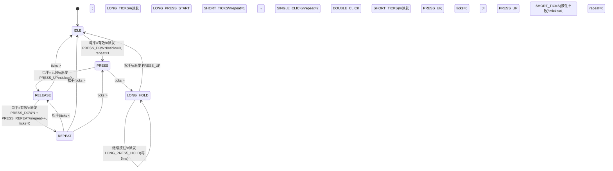

# MultiButton 状态机与按键逻辑分析

> 从按键物理信号到软件事件的完整链路：**采样 → 消抖 → 状态机推进 → 回调派发**。本文逐 tick 跟踪每个状态的内部变量变化，并用实际产品案例讲解回调设计。

---

## 1 一句话理解状态机的设计意图

把按键想象成一个**质检员**：每 5ms 来一件"电平样品"，质检员不急着下结论，而是——

1. **先验货**（消抖）：连续 3 次样品一致才承认变化
2. **再分类**（状态机）：根据"按了多久""松了又按了没"分派到不同工位
3. **最后发货**（回调）：通知下游"单击/双击/长按已出库"

---

## 2 消抖：一票否决的滑动窗口

### 2.1 为什么需要消抖

机械按键的金属触片在接触/分离瞬间会弹跳，产生 5~20ms 的电平毛刺。如果不处理，一次物理按下会被误识别为多次。

```
物理按下时的实际电平（上拉按键，低有效）：

   ┌──┐  ┌┐ ┌───────
   │  │  ││ │
 ──┘  └──┘└─┘
   ← 10~20ms 抖动区 →← 稳定低电平 →
```

### 2.2 MultiButton 的消抖算法

```c
if (read_gpio_level != handle->button_level) {
    if (++(handle->debounce_cnt) >= DEBOUNCE_TICKS) {
        handle->button_level = read_gpio_level;  // 采信新电平
        handle->debounce_cnt = 0;
    }
} else {
    handle->debounce_cnt = 0;  // 一票否决
}
```

核心是**一票否决 + 连续确认**：

| 条件 | 动作 | 比喻 |
|------|------|------|
| 新电平与历史不同 | debounce_cnt++ | "存疑，继续观察" |
| 连续 N 次都不同 | button_level 更新 | "确认了，是真的变了" |
| 任何一次又变回去了 | debounce_cnt 归零 | "果然是假信号，之前的都不算" |

### 2.3 逐 tick 演示消抖过程

假设上拉按键（active_level=0），从松开状态（button_level=1）到按下：

| tick | 物理电平 | button_level | debounce_cnt | 说明 |
|------|---------|-------------|-------------|------|
| 0 | 0（按下，有抖动） | 1 | 1 | 新电平≠历史，开始计数 |
| 1 | 1（弹跳回去） | 1 | 0 | 一票否决！计数归零 |
| 2 | 0（又按下） | 1 | 1 | 重新开始计数 |
| 3 | 0 | 1 | 2 | 连续第 2 次 |
| 4 | 0 | 1 | 3 | 连续第 3 次，≥DEBOUNCE_TICKS |
| 4（后半段） | — | **0** | 0 | **采信！button_level 更新为 0** |

> 实际消抖时间 = DEBOUNCE_TICKS × TICKS_INTERVAL = 3 × 5ms = **15ms**。这在覆盖绝大多数机械抖动的同时，不会让人感觉到延迟（人眼分辨极限约 50ms）。

### 2.4 消抖与状态机的关系

消抖发生在**状态机之前**，是 FSM 的前置过滤器：

```
GPIO 物理电平 → [消抖滤波器] → button_level（确认电平） → [状态机] → 事件
```

状态机内部**只看 button_level**，永远不会接触到毛刺信号。这种分层设计使得状态机逻辑可以完全不考虑抖动问题。

---

## 3 状态机总览：5 状态 9 条边



### 三个关键时间阈值

| 阈值 | 宏 | 心跳数 | 绝对时间 | 作用 |
|------|-----|-------|---------|------|
| 消抖 | DEBOUNCE_TICKS | 3 | 15ms | 电平确认的最小观察期 |
| 短按/连击窗口 | SHORT_TICKS | 60 | 300ms | 单/双击结算等待期，连击手速要求 |
| 长按 | LONG_TICKS | 200 | 1000ms | 长按判定门限 |

---

## 4 逐状态详解

### 4.1 IDLE — 闲着等按

**状态特征**：ticks 不递增（节省计数），repeat 无意义。

**唯一关心的条件**：button_level 是否等于 active_level（有效电平）。

一旦确认按下，连续执行 5 个动作：

```c
handle->event  = BTN_PRESS_DOWN;   // 1. 记录事件类型
EVENT_CB(BTN_PRESS_DOWN);          // 2. 派发回调（你刚按下！）
handle->ticks  = 0;                // 3. 秒表归零（开始计时）
handle->repeat = 1;                // 4. 连击计数=1（第一次按下）
handle->state  = BTN_STATE_PRESS;  // 5. 切入观察态
```

> **PRESS_DOWN 在按下瞬间就派发**，不需要等任何超时。这是所有事件中响应最快的。

### 4.2 PRESS — 按住观察期（十字路口）

这个状态的核心任务：**你到底要长按还是短按？**

**两条出路**：

| 条件 | 动作 | 含义 |
|------|------|------|
| 电平失效（松手） | → RELEASE | "松手了，等一下看还按不按" |
| ticks > LONG_TICKS | → LONG_HOLD | "按了 1 秒还不松，肯定是长按" |
| 都不满足 | break | "继续等，让子弹飞一会儿" |

**逐 tick 演示（长按场景）**：

| tick | button_level | ticks | 动作 |
|------|-------------|-------|------|
| 0 | 0（有效） | 0 | 刚从 IDLE 切入 |
| 1 | 0 | 1 | break，继续等 |
| 2 | 0 | 2 | break |
| ... | 0 | ... | ... |
| 199 | 0 | 199 | break（还差 1 tick） |
| 200 | 0 | 200 | ticks > LONG_TICKS(200)，**派发 LONG_PRESS_START，切入 LONG_HOLD** |

**逐 tick 演示（短按场景）**：

| tick | button_level | ticks | 动作 |
|------|-------------|-------|------|
| 0 | 0（有效） | 0 | 刚从 IDLE 切入 |
| 1 | 0 | 1 | break |
| ... | 0 | ... | ... |
| 20 | 1（消抖后确认松手） | 20 | **派发 PRESS_UP，ticks=0，切入 RELEASE** |

> 注意：PRESS 状态下 ticks 从 0 开始计时，0→1 是第一个 tick，所以第 200 次 ticks 才等于 200。

### 4.3 RELEASE — 松手悬念期（最精妙的状态）

这个状态是整个状态机设计智慧的集中体现：**不急着下结论，等一等看你还按不按**。

想象你在等快递：收到一个包裹（按下→松手），不确定还有没有第二个。你要等一段时间（SHORT_TICKS），超时了才能确认"快递齐了"。

**两条出路**：

| 条件 | 动作 | 含义 |
|------|------|------|
| 超时前又按下了 | → REPEAT | "又来了！连击计数+1" |
| 超时没再按 | → IDLE（结算） | "确认完毕，按了几次就几次" |

**结算规则**：

| repeat 值 | 派发事件 | 含义 |
|-----------|---------|------|
| 1 | SINGLE_CLICK | 单击确认 |
| 2 | DOUBLE_CLICK | 双击确认 |
| ≥3 | 无事件派发 | 多连击不自动派发，需应用层通过 repeat 自行处理 |

> **单击/双击的延迟代价**：单击必须等待 SHORT_TICKS（300ms）超时才能确认。这是"准确识别双击"的不可避免代价——你无法在第一次松手时就判定它是单击，因为用户可能紧接着再按一次。如果你的产品对单击响应速度有极致要求（如游戏手柄），需要调整 SHORT_TICKS 或改用其他判定策略。

### 4.4 REPEAT — 连击按下中

连击是 RELEASE 的延伸：用户在等待期内又按下了，系统进入"连招模式"。

**三条出路**：

| 条件 | 动作 | 含义 |
|------|------|------|
| 快速松手（ticks < SHORT_TICKS） | → RELEASE | "节奏还在，继续等下一次" |
| 拖沓松手（ticks ≥ SHORT_TICKS） | → IDLE | "太慢了，连招断了" |
| 按住不放（ticks > SHORT_TICKS） | → PRESS | "不连了，改为长按" |

**v1.1.1 修复的关键 Bug**：

旧版本从 REPEAT 退回 PRESS 时，**没有清零 ticks 和 repeat**。后果：

```
旧版本：REPEAT 中已累计 ticks=60+，退回 PRESS
→ PRESS 第一轮就检测到 ticks > LONG_TICKS(200)? 还不够
→ 但 ticks 从 60 开始累加，只需要再 140 tick 就误触发长按
→ 且 repeat 残留导致结算逻辑混乱
```

修复后的代码：

```c
handle->ticks  = 0;  // 清零！重新计算长按
handle->repeat = 0;  // 清零！开启新的按压周期
handle->state  = BTN_STATE_PRESS;
```

> **教训**：FSM 状态转移时，必须仔细清理"上一状态的残留数据"。ticks 和 repeat 都属于"状态的附属数据"，跨状态转移时若语义不同，就必须主动重置。

### 4.5 LONG_HOLD — 长按持续期

**逻辑最简单的状态**：不再关心时间，只关心松没松手。

```c
if (handle->button_level == handle->active_level) {
    // 继续按住：每 tick 派发一次 LONG_PRESS_HOLD
    EVENT_CB(BTN_LONG_PRESS_HOLD);
} else {
    // 松手：派发 PRESS_UP，回归 IDLE
    EVENT_CB(BTN_PRESS_UP);
    handle->state = BTN_STATE_IDLE;
}
```

**LONG_PRESS_HOLD 的派发频率** = 1次/tick = 1次/5ms = **200Hz**。

这意味着在回调中可以直接实现连续调节功能（如音量增减），无需额外定时器。但要注意：

| 场景 | 回调耗时 | 200Hz 下是否安全 |
|------|---------|----------------|
| 变量加减 | <1μs | 安全 |
| OLED 刷新局部区域 | ~1ms | 安全（5ms 周期足够） |
| 全屏重绘 | ~20ms | **危险**，会阻塞其他按键的 ticks |
| Flash 写入 | ~50ms | **禁止**，必须在回调中只设标志位，主循环中异步处理 |

---

## 5 典型按键操作的完整时序

### 5.1 单击

```
时间轴（5ms/tick）:

     按下          松手            300ms超时
      ↓             ↓                ↓
 ─────[▼──────────▲──────────────────●────────
      0           20               280

状态: IDLE → PRESS → RELEASE ──────→ IDLE
事件:        ↓PRESS_DOWN  ↓PRESS_UP   ↓SINGLE_CLICK
```

| 阶段 | tick | 状态 | ticks | repeat | 派发事件 |
|------|------|------|-------|--------|---------|
| 按下 | 0 | IDLE→PRESS | 0 | 1 | PRESS_DOWN |
| 按住 | 1~19 | PRESS | 1~19 | 1 | — |
| 松手 | 20 | PRESS→RELEASE | 0 | 1 | PRESS_UP |
| 等待 | 21~79 | RELEASE | 1~59 | 1 | — |
| 超时 | 80 | RELEASE→IDLE | 60 | 1 | **SINGLE_CLICK** |

### 5.2 双击

```
时间轴:

     按下    松手    按下    松手       300ms超时
      ↓       ↓       ↓       ↓          ↓
 ─────[▼─────▲───────▼───────▲────────────●────
      0      10      25      35          295

状态: IDLE→PRESS→RELEASE→REPEAT→RELEASE→IDLE
事件:  ↓PD   ↓PU  ↓PD↓PR  ↓PU         ↓DOUBLE_CLICK
```

| 阶段 | 状态变化 | repeat | 派发事件 |
|------|---------|--------|---------|
| 第 1 次按下 | IDLE→PRESS | 1 | PRESS_DOWN |
| 第 1 次松手 | PRESS→RELEASE | 1 | PRESS_UP |
| 第 2 次按下 | RELEASE→REPEAT | 2 | PRESS_DOWN, PRESS_REPEAT |
| 第 2 次松手 | REPEAT→RELEASE | 2 | PRESS_UP |
| 超时结算 | RELEASE→IDLE | 2 | **DOUBLE_CLICK** |

> 注意第 2 次按下时 repeat 从 1 变为 2，同时派发 PRESS_DOWN 和 PRESS_REPEAT 两个事件。

### 5.3 长按

```
时间轴:

     按下                  1s超时           松手
      ↓                      ↓               ↓
 ─────[▼─────────────────────◆───────────────▲────
      0                     200             350

状态: IDLE→PRESS──────────→LONG_HOLD→IDLE
事件:  ↓PRESS_DOWN  ↓LONG_PRESS_START  ↓PRESS_UP
                   每tick: ↓LONG_PRESS_HOLD ×150
```

| 阶段 | tick | 状态 | 派发事件 |
|------|------|------|---------|
| 按下 | 0 | IDLE→PRESS | PRESS_DOWN |
| 按住 | 1~199 | PRESS | — |
| 超时 | 200 | PRESS→LONG_HOLD | **LONG_PRESS_START** |
| 持续按 | 201~349 | LONG_HOLD | LONG_PRESS_HOLD（每 tick） |
| 松手 | 350 | LONG_HOLD→IDLE | PRESS_UP |

### 5.4 连击 3 次后超时

```
     按下 松手 按下 松手 按下 松手    300ms超时
      ↓    ↓    ↓    ↓    ↓    ↓        ↓
 ─────[▼──▲────▼──▲────▼──▲────────────●────

状态: IDLE→P→R→REP→R→REP→R→IDLE
事件:  ↓PD ↓PU ↓PD↓PR ↓PU ↓PD↓PR ↓PU   (repeat=3,无自动事件)
```

| 阶段 | repeat | 派发事件 |
|------|--------|---------|
| 第 1 次按/松 | 1 | PRESS_DOWN, PRESS_UP |
| 第 2 次按/松 | 2 | PRESS_DOWN, PRESS_REPEAT, PRESS_UP |
| 第 3 次按/松 | 3 | PRESS_DOWN, PRESS_REPEAT, PRESS_UP |
| 超时 | 3 | **无自动事件**（repeat≥3 不派发） |

> 三连击及以上不自动派发事件，应用层需在 PRESS_REPEAT 回调中读取 handle->repeat 自行处理。

---

## 6 回调机制与实战应用

### 6.1 回调触发全链路

```
button_ticks()  →  遍历链表  →  button_handler()
                                    ↓
                              状态机推进，event 赋值
                                    ↓
                              EVENT_CB(ev) 宏展开
                                    ↓
                              if (handle->cb[ev])
                                  handle->cb[ev](handle, user_data)
```

EVENT_CB 的安全设计：

```c
#define EVENT_CB(ev) do {           \
    if (handle->cb[ev]) {          \  // 空指针检查，未注册则跳过
        handle->cb[ev](handle,     \  // 传入 handle 自身
                        handle->user_data); \
    }                              \
} while(0)
```

### 6.2 实战案例：智能台灯按键

一个带开关机、亮度调节和配对功能的台灯，用**一个按键**覆盖所有操作：

| 操作 | 事件 | 功能 |
|------|------|------|
| 单击 | SINGLE_CLICK | 开关灯 |
| 双击 | DOUBLE_CLICK | 进入配对模式 |
| 长按 | LONG_PRESS_START | 开始调节亮度 |
| 长按中 | LONG_PRESS_HOLD | 亮度连续增减 |
| 松手 | PRESS_UP | 停止调节 |

```c
#include "multi_button.h"

/* 硬件层：读取按键 GPIO */
uint8_t read_key1(uint8_t button_id)
{
    return HAL_GPIO_ReadPin(KEY1_GPIO_Port, KEY1_Pin);  // 上拉，低有效
}

/* 应用层：统一回调入口 */
void lamp_key_callback(Button* handle, void* user_data)
{
    uint8_t* lamp_state = (uint8_t*)user_data;

    switch (handle->event)
    {
    case BTN_SINGLE_CLICK:
        *lamp_state = !(*lamp_state);
        lamp_set_power(*lamp_state);
        break;

    case BTN_DOUBLE_CLICK:
        ble_enter_pairing();
        break;

    case BTN_LONG_PRESS_START:
        lamp_brightness_start_adjust();  // 进入调节模式
        break;

    case BTN_LONG_PRESS_HOLD:
        lamp_brightness_step_up();       // 每 5ms 调一步，实际产品中需节流
        break;

    case BTN_PRESS_UP:
        lamp_brightness_stop_adjust();   // 退出调节模式
        break;

    default:
        break;
    }
}

/* 初始化 */
static Button btn_key1;
static uint8_t lamp_on = 0;              // user_data：灯的开关状态

void app_key_init(void)
{
    button_init(&btn_key1, read_key1, 0, 0);           // 低有效(active_level=0)
    button_attach(&btn_key1, BTN_SINGLE_CLICK,         lamp_key_callback, &lamp_on);
    button_attach(&btn_key1, BTN_DOUBLE_CLICK,         lamp_key_callback, &lamp_on);
    button_attach(&btn_key1, BTN_LONG_PRESS_START,     lamp_key_callback, &lamp_on);
    button_attach(&btn_key1, BTN_LONG_PRESS_HOLD,      lamp_key_callback, &lamp_on);
    button_attach(&btn_key1, BTN_PRESS_UP,             lamp_key_callback, &lamp_on);
    button_start(&btn_key1);
}

/* 定时器中断：5ms 心跳 */
void HAL_TIM_PeriodElapsedCallback(TIM_HandleTypeDef* htim)
{
    if (htim->Instance == TIM6)
    {
        button_ticks();
    }
}
```

**关键设计点**：

- **一个回调函数 + user_data**：所有事件共用 lamp_key_callback，通过 handle->event 分发。user_data 传入灯状态指针，回调可修改应用数据。
- **PRESS_UP 搭配长按**：长按调节必须在松手时停止，否则亮度会一直变。PRESS_UP 是 LONG_PRESS_HOLD 的天然终止信号。
- **LONG_PRESS_HOLD 节流**：200Hz 的回调频率对亮度调节太快，实际产品需在回调中做计数分频：

```c
case BTN_LONG_PRESS_HOLD:
    if (++hold_cnt >= 4) {    // 每 20ms(4×5ms) 调一步
        hold_cnt = 0;
        lamp_brightness_step_up();
    }
    break;
```

### 6.3 实战案例：多按键游戏手柄

4 个按键共用一个回调，通过 user_data 区分按键角色：

```c
typedef struct {
    uint8_t key_role;    // 0=A, 1=B, 2=START, 3=SELECT
} KeyContext;

static Button btn[4];
static KeyContext ctx[4] = {{0},{1},{2},{3}};

void gamepad_callback(Button* handle, void* user_data)
{
    KeyContext* kctx = (KeyContext*)user_data;

    if (handle->event == BTN_PRESS_DOWN) {
        gamepad_press(kctx->key_role);       // 按下即响应，无延迟
    } else if (handle->event == BTN_PRESS_UP) {
        gamepad_release(kctx->key_role);
    }
}

void app_gamepad_init(void)
{
    for (uint8_t i = 0; i < 4; i++) {
        button_init(&btn[i], read_gamepad_key, 0, i);
        button_attach(&btn[i], BTN_PRESS_DOWN, gamepad_callback, &ctx[i]);
        button_attach(&btn[i], BTN_PRESS_UP,   gamepad_callback, &ctx[i]);
        button_start(&btn[i]);
    }
}
```

> **游戏手柄为什么只注册 PRESS_DOWN/UP 而不注册 SINGLE_CLICK？** 因为游戏对按键延迟极其敏感，PRESS_DOWN 在按下瞬间（0 延迟）就触发，而 SINGLE_CLICK 需要等待 300ms 超时确认。

### 6.4 实战案例：三连击切换模式

```c
void mode_switch_callback(Button* handle, void* user_data)
{
    if (handle->event == BTN_PRESS_REPEAT) {
        if (handle->repeat == 3) {
            switch_to_next_mode();   // 三连击切模式
        }
    }
}

/* 注册时只需关注 PRESS_REPEAT，在回调中读 repeat 值 */
button_attach(&btn, BTN_PRESS_REPEAT, mode_switch_callback, NULL);
```

> PRESS_REPEAT 在每次连击按下时触发，回调中通过 handle->repeat 判断具体是第几次。这样 3 连击、4 连击、N 连击都能处理，不受 SINGLE/DOUBLE_CLICK 只有 1/2 的限制。

---

## 7 状态机的 FSM 模式归属

MultiButton 的状态机**不是教科书中的纯 FSM**，而是一种嵌入式领域最主流的务实变体：

| 维度 | 教科书 FSM | MultiButton 实现 |
|------|-----------|-----------------|
| 转移表 | 显式二维表 state×event→next | 隐式嵌入 switch-case 的 if-else |
| 事件输入 | 独立的事件枚举传入 | 混合输入：电平 + 超时，无显式事件枚举 |
| 动作模型 | Mealy（动作在转移上）或 Moore（动作在状态上） | **混合型**：转移动作 + 状态动作并存 |
| 时间处理 | 通常不含，需外挂 | ticks 内嵌，时间作为隐含输入条件 |

**为什么不用表驱动？** 5 状态 9 条边的规模下，switch-case 更直观、更易调试，表驱动的间接性反而增加理解成本。当状态数超过 15~20 时，表驱动才展现出可维护性优势。

---

## 8 设计要点速记

| 要点 | 说明 |
|------|------|
| 消抖是 FSM 的前置过滤器 | 状态机只看 button_level，永远接触不到毛刺 |
| PRESS_DOWN 零延迟 | 按下瞬间派发，是所有事件中响应最快的 |
| 单击有 300ms 延迟 | 等待双击确认的不可避免代价 |
| 超时才结算 | RELEASE 状态不急着下结论，等 SHORT_TICKS 后才判定单/双击 |
| 状态转移必须清理残留 | v1.1.1 Bug 证明：ticks 和 repeat 跨状态时语义不同，必须重置 |
| LONG_PRESS_HOLD 200Hz | 回调中耗时的操作必须异步化或节流 |
| 多连击靠 PRESS_REPEAT | 3 次以上连击无自动事件，在回调中读 repeat 自行处理 |
| PRESS_UP 是长按的终止信号 | 长按调节类场景必须注册 PRESS_UP 来停止 |
