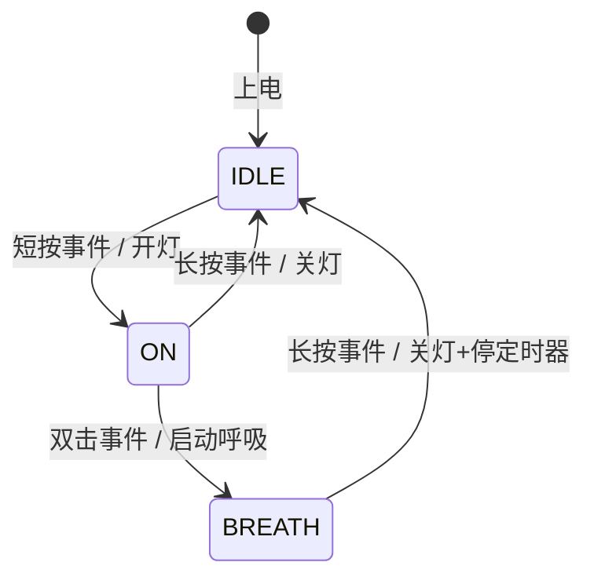
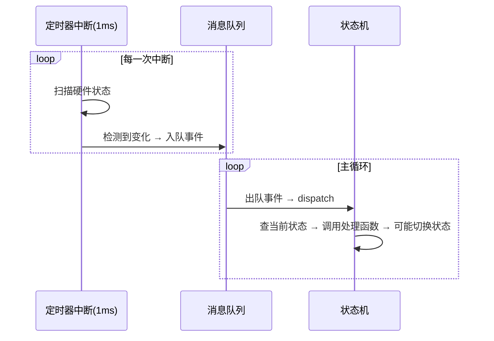
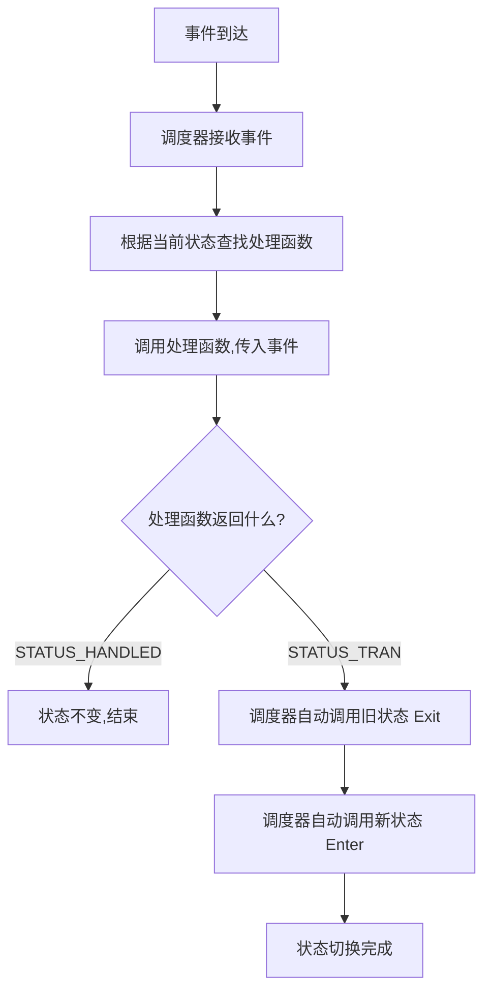
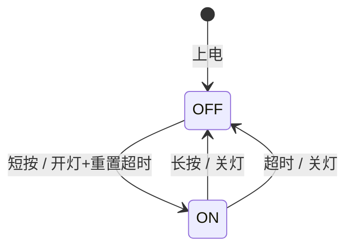

# 有限状态机基础入门

> [!NOTE]
> **定位**:面向有嵌入式 C 语言开发基础、但没有状态机开发经验的开发者
> **目标**:从 C 语言语法根基出发,理解状态机的每个组成部分、设计动机与裸机实现方式,为 [[有限状态机演进详解]] 做铺垫
> **前置知识**:C 语言基本语法、函数指针、struct、枚举、裸机 while(1) 主循环

---

## 1. 为什么需要状态机?

### 1.1 不用状态机的世界:灾难现场

假设你要实现一个"按键控制 LED"的功能:短按开灯,长按关灯。一个没有状态机思维的初学者可能会这样写:

```c
/* 反面教材:纯粹的顺序阻塞思维 */
void main(void)
{
    while (1)
    {
        if (Key_Read() == PRESS)
        {
            Delay_ms(1000);   /* 阻塞等 1 秒判断长短按 */
            if (Key_Read() == PRESS)
            {
                /* 还是按着 -> 长按 -> 关灯 */
                LED_Off();
                while (Key_Read() == PRESS); /* 死等松手 */
            }
            else
            {
                /* 已松手 -> 短按 -> 开灯 */
                LED_On();
            }
        }
    }
}
```

**三宗罪**:
1. **阻塞**:Delay_ms 期间 CPU 什么都干不了,其他任务被挂起
2. **耦合**:按键判断与灯控逻辑混在一起,改灯的代码可能改坏按键
3. **膨胀**:需求稍加复杂(加双击、加呼吸灯、加超时自动关),if-else 就变成意大利面条

### 1.2 状态思维:换一种方式思考

状态机的核心洞察:**把"正在做什么"从"怎么做"里抽出来,变成一个独立的、有名字的东西(状态)**。

同样的需求,用状态思维重构:

> 系统有两个**状态**:灯灭(IDLE)、灯亮(ON)。
> 在灯灭状态下收到"短按事件"→ 切到灯亮状态。
> 在灯亮状态下收到"长按事件"→ 切到灯灭状态。

注意:**没有 Delay,没有阻塞**。系统只需要记住"我现在是灯灭还是灯亮",然后根据当前状态和收到的事件做出响应。延时判断交给定时器中断去做,它会在合适的时候发一个"长按确认事件"过来。

**这就是状态机的本质**:一个记住"我在哪",根据"发生了什么"决定"去哪"和"做什么"的模型。

---

## 2. 有限状态机的组成

### 2.1 形式化定义

一个有限状态机(FSM,Finite State Machine)由五元组组成:

```
FSM = (S, E, T, s0, F)
```

| 符号 | 含义 | 嵌入式对应 |
|---|---|---|
| S | 有限状态集合 | 枚举 `state_t` |
| E | 事件(输入)集合 | 枚举 `event_t` |
| T | 状态转移函数 S×E → S | switch-case / 函数指针数组 |
| s0 | 初始状态 | 变量初始化值 |
| F | 终止状态(可选) | 某些嵌入式系统无终止态 |

### 2.2 核心三要素


**状态(State)**:系统在某一时刻的"模式"或"阶段"。如"待机""运行""故障"。

**事件(Event)**:触发状态机做出响应的外部或内部信号。如"按键按下""定时器超时""数据接收完成"。

**转移(Transition)**:从一个状态到另一个状态的切换,通常伴随一个动作(Action)。如"从待机收到开机事件 → 执行开灯动作 → 进入运行状态"。

### 2.3 状态转移图:可视化你的逻辑

以上面的 LED 控制为例:



每条箭头表示一个转移,格式为:**源状态 → 目标状态 : 事件 / 动作**。

> [!TIP]
> **先画图,再写码**。任何状态机开发的第一步,都是画出状态转移图。它能帮你发现遗漏的状态、不可能的转移、以及死锁(无法退出)的状态。

---

## 3. 从 C 语言语法到状态机:必要的工具箱

状态机不是凭空而来的语法,它完全建立在 C 语言的几项核心特性之上。理解这些特性,才能理解状态机代码在做什么。

### 3.1 枚举(enum):给状态和事件起名字

```c
/* 没有枚举的写法:魔法数字,可读性为零 */
int current_state = 0;  /* 0 是什么? */
if (event == 3) { ... } /* 3 又是什么? */

/* 用枚举:自文档化,编译器还能帮你检查 */
typedef enum {
    STATE_IDLE,
    STATE_ON,
    STATE_BREATH
} state_t;

typedef enum {
    EVT_KEY_SHORT,
    EVT_KEY_LONG,
    EVT_KEY_DOUBLE
} event_t;

state_t current_state = STATE_IDLE;  /* 一目了然 */
```

**关键点**:
- 枚举值默认从 0 开始连续递增,这个特性在函数指针数组查表时至关重要
- typedef 让枚举有了类型名,函数参数可以声明为 `state_t` 而非 `int`

### 3.2 函数指针:把"行为"变成"数据"

函数指针是状态机从 V3 开始的基石。理解它,才能理解"查表法"和"函数地址状态"。

```c
/* 普通函数调用:编译时就确定了调用目标 */
Handle_Idle(event);    /* 写死了,无法在运行时改变 */

/* 函数指针:运行时才决定调用谁 */
typedef void (*handler_t)(event_t event);  /* 定义函数指针类型 */

handler_t current_handler = Handle_Idle;   /* 指向 Handle_Idle */
current_handler(event);                    /* 等价于调用 Handle_Idle(event) */

current_handler = Handle_On;               /* 运行时切换目标! */
current_handler(event);                    /* 现在调用 Handle_On(event) */
```

**形象理解**:函数指针是一个"遥控器按钮",按钮本身不是功能,但按下后调用的是按钮背后绑定的那台设备。你可以随时重新绑定按钮。

### 3.3 结构体(struct):把"数据"和"行为"绑在一起

```c
/* V5 的核心:用 struct 模拟"对象" */
typedef struct fsm fsm_t;
typedef status_t (*state_handler_t)(fsm_t *self, event_t event);

struct fsm
{
    state_t state;                    /* 数据:我在哪 */
    state_handler_t *state_handler;   /* 行为:怎么响应 */
};
```

**self 指针的作用**:C 语言没有 class,但通过把结构体指针作为第一个参数传入函数,函数就能访问这个实例的数据。这就是 C 语言的"面向对象"。

```c
/* 没有自指针:只能操作全局变量,只能有一个实例 */
void handle_idle(event_t event)
{
    current_state = STATE_ON;  /* 改的是全村唯一的黑板 */
}

/* 有自指针:操作自己的数据,可以有无数个实例 */
status_t handle_idle(fsm_t *self, event_t event)
{
    self->state = STATE_ON;    /* 改的是自己的笔记本 */
}
```

### 3.4 回调函数:状态机的驱动方式

**回调**的本质是:"我不直接调用你,而是把我的函数地址给你,你在合适的时候来调用我"。

在状态机中:
- **注册**:把状态处理函数的地址"注册"到调度器
- **回调**:调度器在收到事件时,通过函数指针"回叫"对应的处理函数

```c
/* 调度器不知道具体有哪些处理函数,只知道它们的"长相"(签名) */
typedef void (*callback_t)(event_t);

/* 用户注册自己的处理函数 */
callback_t on_event = my_handler;

/* 某处触发事件时,调度器回调注册的函数 */
void trigger_event(event_t evt)
{
    if (on_event != NULL)
    {
        on_event(evt);    /* 回调! */
    }
}
```

**状态机中的回调链路**:
```
中断/定时器 → 产生事件 → 调度器(fsm_dispatch) → 查找当前状态对应的处理函数 → 回调处理函数
```

---

## 4. 状态切换的裸机实现

### 4.1 最原始的模型:轮询全局变量

这是最朴素、也是最常见的裸机状态机形式:

```c
/* 全局变量:系统的"公共黑板" */
volatile uint8_t g_event = EVT_NONE;   /* volatile!中断里写的 */

/* 主循环:不断看黑板,有新消息就处理 */
while (1)
{
    if (g_event != EVT_NONE)
    {
        switch (current_state)
        {
        case STATE_IDLE:
            if (g_event == EVT_KEY_SHORT)
            {
                LED_On();
                current_state = STATE_ON;
            }
            break;
        case STATE_ON:
            if (g_event == EVT_KEY_LONG)
            {
                LED_Off();
                current_state = STATE_IDLE;
            }
            break;
        }
        g_event = EVT_NONE;   /* 消费完毕,擦黑板 */
    }

    /* 其他任务:喂狗、闪灯... */
}
```

**中断里写黑板**:

```c
void EXTI0_IRQHandler(void)
{
    g_event = EVT_KEY_SHORT;   /* 极速写入,立刻返回 */
}
```

**问题**:
- 全局变量谁都能改,容易被意外篡改
- 只有一个事件槽,连续两个事件会丢失(后写的覆盖前写的)
- switch-case 随状态数膨胀

### 4.2 进化:用回调替代轮询

与其让主循环不断去"看黑板",不如让事件生产者直接"打电话"(调用回调函数):

```c
typedef void (*event_callback_t)(event_t);
static event_callback_t g_callback = NULL;

/* 注册回调 */
void fsm_register_callback(event_callback_t cb)
{
    g_callback = cb;
}

/* 中断中直接回调 */
void EXTI0_IRQHandler(void)
{
    if (g_callback != NULL)
    {
        g_callback(EVT_KEY_SHORT);
    }
}
```

**与轮询的关键区别**:
- 轮询:主循环主动问"有事件吗?"(Pull 模型)
- 回调:中断主动喊"事件来了!"(Push 模型)

**裸机回调的风险**:如果回调函数执行耗时操作(如 printf、delay),中断会被长时间阻塞,导致其他中断丢失或时序紊乱。所以**回调函数必须极速返回**。

> [!CAUTION]
> **裸机铁律**:中断回调里只做两件事——记录事件、设置标志。复杂逻辑推迟到主循环处理。这正是 V7 消息队列要解决的问题。

### 4.3 再进化:消息队列(异步缓冲)

回调的问题在于"同步":中断必须等回调执行完才能继续。消息队列引入了"异步缓冲":

```c
/* 生产者:中断中入队(极速) */
void EXTI0_IRQHandler(void)
{
    event_t evt = EVT_KEY_SHORT;
    queue_send(g_queue, &evt);   /* 几微秒,立刻返回 */
}

/* 消费者:主循环中出队处理(可耗时) */
while (1)
{
    event_t evt;
    if (queue_receive(g_queue, &evt))
    {
        fsm_dispatch(&fsm, evt);  /* 在这里慢慢处理 */
    }
}
```

**队列的三重价值**:
1. **解耦**:生产者不认识消费者,只管入队
2. **缓冲**:突发高频事件排队等待,不会丢失(除非队列溢出)
3. **安全**:中断中无复杂逻辑,系统稳定

---

## 5. 状态机的心跳

### 5.1 什么是"心跳"?

**心跳(Heartbeat/Timer Tick)**是驱动状态机持续运转的周期性信号。它不是状态机本身的组成部分,而是裸机/RTOS 环境下让状态机"活起来"的外部驱动力。

**比喻**:
- 状态机是一台机器,心跳就是转动手柄的人
- 没有手柄转动,机器就是一具静止的雕塑(有结构但不运行)
- 每转一次手柄,机器就"消化"一个事件

### 5.2 心跳的三种来源

| 来源 | 触发方式 | 典型场景 |
|---|---|---|
| 定时器中断 | 周期性硬件中断产生 TICK 事件 | 传感器轮询、超时检测、呼吸灯 |
| 外部中断 | GPIO/UART 等外设中断 | 按键、串口数据到达 |
| 主循环轮询 | while(1) 中主动扫描 | 简单按键检测、ADC 轮询 |

### 5.3 心跳驱动状态机的完整流程

以 1ms 定时器作为心跳源:

```c
/* 1ms 定时器中断:心跳的"发源地" */
void TIM2_IRQHandler(void)
{
    static uint16_t key_hold_counter = 0;

    /* 扫描按键状态 */
    if (Key_IsPressed())
    {
        key_hold_counter++;
        if (key_hold_counter == 20)        /* 按下 20ms:去抖完成 */
        {
            queue_send(g_queue, &(event_t){EVT_KEY_DOWN});
        }
        else if (key_hold_counter == 1000)  /* 按下 1000ms:长按确认 */
        {
            queue_send(g_queue, &(event_t){EVT_KEY_LONG});
        }
    }
    else
    {
        if (key_hold_counter >= 20 && key_hold_counter < 1000)
        {
            /* 按下时长在去抖与长按之间:短按 */
            queue_send(g_queue, &(event_t){EVT_KEY_SHORT});
        }
        key_hold_counter = 0;
    }
}
```

```c
/* 主循环:心跳的"消化场" */
while (1)
{
    event_t evt;
    if (queue_receive(g_queue, &evt))
    {
        fsm_dispatch(&fsm, evt);   /* 每收到一个事件,状态机就跳动一次 */
    }
}
```

**关键理解**:心跳不是状态机内部的"循环",而是**外部世界按一定节奏向状态机"投喂"事件**。状态机本身是**响应式**的——没有事件,它就不动。

### 5.4 心跳与状态机的关系图



---

## 6. 状态切换流程的详细设计

### 6.1 完整的状态切换步骤

一次完整的状态切换包含以下步骤:



### 6.2 代码逐行剖析

以 V4 版本的调度器为例:

```c
void state_machine_handler(event_t event)
{
    /* ① 备份当前状态(旧房间号) */
    state_t prev_state = current_state;

    /* ② 调用当前状态的处理函数 */
    status_t status = (*state_handler[current_state])(event);

    /* ③ 检查是否发生了状态转换 */
    if (status == STATUS_TRAN)
    {
        /* ④ 在旧状态上执行清理(拔卡断电) */
        (*state_handler[prev_state])(EVENT_STATE_EXIT);

        /* ⑤ 在新状态上执行初始化(插卡通电) */
        /* 注意:此时 current_state 已在步骤②中被处理函数修改 */
        (*state_handler[current_state])(EVENT_STATE_ENTER);
    }
}
```

**时序细节**:
- 步骤②中,处理函数**先**修改了 `current_state`,**再**返回 `STATUS_TRAN`
- 步骤④使用的是 `prev_state`(备份值),指向旧状态
- 步骤⑤使用的是 `current_state`(已被修改),指向新状态
- 如果步骤②返回 `STATUS_HANDLED`,则 ④⑤都不执行,状态不变

### 6.3 为什么 Exit 在 Enter 之前?

```c
/* 先打扫旧房间,再布置新房间 */
state_table[prev_state](EVENT_STATE_EXIT);     /* 关定时器、释放资源 */
state_table[current_state](EVENT_STATE_ENTER);  /* 开定时器、初始化变量 */
```

如果顺序反了(先 Enter 再 Exit),新状态的初始化会被旧状态的清理破坏。例如:
- Enter 新状态:开启定时器 A
- Exit 旧状态:关闭所有定时器 → 定时器 A 被误关!

---

## 7. 数据结构设计

### 7.1 演进路线


### 7.2 各版本数据结构对比

**V1-V3:全局变量方案**

```c
/* 最简单,但无法多实例 */
state_t current_state = STATE_IDLE;              /* 全局:当前状态 */
static state_handler_t state_handler[] = { ... }; /* 全局:跳转表 */
```

**V5:结构体封装方案**

```c
/* 可多实例,每个实例独立运行 */
typedef struct fsm fsm_t;
typedef status_t (*state_handler_t)(fsm_t *self, event_t event);

struct fsm
{
    state_t state;                    /* 实例私有:当前状态 */
    state_handler_t *state_handler;   /* 实例私有:跳转表指针 */
};

/* 创建实例 */
fsm_t left_lamp  = { STATE_OFF, lamp_logic };
fsm_t right_lamp = { STATE_OFF, lamp_logic };
```

**V6:函数地址状态方案**

```c
/* 极致精简:不需要 enum,不需要跳转表 */
struct fsm
{
    state_handler_t state;   /* 状态本身就是函数地址 */
};

/* 初始化直接传函数地址 */
fsm_ctor(&safe, state_wait_first_digit);
```

**V8:带载荷事件方案**

```c
/* 基类:框架层定义,不可修改 */
struct event
{
    unsigned short type;   /* 事件 ID */
};

/* 派生类:用户自由扩展 */
struct fsm_event
{
    event_t super;          /* 基类必须放首位! */
    unsigned short value;   /* 自定义载荷 */
};

/* 状态机 + 队列 的完整数据结构 */
static fsm_t g_fsm;                            /* 状态机实例 */
static queue_handle_t g_event_queue;           /* 事件队列 */
```

### 7.3 设计原则

| 原则 | 说明 |
|---|---|
| **数据与逻辑分离** | 实例数据(RAM)与处理代码(Flash)分开,实现复用 |
| **基类首位** | 派生结构体的基类成员必须放在第一个,保证指针安全互转 |
| **const 保护只读数据** | 跳转表用 `static const` 修饰,放入 Flash 节省 RAM |
| **volatile 保护共享变量** | 中断与主循环共享的事件变量必须加 volatile,防止编译器优化 |

---

## 8. 设计模式视角:状态模式

### 8.1 GoF 状态模式(State Pattern)

状态机不仅是嵌入式开发的实用工具,它也是面向对象设计模式中的经典成员。

**GoF 定义**:允许一个对象在其内部状态改变时改变它的行为,对象看起来似乎修改了它的类。

**通俗解释**:同一个接口调用,因为对象当前状态不同,而产生不同的行为。

```c
/* 同一个 dispatch 调用,行为随状态变化 */
fsm_dispatch(&fsm, EVT_KEY_SHORT);

/* 在 IDLE 状态下 → 开灯 */
/* 在 ON 状态下   → 切呼吸 */
/* 在 BREATH 状态下 → 回 IDLE */
```

### 8.2 C 语言 vs C++ vs 其他语言的实现

| 语言 | 状态表示 | 转移实现 | 典型框架 |
|---|---|---|---|
| **C** | enum / 函数指针 | switch-case / 函数指针数组 | QP/C、自主框架 |
| **C++** | 类(每个状态一个子类) | 虚函数重写 | QP/C++、Boost.Statechart |
| **Java** | 枚举(可携带行为) | 枚举的抽象方法 | Spring StateMachine |
| **Python** | 装饰器 / 字典映射 | @state装饰器 | transitions 库 |
| **Rust** | enum + match | 模式匹配 | statig、sm |

**C 语言的独特挑战**:
- 没有类和继承,需用 struct + 函数指针模拟
- 没有垃圾回收,队列实现需谨慎处理内存(建议静态池)
- 没有泛型,事件"继承"依赖结构体首成员对齐的约定

### 8.3 其他领域的状态机

| 领域 | 应用 | 特点 |
|---|---|---|
| **游戏开发** | 角色AI(巡逻/追击/逃跑) | 行为树与FSM结合 |
| **网络协议** | TCP 状态机(LISTEN/SYN_SENT/ESTABLISHED...) | 标准化、不可自行扩展 |
| **正则表达式** | NFA/DFA 自动机 | 状态数由模式串决定 |
| **硬件设计** | Verilog/VHDL 状态机 | 完全同步时钟驱动 |
| **UI 交互** | 页面路由、表单校验 | 状态栈(历史记录) |

---

## 9. 一个完整的入门实例:带超时的按键控灯

综合本笔记所有知识点,实现一个完整的、可在裸机运行的状态机:

**需求**:
- 短按开灯,长按关灯
- 开灯后 10 秒无操作自动关灯
- 任何状态下,系统 Tick 不中断

**状态转移图**:



**完整代码**:

```c
#include <stdint.h>

/* ===== 1. 类型定义 ===== */

typedef enum { STATE_OFF, STATE_ON, STATE_MAX } state_t;

typedef enum {
    EVT_STATE_ENTER,
    EVT_STATE_EXIT,
    EVT_KEY_SHORT,      /* 短按事件(由心跳驱动层产生) */
    EVT_KEY_LONG,       /* 长按事件 */
    EVT_TIMEOUT         /* 超时事件(由心跳驱动层产生) */
} event_t;

typedef enum { STATUS_HANDLED, STATUS_TRAN } status_t;

typedef struct fsm fsm_t;
typedef status_t (*state_handler_t)(fsm_t *self, event_t event);

/* ===== 2. 状态机结构体 ===== */

struct fsm
{
    state_t state;
    state_handler_t *handlers;
    uint16_t timeout_counter;   /* 超时计数器(私有数据) */
};

/* ===== 3. 硬件模拟 ===== */

void HW_LED_On(void)   { /* 点灯 */ }
void HW_LED_Off(void)  { /* 灭灯 */ }

/* ===== 4. 状态处理函数 ===== */

status_t handle_off(fsm_t *self, event_t event)
{
    switch (event)
    {
    case EVT_KEY_SHORT:
        self->state = STATE_ON;
        return STATUS_TRAN;
    default:
        return STATUS_HANDLED;
    }
}

status_t handle_on(fsm_t *self, event_t event)
{
    switch (event)
    {
    case EVT_STATE_ENTER:
        HW_LED_On();
        self->timeout_counter = 0;      /* 重置超时 */
        return STATUS_HANDLED;

    case EVT_STATE_EXIT:
        HW_LED_Off();
        return STATUS_HANDLED;

    case EVT_KEY_SHORT:
        self->timeout_counter = 0;      /* 重新计时 */
        return STATUS_HANDLED;

    case EVT_KEY_LONG:
        self->state = STATE_OFF;
        return STATUS_TRAN;

    case EVT_TIMEOUT:
        self->state = STATE_OFF;        /* 超时自动关 */
        return STATUS_TRAN;

    default:
        return STATUS_HANDLED;
    }
}

/* ===== 5. 跳转表 ===== */

static state_handler_t lamp_handlers[] = {
    [STATE_OFF] = handle_off,
    [STATE_ON]  = handle_on
};

/* ===== 6. 调度器 ===== */

void fsm_dispatch(fsm_t *self, event_t event)
{
    state_t prev = self->state;
    status_t s = self->handlers[self->state](self, event);

    if (s == STATUS_TRAN)
    {
        self->handlers[prev](self, EVT_STATE_EXIT);
        self->handlers[self->state](self, EVT_STATE_ENTER);
    }
}

/* ===== 7. 心跳驱动层(1ms 定时器中断) ===== */

#define TIMEOUT_MS  10000   /* 10 秒超时 */
#define HOLD_MS     1000    /* 1 秒长按 */

static fsm_t g_lamp = { STATE_OFF, lamp_handlers, 0 };
static uint16_t key_hold_counter = 0;

/* 在 1ms 定时器中断中调用 */
void TIM_Tick(void)
{
    /* ---- 按键扫描 ---- */
    if (Key_IsPressed())
    {
        key_hold_counter++;
        if (key_hold_counter == HOLD_MS)
        {
            fsm_dispatch(&g_lamp, EVT_KEY_LONG);
        }
    }
    else
    {
        if (key_hold_counter >= 20 && key_hold_counter < HOLD_MS)
        {
            /* 去抖后、长按前 → 短按 */
            fsm_dispatch(&g_lamp, EVT_KEY_SHORT);
        }
        key_hold_counter = 0;
    }

    /* ---- 超时检测 ---- */
    if (g_lamp.state == STATE_ON)
    {
        g_lamp.timeout_counter++;
        if (g_lamp.timeout_counter >= TIMEOUT_MS)
        {
            fsm_dispatch(&g_lamp, EVT_TIMEOUT);
        }
    }
}

/* ===== 8. 初始化 ===== */

void app_lamp_init(void)
{
    /* 触发初始状态的 Enter */
    g_lamp.handlers[g_lamp.state](&g_lamp, EVT_STATE_ENTER);
}
```

**设计要点回顾**:
- **心跳(TIM_Tick)**每 1ms 驱动一次,负责按键扫描和超时计数
- **状态机(fsm_dispatch)**只响应事件,不关心事件来源
- **Enter/Exit**自动管理灯的开关,开发者不可能"忘记关灯"
- **超时计数器**作为 fsm 结构体的私有数据,与状态绑定,状态切换时在 Enter 中重置

---

## 10. 总结速查

- **状态机本质**:记住"我在哪",根据"发生了什么",决定"去哪"和"做什么"
- **三大要素**:状态(State)、事件(Event)、转移(Transition)
- **C 语言工具箱**:enum(命名状态)、函数指针(行为数据化)、struct(数据封装)、回调(驱动方式)
- **裸机驱动模型**:定时器中断(心跳)→ 扫描硬件 → 产生事件 → 主循环 dispatch
- **心跳**:不是状态机内部循环,而是外部周期性投喂事件
- **切换流程**:事件到达 → 查处理函数 → 执行并返回 → 若 TRAN 则 Exit 旧 + Enter 新
- **数据结构演进**:全局变量 → struct 封装 → 函数地址状态 → 事件结构体继承

---

## 11. 关联笔记

- [[有限状态机演进详解]] - 从 V1 到 V8 的完整演进路径
- [[驱动层状态机实操指南]] - 驱动层状态机的实战应用
- [[应用层状态机实操指南]] - 应用层状态机的实战应用
