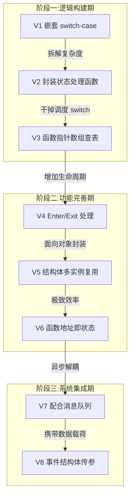
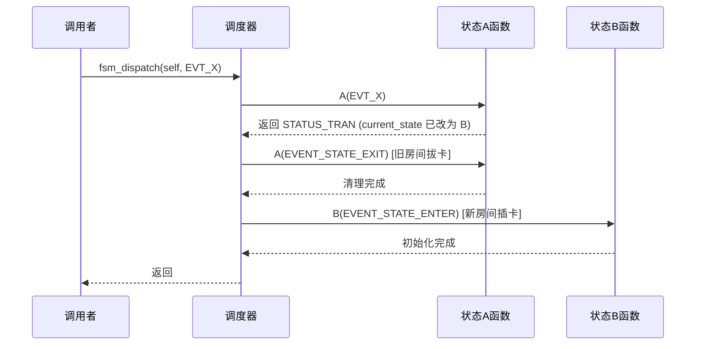
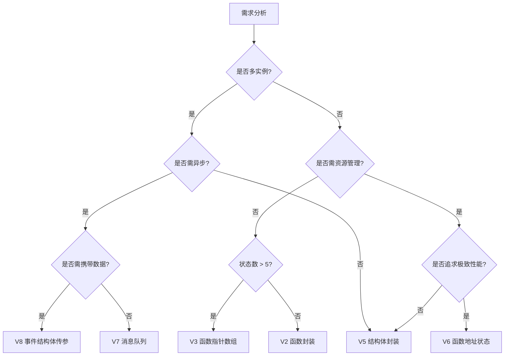

# 有限状态机演进详解

> [!NOTE]
> **来源**:Gemini 对话《有限状态机的演进》+ 配套代码库 8 个版本实测代码
> **整理说明**:本文将 AI 对话的演进思路与代码库实际实现逐版对照,去除口语化表达,补全代码注释,并补充工程实践要点。代码片段以代码库实际版本为准,关键设计点引用对话中的形象比喻。

---

## 1. 全局演进总览

有限状态机(FSM,Finite State Machine)是嵌入式系统中描述"状态-事件-迁移"关系的核心建模工具。本教程通过 8 个版本递进演化,展示了从玩具级代码到工业级架构的完整蜕变路径。

### 1.1 演进路线图



### 1.2 八版核心特征对比

| 版本 | 核心特征 | 解决的痛点 | 适用场景 |
|---|---|---|---|
| V1 | 嵌套 switch-case | 逻辑入口统一 | 极简玩具 |
| V2 | 封装状态处理函数 | 函数过长、状态耦合 | 简单业务 |
| V3 | 函数指针数组查表 | 调度效率、开闭原则 | 多数裸机项目 |
| V4 | Enter/Exit 生命周期 | 状态残留、资源泄漏 | 需资源管理的硬件控制 |
| V5 | 结构体封装复用 | 多实例需求 | 驱动/中间件开发 |
| V6 | 函数地址即状态 | 极致性能 | 复杂算法、QP 框架底层 |
| V7 | 配合消息队列 | 中断阻塞、异步解耦 | GUI、协议栈、复杂交互 |
| V8 | 事件结构体传参 | 事件无数据载荷 | 完整 OS 级架构 |

---

## 2. 第一阶段:逻辑构建期(V1-V3)

### 2.1 V1 直接嵌套 switch-case

**核心思想**:外层 switch 判断"当前在哪个状态",内层 switch 判断"发生了什么事件"。所有逻辑堆叠在一个巨大函数里。

**关键代码骨架**(取自代码库 [01_直接嵌套switch-csae/main.c](file:///C:/Users/liyun/Documents/Embedded/02代码库/01待处理/有限状态机演进/01_直接嵌套switch-csae/main.c)):

```c
void state_machine_handler(event_t event)
{
    /* 外层:判断当前在哪里 */
    switch (current_state)
    {
    case STATE_1:
        /* 内层:判断发生了什么 */
        switch (event)
        {
        case EVENT_GOTO_STATE2:
            current_state = STATE_2;
            break;
        case EVENT_RUN_STATE1_ONLY:
            /* 状态1专属逻辑 */
            break;
        }
        break;

    case STATE_2:
        switch (event) { /* ... */ }
        break;
    }
}
```

**优势**:思维映射直接(符合人类直觉"如果我在 A 状态且发生 X 事件,就做 Y"),调试方便。

**致命缺陷**:
- 函数体积随状态数指数膨胀,缩进金字塔化
- 修改某状态逻辑易误伤其他状态的 break
- 全局变量 current_state 被多处直接修改,无访问控制

---

### 2.2 V2 单独封装状态处理函数

**核心思想**:Divide and Conquer(分而治之)。将每个状态的内部逻辑拆成独立函数,调度器只负责"派发"。

**形象比喻**:从"一个厨师炒所有菜"变为"每个厨师专精一道菜,前台负责接单派发"。

**关键代码骨架**(取自 [02_单独封装状态处理函数/main.c](file:///C:/Users/liyun/Documents/Embedded/02代码库/01待处理/有限状态机演进/02_单独封装状态处理函数/main.c)):

```c
/* 每个状态对应一个独立处理函数 */
static void handle_state1(event_t event)
{
    switch (event)
    {
    case EVENT_GOTO_STATE2:
        current_state = STATE_2;
        break;
    case EVENT_RUN_STATE1_ONLY:
        printf("状态1专属\r\n");
        break;
    }
}

/* 调度器:仅负责派发,不再承担业务逻辑 */
void state_machine_handler(event_t event)
{
    switch (current_state)
    {
    case STATE_1: handle_state1(event); break;
    case STATE_2: handle_state2(event); break;
    case STATE_3: handle_state3(event); break;
    }
}
```

**V2 vs V1 核心对比**:

| 特性 | V1 嵌套 switch | V2 函数封装 |
|---|---|---|
| 代码结构 | 金字塔型(缩进越来越深) | 扁平型(多个独立小函数) |
| 逻辑隔离 | 差,易手滑误删他人 break | 优,函数作用域天然隔离 |
| 多人协作 | 冲突爆炸 | 互不干扰 |
| 可读性 | 超过 100 行极难阅读 | 每函数 10~20 行 |

> [!WARNING]
> **架构陷阱**:状态机本身不负责按键去抖。去抖属于驱动层职责,通过定时器轮询确认电平稳定后,才向状态机发送纯净事件。若强行在状态机里加 STATE_DEBOUNCE 状态,会把业务逻辑与硬件特性混在一起,违反分层原则。

---

### 2.3 V3 函数指针数组映射调用(查表法)

**核心思想**:干掉调度器中的 switch-case,改用"查表法"实现 O(1) 时间复杂度的极速跳转。

**形象比喻**:
- V2(switch-case)像"问路":挨个判断"你是状态1吗?不是。你是状态2吗?是。"
- V3(函数指针数组)像"查通讯录":状态值 0 对应数组第 0 项函数,直接取出地址跳转。

**关键代码骨架**(取自 [03_函数指针数组映射调用/main.c](file:///C:/Users/liyun/Documents/Embedded/02代码库/01待处理/有限状态机演进/03_函数指针数组映射调用/main.c)):

```c
/* 1. 定义函数指针类型 */
typedef void (*state_handler_t)(event_t event);

/* 2. 建立映射表:数组下标 = 状态枚举值 */
static state_handler_t state_handler[] = {handle_state1, handle_state2, handle_state3};

/* 3. 极简调度器:一行完成派发 */
void state_machine_handler(event_t event)
{
    (*state_handler[current_state])(event);
}
```

**底层性能剖析**:CPU 只需一次乘法计算内存地址 `Base_Address + Index × sizeof(指针)`,然后直接跳转。无论状态数是 3 还是 100,跳转速度恒定。

---

#### 2.3.1 C99 指定初始化:防错位神器

**问题背景**:传统写法依赖数组物理顺序与枚举顺序严格对应。一旦在枚举中间插入新状态,数组会"多米诺骨牌式"错位,编译器不报错但运行时逻辑错乱。

**形象比喻**:
- 传统写法 = 食堂排队打饭,中间插队,后面全拿错
- 指定初始化 = 宴会桌名牌,凭票对号入座,顺序乱也坐不错

**错误场景演示**:

```c
/* 枚举中间插入新状态 */
enum {
    STATE_STANDBY,      /* 0 */
    STATE_NIGHT,        /* 1 <-- 新插入! */
    STATE_WHITE,        /* 2 (原值后移) */
    STATE_COLOR         /* 3 */
};

/* 传统写法:小李忘了改数组,导致状态1(NIGHT)执行了 white 的逻辑 */
void (*state_table[])(event_t) = {
    handle_standby,     /* [0] OK */
    handle_white,       /* [1] 错位! */
    handle_color        /* [2] 错位! */
};
```

**C99 指定初始化写法**:

```c
static const state_handler_t state_handler[] = {
    [STATE_STANDBY] = handle_standby,
    [STATE_NIGHT]   = handle_night,
    [STATE_WHITE]   = handle_white,
    [STATE_COLOR]   = handle_color
};
```

**编译器行为**:读取 `[STATE_WHITE] = handle_white` 时,查 `STATE_WHITE` 的值(假设 2),直接把函数地址填入数组偏移量 2 的位置。无论代码书写顺序如何,映射绝对正确。

> [!CAUTION]
> **稀疏数组陷阱**:若枚举值不连续(如 `STATE_A=0, STATE_Z=1000`),编译器会分配大小为 1001 的连续数组以维持 O(1) 查表,索引 1~999 全部填 0,浪费 Flash。**查表法状态机务必保持枚举值从 0 开始连续递增,不要手动跳变赋值**。

> [!IMPORTANT]
> **const 关键字对 STM32 的意义**:`static const state_handler_t state_table[]` 会将跳转表放入 Flash(RO-DATA)而非 RAM。对于大量状态的系统,可显著节省宝贵的 RAM 资源。

---

## 3. 第二阶段:功能完善期(V4-V6)

### 3.1 V4 增加状态进入退出处理(Enter/Exit)

**核心思想**:引入 ENTER/EXIT 系统级事件,调度器在状态切换瞬间**强制自动**执行旧状态清理和新状态初始化,解决"状态残留"问题。

**形象比喻**:酒店房卡取电系统。
- V3:你从 A 房搬到 B 房,忘关 A 的水电会一直泄漏
- V4:拔卡断电。离开 A 自动断电,进入 B 自动开空调

**关键改进**:状态函数从 void 返回值升级为 status_t,实现"控制反转"。

**核心代码骨架**(取自 [04_增加状态进入退出处理/main.c](file:///C:/Users/liyun/Documents/Embedded/02代码库/01待处理/有限状态机演进/04_增加状态进入退出处理/main.c)):

```c
/* 系统级事件枚举 */
enum {
    EVENT_STATE_ENTER,     /* 进入状态事件 */
    EVENT_STATE_EXIT,      /* 退出状态事件 */
    EVENT_GOTO_STATE1,
    /* ... */
};

/* 状态处理结果 */
enum {
    STATUS_TRAN,           /* 发生状态迁移 */
    STATUS_HANDLED         /* 事件已处理,状态未变 */
};

/* 状态函数返回 status_t,告知调度器是否切换 */
static status_t handle_state1(event_t event)
{
    status_t ret = STATUS_HANDLED;
    switch (event) {
    case EVENT_STATE_ENTER:
        printf("进入状态1,初始化资源\r\n");
        break;
    case EVENT_STATE_EXIT:
        printf("退出状态1,清理资源\r\n");
        break;
    case EVENT_GOTO_STATE2:
        current_state = STATE_2;
        ret = STATUS_TRAN;          /* 关键:向上汇报"我换岗了" */
        break;
    }
    return ret;
}

/* 调度器自动管理生命周期 */
void state_machine_handler(event_t event)
{
    state_t prev_state = current_state;
    status_t status = (*state_handler[current_state])(event);

    if (status == STATUS_TRAN) {
        (*state_handler[prev_state])(EVENT_STATE_EXIT);      /* 旧房间拔卡 */
        (*state_handler[current_state])(EVENT_STATE_ENTER);  /* 新房间插卡 */
    }
}
```

---

#### 3.1.1 设计巧思:status_t 与 state_t 的双人舞

**state_t(名词)**:代表"目的地",要去哪个状态。
**status_t(动词信号)**:代表"动作状态",是原地不动还是已经出发。

| 步骤 | 角色 | 变量 | 动作 |
|---|---|---|---|
| 1 | 状态函数 | current_state (state_t) | 修改数据:把全局变量改成 STATE_2 |
| 2 | 状态函数 | return (status_t) | 发出信号:返回 STATUS_TRAN |
| 3 | 调度器 | if (status == ...) | 捕获信号:检测到切换请求 |
| 4 | 调度器 | prev_state & current_state | 利用数据:精准调度 Enter/Exit |

**控制反转的价值**:
- **解耦**:业务逻辑(何时跳转)与框架逻辑(跳转时清理什么)完全分离
- **原子性保障**:只要发生转换,Exit/Enter 百分百执行(电机控制场景防炸机)
- **代码复用**:Exit/Enter 只写一次,无论从哪跳来都自动调用

> [!WARNING]
> **V4 潜在缺陷**:状态函数若修改了 current_state 却忘了返回 STATUS_TRAN(误返回 STATUS_HANDLED),则调度器无法感知,Exit/Enter 不会触发,导致资源泄漏。这是 V5 把 state 封装进结构体的核心动机之一。

---

#### 3.1.2 扩展应用:多级菜单与历史记录

利用 status_t 可扩展为导航指令,实现浏览器级"前进/后退":

```c
typedef enum {
    STATUS_HANDLED,    /* 原地不动 */
    STATUS_TRAN,       /* 平级跳转(不记历史) */
    STATUS_PUSH,       /* 进入下级(入栈当前状态) */
    STATUS_POP         /* 返回上级(出栈恢复状态) */
} status_t;

/* 历史栈 */
#define HISTORY_DEPTH 10
static state_t history_stack[HISTORY_DEPTH];
static int stack_top = 0;

/* 调度器统一处理进出栈,业务函数无需感知栈存在 */
void fsm_dispatch(event_t event)
{
    state_t prev_state = current_state;
    status_t result = state_table[current_state](event);

    if (result == STATUS_PUSH) {
        history_push(prev_state);        /* 留下面包屑 */
    } else if (result == STATUS_POP) {
        current_state = history_pop();   /* 强制从栈恢复 */
    }

    if (result != STATUS_HANDLED) {
        state_table[prev_state](EVENT_EXIT);
        state_table[current_state](EVENT_ENTER);
    }
}
```

**架构价值**:子菜单函数只需 `return STATUS_POP`,完全不需要知道上级是谁。从不同入口进入同一页面,返回键能回到各自入口。

---

### 3.2 V5 对状态机进行封装复用(面向对象)

**核心思想**:从"单例"升级为"图纸化"。将状态机定义为结构体(类),即可用同一套代码逻辑制造出无数个独立实例(对象)。

**形象比喻**:从"国营大食堂"(全村一口锅)进化到"连锁加盟店"(同一份菜谱,无数家门店)。
- **代码(Flash)** = 加盟手册,只有一份,放在总部
- **对象(RAM)** = 具体门店,散落各地,各自有库存
- **self 指针** = 门店工牌,厨师干活前先看工牌才知道在哪家店

**核心代码骨架**(取自 [05_对状态机进行封装复用/main.c](file:///C:/Users/liyun/Documents/Embedded/02代码库/01待处理/有限状态机演进/05_对状态机进行封装复用/main.c)):

```c
/* 前向声明 */
typedef struct fsm fsm_t;

/* 函数指针:第一个参数变为 self 指针 */
typedef status_t (*state_handler_t)(fsm_t *self, event_t event);

/* 状态机结构体:模拟"类" */
struct fsm
{
    state_t state;                  /* 数据:每个实例独有 */
    state_handler_t *state_handler; /* 行为:指向共享逻辑表 */
};

/* 状态处理函数:所有操作针对 self,不碰全局变量 */
static status_t handle_state1(fsm_t *self, event_t event)
{
    status_t ret = STATUS_HANDLED;
    switch (event) {
    case EVENT_GOTO_STATE2:
        self->state = STATE_2;      /* 修改自己的状态 */
        ret = STATUS_TRAN;
        break;
    }
    return ret;
}

/* 调度器:接收 self 指针,实现多实例独立运行 */
void fsm_dispatch(fsm_t *self, event_t event)
{
    state_t prev_state = self->state;
    status_t status = (*(self->state_handler[self->state]))(self, event);

    if (status == STATUS_TRAN) {
        (*(self->state_handler[prev_state]))(self, EVENT_STATE_EXIT);
        (*(self->state_handler[self->state]))(self, EVENT_STATE_ENTER);
    }
}

/* 构造函数:初始化实例 */
static void fsm_ctor(fsm_t *self, state_t state, state_handler_t *handlers)
{
    self->state = state;
    self->state_handler = handlers;
}
```

---

#### 3.2.1 self 指针的底层本质

CPU 不知道"左灯""右灯"的概念。调用 `handle_state1(&left_lamp, event)` 时:
- `&left_lamp` 的首地址被传入寄存器(如 ARM 的 R0)
- `self->state = STATE_2` 翻译为汇编 `STR R1, [R0, #0]`
- 意思:**往 R0 保存的地址偏移 0 处写入数据**
- 若传 `&right_lamp`,R0 即右灯地址,写的便是右灯内存

这就是"一套代码,控制万物"的本质。

#### 3.2.2 内存全景图

```plaintext
+-----------------------+         +-----------------------------+
|      Flash (ROM)      |         |          SRAM (RAM)         |
|    代码区 - 只读      |         |       数据区 - 可读写       |
+-----------------------+         +-----------------------------+
|                       |         |                             |
|  [函数 handle_off]  <--------+  |  [变量: left_lamp]          |
|  指令: 关灯...        |      |  |  + state: STATE_OFF         |
|                       |      |  |  + handler: 0x0800... ------+--+
|  [函数 handle_dim] <-+ |      |  |                             |  |
|  指令: 调光...        | |      |  |  [变量: right_lamp]         |  |
|                       | |      |  |  + state: STATE_BRIGHT      |  |
|  [数组 lamp_logic]    | |      |  |  + handler: 0x0800... ------+--+
|  [0] -> handle_off  --+ |      |  |                             |
|  [1] -> handle_dim  --+ |      |  +-----------------------------+
+-----------------------+
```

**性价比**:Flash 占用恒定(代码只有一份),每新增实例仅增加 8~12 字节 RAM。这是控制多个同类外设(4 个电机、8 个 LED、2 路串口协议)的**必选架构**。

> [!WARNING]
> **空指针风险**:self 是一切的基石,若为 NULL 将导致 HardFault。调度器入口必须防御:
> ```c
> if (self == NULL) { return; }
> ```

---

### 3.3 V6 使用函数地址作为状态(极致效率)

**核心思想**:删除 state_t 枚举,删除 state_handler 映射表。**状态变量直接存储函数指针地址**,状态切换即函数指针赋值。

**形象比喻**:
- V5(查表法)= 调度台模式:跑完回调度台,查表决定下一个是谁
- V6(函数状态)= 接力赛模式:1 号跑完直接把 2 号的接力棒(函数地址)递过去,无调度台

**核心代码骨架**(取自 [06_使用函数地址作为状态/main.c](file:///C:/Users/liyun/Documents/Embedded/02代码库/01待处理/有限状态机演进/06_使用函数地址作为状态/main.c)):

```c
/* 结构体:只剩一个函数指针,无 enum */
struct fsm
{
    state_handler_t state;  /* 当前运行函数的地址 */
};

/* 状态切换:直接赋值函数地址 */
static status_t handle_state1(fsm_t *self, event_t event)
{
    switch (event) {
    case EVENT_GOTO_STATE2:
        self->state = handle_state2;   /* 直接指向新函数 */
        return STATUS_TRAN;
    }
}

/* 极简调度器:直接调用,无查表 */
void fsm_dispatch(fsm_t *self, event_t event)
{
    state_handler_t prev_state = self->state;       /* 备份旧函数地址 */
    status_t status = (*self->state)(self, event); /* 直接调用 */

    if (status == STATUS_TRAN) {
        (*prev_state)(self, EVENT_STATE_EXIT);      /* 旧地址上 Exit */
        (*self->state)(self, EVENT_STATE_ENTER);    /* 新地址上 Enter */
    }
}
```

---

#### 3.3.1 V5 vs V6 巅峰对决

| 维度 | V5 面向对象封装 | V6 函数地址状态 |
|---|---|---|
| 状态存储 | enum 整数索引(0, 1, 2) | 函数指针地址(0x08001234) |
| 查找方式 | 数组索引 `table[index]` | 直接访问 `func_ptr()` |
| 执行效率 | O(1),但多一次内存访存(查表) | O(1),极致最快(少一次访存) |
| 代码依赖 | 需维护庞大的 state_table 数组 | 完全不需要表,逻辑分散各函数 |
| 调试难度 | 容易,打印 state 显示 1 (STATE_DIM) | 极难,显示 0x08004410 需查 Map 文件 |

**选型建议**:
- **V6 适用**:电机 FOC 高频状态切换、QP 框架底层、状态流转复杂无法用表描述
- **V5 适用**:绝大多数业务场景。可读性与可调试性远高于 V6

---

## 4. 第三阶段:系统集成期(V7-V8)

### 4.1 V7 状态机配合消息队列(异步解耦)

**核心思想**:引入消息队列,将事件的"产生"与"处理"在时间和空间上彻底分离。中断只负责"通知"(入队),主循环负责"处理"(出队),解决"中断里不敢写复杂逻辑"的千古难题。

**形象比喻**:
- **同步调用(V1-V6)** = 打固定电话,对方必须立刻接听,期间双方都干不了别的事。若对方处理慢(如去抖延时),整个系统卡死
- **异步处理(V7)** = 发微信/邮件,你只管把消息扔进聊天框(队列),然后立刻去忙别的,对方有空再一条条处理

**餐厅后厨模型**:
- 服务员(中断/生产者):客人来喊"炒饭",极速写单子戳钉子上(入队),转身迎接下一位,耗时 0.01 秒
- 厨师(状态机/消费者):按自己节奏从钉子取单炒菜
- **削峰填谷**:突发 10 个客人,服务员瞬间挂 10 张单,厨师慢慢炒,不崩溃不漏单

---

#### 4.1.1 框架层封装

V7 开始引入独立框架文件 [fsm.h](file:///C:/Users/liyun/Documents/Embedded/02代码库/01待处理/有限状态机演进/07_状态机配合上消息队列/fsm.h) 与 [queue.h](file:///C:/Users/liyun/Documents/Embedded/02代码库/01待处理/有限状态机演进/07_状态机配合上消息队列/queue.h),状态机与队列解耦。

**fsm.h 关键定义**:

```c
/* 系统事件枚举,预留 EVENT_USER 给用户扩展 */
enum {
    EVENT_STATE_INIT,
    EVENT_STATE_ENTER,
    EVENT_STATE_EXIT,
    EVENT_USER,    /* 用户自定义事件起始值 */
};

/* 简化状态转换的宏:设置新状态并返回 TRAN */
#define TRAN_TO(target) (((fsm_t *)self)->state = (state_handler_t)(target), STATUS_TRAN)
```

**状态函数使用宏简化**:

```c
static status_t handle_state1(fsm_t *self, event_t event)
{
    switch (event) {
    case EVENT_GOTO_STATE2:
        return TRAN_TO(handle_state2);   /* 一行完成切换 */
    }
}
```

---

#### 4.1.2 生产者-消费者模型

**生产者(中断中调用,要求极速无阻塞)**:

```c
static void add_event_to_queue(event_t event)
{
    /* 绝对不执行状态机逻辑,只存数据 */
    queue_send(g_event_queue, &event);
}

/* 模拟中断:几微秒即返回 */
void Hardware_Button_ISR(void)
{
    add_event_to_queue(EVENT_BUTTON_CLICK);
}
```

**消费者(主循环中执行,可耗时)**:

```c
static void process_events(void)
{
    event_t event;
    while (!queue_is_empty(g_event_queue)) {
        if (queue_receive(g_event_queue, &event)) {
            fsm_dispatch(&g_fsm, event);   /* 真正干活 */
        }
    }
}

int main(void)
{
    /* 初始化 */
    g_event_queue = queue_create(sizeof(event_t));
    fsm_ctor(&g_fsm, handle_state_init);
    fsm_init(&g_fsm, EVENT_STATE_INIT);

    while (1) {
        process_events();   /* 轮询处理 */
        /* 还可喂狗、闪灯等其他低优先级任务 */
    }
}
```

---

#### 4.1.3 同步 vs 异步核心对比

| 维度 | 同步调用 V1-V6 | 异步处理 V7+Queue |
|---|---|---|
| 响应速度 | 立即执行(忙时无法响应新的) | 延迟执行(入队稍后处理) |
| 中断安全性 | 低,中断跑业务易优先级反转 | 高,中断只通知,耗时极短 |
| 并发能力 | 差,一件事没做完下一件进不来 | 强,队列缓冲应对突发高频事件 |
| 逻辑复杂度 | 简单直观,调用栈清晰 | 稍复杂,需管理队列内存 |
| 典型应用 | 简单裸机,逻辑 <10us | GUI、协议栈、RTOS 通信 |

> [!CAUTION]
> **队列溢出风险**:若事件产生速率(如 1000Hz 疯狂按键)远超处理速率(单事件 10ms),队列很快填满。代码库 queue.c 的策略是**丢弃新事件**(malloc 失败即返回 false)。生产实践需在源头限流(如硬件去抖),或采用双队列架构(高优先级紧急停机 + 低优先级 UI 刷新)。

> [!WARNING]
> **内存隐患**:代码库 [queue.c](file:///C:/Users/liyun/Documents/Embedded/02代码库/01待处理/有限状态机演进/07_状态机配合上消息队列/queue.c) 使用 `malloc` 动态分配节点。嵌入式系统(尤其裸机)长期运行可能产生堆碎片,导致 malloc 失败。生产代码建议改用**静态内存池**或**定长环形缓冲区**替代动态链表。

---

### 4.2 V8 事件通知加参数(数据载荷)

**核心思想**:补全事件驱动架构最后一块拼图——**数据载荷(Payload)**。事件不再只是"信号",还能携带具体数据(温度值、串口字节、触摸坐标等)。

**形象比喻**:
- V7(只有信号)= BB 机,只能看到"有人呼你",不知具体何事
- V8(带参数)= 快递包裹,快递员不仅敲门(事件触发),还把箱子(数据)交到你手里

**核心技术**:利用 C 语言结构体内存布局实现"继承",让通用 fsm 框架能处理用户自定义数据。

---

#### 4.2.1 结构体继承的魔法

**基类定义**(框架层,不可改):

```c
/* fsm.h 中定义基础事件类型 */
typedef struct event event_t;
struct event {
    unsigned short type;   /* 事件 ID(快递单号) */
};
```

**派生类定义**(用户层,自由扩展):

```c
/* main.c 中用户自定义事件,携带 value 载荷 */
struct fsm_event
{
    event_t super;          /* 基类:放在首位,实现"继承" */
    unsigned short value;   /* 派生类新增:载荷数据 */
};
```

**关键前提**:基类 `event_t` 必须作为派生结构体的**第一个成员**,这样 `&fsm_event` 与 `&fsm_event.super` 在内存上**同址**,可安全互转。

---

#### 4.2.2 生产者(打包发货)

```c
static void add_event_to_queue(unsigned short event_type)
{
    /* static 保证值在调用间不丢失 */
    static struct fsm_event event = {0, 0};

    event.super.type = event_type;   /* 填单号 */
    event.value++;                   /* 装货物 */

    /* 强转为基类指针入队 */
    queue_send(g_event_queue, (event_t *)&event);
}
```

#### 4.2.3 消费者(拆包验货)

```c
static status_t handle_state1(fsm_t *self, event_t *event)
{
    /* 拆包:将基类指针强转回派生类 */
    struct fsm_event *evt = (struct fsm_event *)event;

    /* 验货:读取载荷 */
    printf("evt >>> type:%d - value:%d\r\n", evt->super.type, evt->value);

    switch (event->type) {
    case EVENT_GOTO_STATE2:
        return TRAN_TO(handle_state2);
    }
}
```

> [!NOTE]
> **队列创建注意**:V8 的队列必须按完整结构体大小创建:
> `queue_create(sizeof(struct fsm_event))`,而非 `sizeof(event_t)`。否则只拷贝了基类部分,载荷丢失。

---

#### 4.2.4 大数据传输的内存策略

| 数据规模 | 推荐策略 | 风险点 |
|---|---|---|
| 小数据(<16 字节,如温度值) | 直接拷贝入队 | 无 |
| 大数据(如 1KB 串口缓冲) | malloc 申请内存,只把 4 字节指针入队 | 消费者必须 free,否则内存泄漏 |

**大数据错误做法**:把 1KB 直接塞进队列 → 队列内存爆炸 + memcpy 耗时长,阻塞中断

**大数据正确做法**:
```c
/* 生产者 */
char *buf = malloc(1024);
/* 填充数据... */
event.buf_ptr = buf;   /* 仅 4 字节指针入队 */
queue_send(queue, &event);

/* 消费者处理完后必须释放 */
free(evt->buf_ptr);
```

> [!CAUTION]
> **内存泄漏陷阱**:若消费者处理慢或丢包,指针所指内存将永远无法回收。RTOS 环境建议配合"引用计数"或"内存池"管理。

---

## 5. 关键设计点深度剖析

### 5.1 TRAN_TO 宏的设计精妙

V7 框架引入的宏定义:

```c
#define TRAN_TO(target) (((fsm_t *)self)->state = (state_handler_t)(target), STATUS_TRAN)
```

**拆解**:
- 逗号表达式:先执行赋值(切换状态),再返回 STATUS_TRAN
- `(fsm_t *)self`:强制类型转换,允许 self 在不同上下文传递
- 一行代码完成"切状态 + 报信号"两件事,避免开发者忘记 return

**使用对比**:

```c
/* 笨重写法(易漏 return) */
self->state = handle_state2;
return STATUS_TRAN;

/* 宏写法(一行搞定,防呆) */
return TRAN_TO(handle_state2);
```

---

### 5.2 多状态机的并发模型

V5+ 架构下,多个状态机实例可并发运行,各自独立:

```c
fsm_t left_lamp, right_lamp;   /* 两个床头灯实例 */

fsm_ctor(&left_lamp,  STATE_OFF, lamp_logic);
fsm_ctor(&right_lamp, STATE_OFF, lamp_logic);

fsm_dispatch(&left_lamp, EVT_BUTTON_CLICK);   /* 老婆开左灯 */
fsm_dispatch(&right_lamp, EVT_BUTTON_CLICK);  /* 老公误触右灯 */
/* 两者状态独立,互不干扰 */
```

**底层原理**:每个实例拥有独立的 `state` 成员,共享同一份函数代码(Flash)。函数通过 self 指针定位具体实例的数据,实现"代码共享、数据隔离"。

---

### 5.3 Enter/Exit 的执行时序

状态从 A 切换到 B 时,完整事件序列:



**关键点**:
1. 业务事件先于 Exit 处理(保证退出时上下文完整)
2. Exit 在旧状态函数上调用,Enter 在新状态函数上调用
3. current_state 在业务函数内已被修改,调度器靠 prev_state 备份定位旧函数

---

## 6. 版本选型决策指南



**实战经验法则**:
- **V3**:大多数简单裸机项目的**最佳性价比**选择
- **V5**:多实例驱动开发(多电机、多 LED、多协议)的**推荐架构**
- **V8**:复杂系统(GUI、协议栈、物联网)的**必经之路**

---

## 7. 常见陷阱与最佳实践

> [!WARNING]
> **陷阱 1:switch-case 漏写 break**
> V1-V2 中漏写 break 会导致状态穿透,逻辑错乱。建议每个 case 显式写 break,即使看似多余。

> [!WARNING]
> **陷阱 2:状态切换忘记返回 STATUS_TRAN**
> V4+ 中若修改了 current_state 却返回 STATUS_HANDLED,调度器不会触发 Exit/Enter,资源泄漏。V7 的 TRAN_TO 宏是防呆方案。

> [!WARNING]
> **陷阱 3:函数指针数组越界**
> V3 中若 current_state 越界(被篡改或未初始化),`state_table[current_state]` 会读取随机内存并跳转,导致 HardFault。建议调度器加入边界检查:
> ```c
> if (current_state < STATE_MAX) {
>     (*state_handler[current_state])(event);
> } else {
>     current_state = STATE_DEFAULT;   /* 强制恢复 */
> }
> ```

> [!CAUTION]
> **陷阱 4:中断中调用阻塞操作**
> V1-V6 中若在中断里直接调用 fsm_dispatch,而 dispatch 内含 printf 或 delay,系统会卡死。V7 的队列机制是根本解决方案。

> [!CAUTION]
> **陷阱 5:动态内存碎片化**
> V7/V8 的 queue.c 用 malloc 分配节点,长期运行会堆碎片。生产代码应替换为静态内存池或定长环形缓冲区。

> [!IMPORTANT]
> **最佳实践 1:状态枚举务必连续**
> 查表法要求枚举值从 0 开始连续递增,避免稀疏数组浪费 Flash。

> [!IMPORTANT]
> **最佳实践 2:const 修饰只读跳转表**
> `static const state_handler_t table[]` 将跳转表放入 Flash,节省 RAM。

> [!IMPORTANT]
> **最佳实践 3:基类放结构体首位**
> V8 派生事件结构体中,event_t super 必须作为第一个成员,保证指针互转安全。

---

## 8. 总结速查

- **演进本质**:从"控制流集中"到"控制流分散",从"数据共享"到"数据封装",从"同步阻塞"到"异步解耦"
- **三大阶段**:逻辑构建(V1-V3)→ 功能完善(V4-V6)→ 系统集成(V7-V8)
- **核心抽象**:状态(state_t)、事件(event_t)、处理函数(state_handler_t)、调度器(dispatch)
- **关键跨越**:V3 干掉调度 switch(查表)、V4 引入生命周期(Enter/Exit)、V5 实现多实例(面向对象)、V6 极致效率(函数即状态)、V7 异步解耦(队列)、V8 携带数据(结构体继承)
- **选型口诀**:简单用 V3,多实例用 V5,异步系统用 V8

---

## 9. 待深入 / 遗留疑问

- [ ] 层次状态机(HSM):如何设计"播放器"状态内含"播放/暂停/快进"子状态?
- [ ] QP 框架(Quantum Platform)与 V6 函数地址状态的关系
- [ ] FreeRTOS xQueueSend/xQueueReceive 替换手写队列的实践
- [ ] 双队列架构:高优先级队列(紧急停机)+ 低优先级队列(UI 刷新)的实现
- [ ] V8 队列满时的丢包处理策略对比(丢最新 vs 丢最旧 vs 覆盖)

---

## 10. 关联笔记

- [[驱动层状态机实操指南]]
- [[应用层状态机实操指南]]
